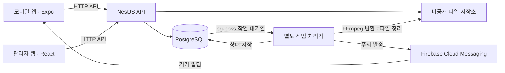

# Holdlog 아키텍처 안내

이 문서는 전체 구성, 코드의 책임과 의존 방향, 저장소 구성의 이유를 설명하는 진입점이다. 기술·운영 조건은 [기술·운영 명세](technical-spec.md), 제품 동작은 [기능 명세](functional-spec.md), 실행 방법은 [개발 시작 안내](development.md)에서 관리한다. 세부 규칙을 이 문서에 복사하지 않는다.

서비스별 상세 문서와 `AGENTS.md`의 위치·준비 상태는 [서비스별 문서 목차](architecture/README.md)에서 확인한다. [모바일 아키텍처](architecture/mobile.md)는 내부 코드 배치·상태·계약 소비의 설계 기준이며, 실제 구현 상태는 해당 문서와 기능 스펙에서 구분한다.

## 시스템 구성

아래는 제품 기능 구현 후의 목표 구성이다. 현재 구현 범위는 뒤의 상태 표와 구분해서 읽는다.



모바일과 관리자 웹은 API를 통해 업무 데이터를 읽고 변경한다. 서버가 인증·권한·데이터 관계·트랜잭션을 검사한다. DB와 비공개 파일 저장소에 클라이언트가 직접 접근하는 구조는 사용하지 않는다.

서버는 하나의 NestJS API 안에서 계정·크루·일정·기록·암장·미디어 등의 책임을 나누는 방향이다. API와 작업 처리기는 실행 프로세스를 분리하되 같은 서버 코드베이스를 사용한다. 업무별 독립 마이크로서비스와 서비스 간 통신 체계는 현재 구성에 포함하지 않는다. 세부 실행·작업 일관성 기준은 [기술·운영 명세](technical-spec.md#2-서버db푸시--확정)를 따른다.

## 코드 구조와 책임

```text
apps/
  mobile/       모바일 앱: React Native + Expo
  admin/        서비스 관리자 웹: React + Vite
  server/       NestJS API와 별도 worker 진입점, SQL 변경 파일
packages/
  contracts/    공통 API·runtime 계약과 생성 타입·검사 함수·합성 예제
infra/
  development/  개발·시험 DB와 파일 볼륨의 Docker Compose 구성
scripts/        계약 생성, workspace 검사, 문서 검사 도구
docs/           제품·기술·화면 기준과 개발 안내
specs/          기능별 범위·설계·작업·검증 기준
```

| 경계 | 담당 책임 |
|---|---|
| 모바일 | 화면·탐색·기기 기능과 API 결과 표시. 최종 권한 판단은 서버에 요청 |
| 관리자 웹 | 관리자 화면과 API 소비. 모바일과 별도 실행·배포 |
| API | 인증·인가, 업무 규칙, 데이터 변경과 파일 접근 권한 검사 |
| worker | 시간이 걸리는 작업과 재시도. 목표는 영상 변환·삭제·알림 처리 |
| contracts | 통신·runtime 형식과 처리 의미의 공통 기준. 업무 서비스 구현은 포함하지 않음 |
| PostgreSQL·파일 저장소 | 업무 데이터와 작업 상태, 미디어 바이트를 각각 보관 |

### 의존 방향

세 앱은 `@holdlog/contracts`의 용도별 진입점을 소비한다. 앱 사이에서 구현 코드를 직접 가져오는 구조는 사용하지 않는다. 모바일·관리자 번들에 NestJS·DB 모듈·서버 비밀값을 포함하지 않는다. 계약 검사 함수의 통과가 서버 권한·업무 규칙의 통과를 대신하지 않는다.

계약의 원본은 `packages/contracts/openapi.json`, `runtime.schema.json`, `conventions.md`, `examples.json`이다. 원본 변경 후 타입·검사 함수·fixture를 생성하며 생성물을 수기로 수정하지 않는다. 상세 형식과 변경 절차는 [계약 패키지 안내](../packages/contracts/README.md)와 [002 전달 기준](../specs/002-shared-contracts/contract-readiness.md)을 따른다.

## 하나의 저장소를 사용하는 이유

현재는 npm workspaces를 사용하는 모노레포다. 초기 개발에서 기능 명세·API 계약·서버·모바일·관리자 변경을 같은 PR로 검토하고, 같은 커밋의 계약 생성과 소비 검사를 실행하기 위해 이 구성을 사용한다. 계약 변경과 소비자 수정을 함께 병합할 수 있어 여러 저장소의 패키지 배포·버전 갱신·PR 순서를 맞추는 작업을 줄인다.

공통 계약을 사용한다는 사실만으로 모노레포가 필수인 것은 아니다. 멀티레포에서도 계약 패키지를 배포하거나 버전이 고정된 스키마를 소비할 수 있다. 현재 선택은 초기 기능 변경의 조율 비용을 줄이기 위한 것이며, 배포되는 앱의 개수나 담당 개발자의 수가 저장소 개수를 결정하지 않는다.

대신 루트 설정·lockfile·계약 원본에 변경이 몰릴 수 있고 저장소 접근 권한도 함께 관리해야 한다. 공통 파일 변경 담당과 기능별 작업 배정은 [개발자 배정 기준](../specs/development-roles.md#여러-개발자의-작업-배정)을 따른다. 병렬 작업의 선행 조건은 [기능 스펙 목록](../specs/README.md#선행-관계)에서 확인한다.

`apps/`는 실행·배포 대상, `packages/`는 소비되는 공통 패키지를 구분한다. 루트에는 workspace 설정·lockfile·공통 도구를 둔다. 세 실행 대상을 같은 깊이에서 찾고 각 앱의 설정과 책임을 분리하기 위한 배치다. `apps/`라는 이름이나 위치 자체가 모노레포의 필수 조건은 아니다.

## 실행과 배포의 경계

모바일 앱, 관리자 웹, API는 각각 빌드·배포한다. 같은 저장소에 있다고 항상 동시에 배포하는 것은 아니다. 다만 계약을 바꾸는 경우 실제 배포된 소비자와 서버 사이의 호환성을 확인해야 하며, 같은 PR로 병합했다는 이유만으로 배포 호환성이 보장되지는 않는다.

목표 운영 환경은 보유 물리 서버이며 Docker Compose로 API·PostgreSQL·작업 처리기를 실행한다. 영상 처리기는 알림·삭제 처리기와 분리한다. 미디어는 비공개 로컬 저장 어댑터로 시작하며 저장소 교체 경계는 [미디어 저장소 설계](technical-spec.md#저장소-교체-설계--구현-필수-요구사항)를 따른다.

현재 `infra/development/`의 Compose는 개발·시험용이다. 운영 배포 구성, 외부 도메인·HTTPS, 백업·복구와 배포 자동화의 확정·검증을 의미하지 않는다. 운영 준비 범위는 [기술·운영 명세](technical-spec.md#6-기능-개발-이후에-다룰-운영-준비)에서 관리한다.

## 현재 구현 상태

| 구분 | 현재 코드·검증 범위 | 앞으로 구현·검증할 부분 |
|---|---|---|
| workspace·계약 | 공통 설정·lockfile, 계약 생성·검사, 세 앱의 타입·합성 소비 | 기능별 실제 요청·응답·업무 동작 |
| API·DB | NestJS 실행, 개발 health 경로, DB 연결·기반 SQL 변경 실행 | 제품 API, 인증·권한, 업무 테이블·트랜잭션 |
| worker | pg-boss 기반 합성 작업·재시작 검사. 현재 worker는 개발 전용 | 영상 변환·삭제·알림 처리기와 운영 실행 |
| 모바일·관리자 웹 | 실행·빌드 기반, 브라우저·가상 기기의 로컬 API 연결 | 제품 화면과 기기 기능, 실제 제품 API 연동 |
| 파일·운영 | 개발 비공개 파일 볼륨 준비 | 파일 저장·전달·권한 검증, FCM·FFmpeg 연동, 물리 서버 배포 |

기반과 공통 계약은 001·002의 산출물을 사용한다. 공통 계약 설계 완료를 제품 API나 화면 구현 완료로 취급하지 않는다. 구현 상태와 증거는 [기능 스펙 목록](../specs/README.md), [001 검증 기록](history/development/001-foundation-verification.md), [002 전달 기준](../specs/002-shared-contracts/contract-readiness.md)에서 확인한다.

데이터의 논리 관계는 [002 데이터 모델](../specs/002-shared-contracts/data-model.md), 기록·파일의 소유권과 삭제 영향은 [기록 관계 설계](record-relationships.md)를 따른다. 이 문서는 구체적인 테이블·모듈의 실제 구현을 대신하는 상세 설계가 아니다.
