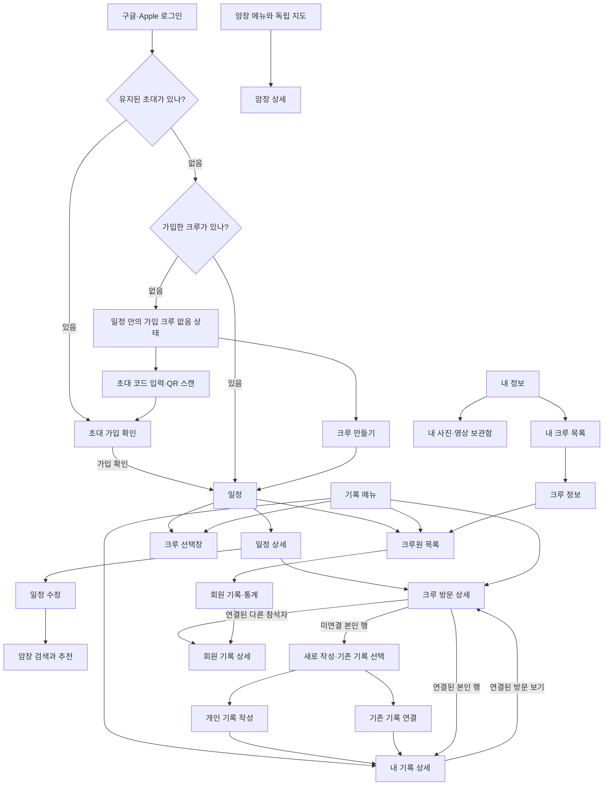

# 클라이밍 크루 앱 — 화면별 기능 명세서

- 문서 버전: 0.12
- 작성일: 2026-09-28
- 갱신일: 2026-10-07
- 기준: [현재 제작 화면](./screens.md)과 사용자 확정 동작. [PRD v0.21](prd.md)·[화면 설계](./screen-design.md)는 이 기준으로 함께 관리한다.
- 대상: iOS·Android 앱 첫 버전
- 목적: 화면 설계와 개발에 사용할 표시 정보, 입력, 동작, 권한, 상태, 오류 처리, 검증 기준을 정의한다.
- 범위: 화면과 기능 동작. 실제 디자인 시안, 기술 스택, API 상세 규격은 이 문서의 범위 밖이다.
- 시각 자료: [화면 설계서](screen-design.md). 실제 시안·표시의 뜻·화면 이동을 함께 설명한다. 기록 달력·리스트는 S08의 동일한 세 필터를 사용한다.

- 화면 이름·연결: [화면·상태 번호표](./screen-numbering.md). 섹션·화면·상태 번호는 화면 정렬용이며 이 문서의 S번호는 기능 ID로 유지한다.

## 0. 문서를 읽는 방법

- **확정:** 사용자와 합의한 PRD의 요구사항이다.
- **개발 정책 D01~D08:** 현재 제품 범위는 확정됐다. 7절의 정책표를 따르며, 후순위 기능은 현재 구현 범위에 포함하지 않는다.
- **경계 정책 B01~B05:** 연결·삭제·통계·알림·탈퇴의 핵심 동작은 확정됐다. 5절과 8절의 규칙을 따른다.
- 버튼 이름·정렬·오류 표시도 최신 Figma 화면과 사용자 확정 규칙을 따른다. 미확정 제안은 확정 요구사항과 구분한다.
- ‘삭제된 공동 기록 복구 불가’와 ‘살아 있는 기록의 잘못된 수정 되돌리기’는 서로 다른 기능이다.

일정 작성·수정과 응답의 기준은 아래 S04·S05에서 관리한다.

## 1. 용어와 화면 구조

### 1.1 주요 데이터

| 용어 | 의미 |
|---|---|
| 일정 | 앞으로 운동할 날짜·시간·암장과 참여 신청을 담은 약속 |
| 참여 신청 | 참여·불참·미응답 상태. 실제 참석과 다름 |
| 공동 방문 | 실제로 다녀온 날짜·암장·참석자·공동 메모를 담은 기록 |
| 개인 기록 | 본인 날짜·암장·완등 개수·컨디션·후기·미디어를 가진 독립 기록. 공동 방문은 ID로 참조하며 연결 중 날짜·암장이 같아야 함 |
| 연결 | 기존 개인 기록을 공동 방문에 붙이는 관계. 복사나 개수 합산이 아님 |
| 브랜드 | 난이도 이름·색상·순서를 정의하는 단위 |
| 지점 | 실제로 방문하는 암장. 브랜드와 연결됨 |
| 벽 | 지점에 등록된 고정 벽. 세팅은 벽의 문제를 바꾸는 것 |

### 1.2 하단 메뉴 — 확정

| 메뉴 | 기본 화면 | 주요 하위 화면 |
|---|---|---|
| 일정 | S03 일정 목록·달력 | S04 생성·수정, S05 상세, S06 암장 선택 |
| 기록 | S08 전체 / 내 방문 / 크루 방문 | S09 공동 방문 생성·편집, S10 상세, S11 연결, S12 내 기록 |
| 암장 | S23 독립 암장 지도 | 검색, 지점 미리보기, S07 암장 상세 |
| 통계 | S15 개인 통계 | 기간 선택, 브랜드 전환, 같은 화면의 난이도별 완등·컨디션 영역 |
| 내 정보 | S16 내 정보 | S17 초대 코드·QR·초대 링크, S18 회원 관리(후순위·현재 미노출), S19 크루 목록·생성·가입, S21 보관함, S22 크루 정보(회원·초대·S25 이관 진입) |

가입 크루 없음은 일정 달력 안의 상태로 처리하며 별도 독립 화면으로 이동하지 않는다. 일정 내부 상태01.01.02로 시안을 표시한다. 로그인 후 크루 가입을 강제하지 않는다. 가입 크루가 없으면 일정 탭에 ‘크루에 가입해보세요’와 크루 가입·크루 만들기 버튼을 제공하되 기존 계정의 내 기록·보관함·통계는 계속 접근할 수 있다. 로그인 전에는 하단 메뉴를 노출하지 않는다. 가입 크루가 있을 때 일정·기록 상단 ‘크루 이름 ⌄’을 누르면 S19-A 크루 선택창을 연다. 크루를 누르면 바로 전환하고 선택창을 닫으며 보고 있던 탭을 유지한다. 가입 크루가 없으면 이 상단 항목을 숨긴다. 내 정보의 S19-B 내 크루 목록은 별도 화면이며 각 > 행은 S22 크루 정보로 이동한다. 일정 화면의 ‘크루원’ 또는 내 정보 → 가입한 크루 → 크루 정보(S22)에서 S20을 연다. 내 기록·개인 통계·보관함은 계정 전체 기준이다(D08). 개인 통계에는 계정 전체 기준 안내 문구를 표시하지 않는다. 일정·기록의 달력·목록에만 종 버튼을 두고 전체 크루의 수신 알림 목록05.07을 연다. 암장 상세(S07), 다른 회원 기록(S13), 변경 이력(S14)은 관련 화면에서 연다. 추가 독립 홈 탭은 만들지 않는다.

### 1.3 주요 이동

‘내 기록’에서 열든 크루 방문에서 열든 본인의 동일 기록은 S12를 사용한다. 다른 회원은 공개 정보만 보이는 S13을 사용한다.

## 2. 공통 화면 규칙

### 2.1 상태와 입력

- 데이터 처리에서는 조회 중·빈 결과·오류·정상을 구분하고 오류를 빈 기록으로 취급하지 않는다. 이는 개발 동작 기준이며 별도 로딩·조회 실패·재시도 시안을 추가하라는 뜻이 아니다. 이미 받은 데이터로 표시하는 날짜 시트에는 추가 조회 상태가 없다. 필요한 문제 안내는 기존 화면 위 공통 다이얼로그를 사용한다.
- 저장 중 버튼 중복 누름을 막는다. 서버도 재시도 요청을 같은 작업으로 처리한다.
- 저장 실패 시 입력값을 유지하고 재시도한다. 실패했는데 성공 메시지나 화면 이동을 보여주지 않는다.
- 저장하지 않은 변경이 있는 상태에서 뒤로 가기·다른 화면 이동을 요청하면 공통 확인창의 ‘계속 작성 / 나가기’를 제공한다. 계속 작성은 입력을 유지하고, 나가기는 이번에 저장하지 않은 변경만 버린다. 기존 저장 자료는 삭제하지 않는다. 변경이 없으면 확인 없이 이동한다. 개인 기록 작성의02.04.05 대표 시안을 재사용하며 작성 화면마다 확인 시안을 복제하지 않는다. 관리자 웹의 각 폼도 같은 동작을 따른다.
- 연결 끊김 상태에서는 저장 성공으로 처리하지 않는다. 오프라인 자동 동기화는 첫 버전 필수 범위가 아니다.
- 수정 충돌 시 ‘다른 회원이 수정했어요’를 표시하고 최신 내용과 내 입력을 비교할 수 있게 한다. 내 입력을 조용히 버리거나 최신 내용을 덮어쓰지 않는다.
- 권한은 버튼 표시와 서버 처리 양쪽에서 확인한다. 화면 진입 후 권한이 사라지면 저장을 거절하고 입력 유실 없이 안내한다.
- 색상만으로 난이도를 구분하지 않고 난이도 이름·순서를 함께 표시한다.
- 고정 벽 수·추천 비율·인원·완등 개수는 단위와 함께 표시한다.
- 일정 달력은 대표 도장 아래 점 한 줄로 여러 일정을 표시한다(S03). 모든 표시는 자기 날짜 칸 안에 둔다. 통합 기록 화면도 도장 아래 점으로 맞춘다. 기록의 점은 연결 중복을 제외한 전체 방문 수를 뜻한다.
- 암장 표시는 등록 브랜드 로고 + 지점 이름 + 지점별 표시 색상으로 통일한다. 로고는 원본 비율과 색상을 유지하고 지점 색상은 배경·테두리·표식에 적용한다.
- 달력에 브랜드 로고 스탬프를 표시하고 지점 색상으로 구분한다. 날짜 숫자와 도장 사이 충분한 여백을 두고 날짜 선택 테두리·배경 효과는 사용하지 않는다. 달력 아래 암장별 가로 범례는 표시하지 않는다. 기록 달력의 날짜 칸을 누르면 해당 날짜의 바텀시트를 연다. 달력 아래에는 별도 방문 목록을 두지 않고 달력 높이를 넓혀 사용한다. 여러 방문은 추가 건수를 표시하고 날짜 바텀시트에서 모두 조회한다. 예정 일정과 실제 기록은 라벨·테두리로도 구분한다.
- 지점 색상은 난이도·컨디션 색상과 별개다. 색상만으로 의미를 전달하지 않으며 이름·숫자를 함께 표시한다. 로고 미등록 시 브랜드 이름을 표시한다.
- 로고·지점 색상은 서비스 관리자가 첫 버전의 데이터 등록용 관리자 페이지에서 관리한다. [관리자 명세](./admin-spec.md)를 따른다.

### 2.2 권한

| 작업 | 권한 |
|---|---|
| 일정 생성 | 모든 크루원 |
| 일정 내용 수정·취소 | 작성자 또는 관리자 |
| 참여·불참 응답 | 본인 |
| 공동 방문 생성·공동 정보·실제 참석자 수정 | 모든 크루원. 불참자도 가능 |
| 공동 방문 삭제 | 관리자만. 복구 불가 |
| 개인 완등·컨디션·후기·미디어 편집 | 본인만 |
| 개인 기록 후보 선택·최초 연결 | 해당 개인 기록의 본인 |
| 참석자 재추가 시 이전 기록 재연결 | 참석자 변경 작업에 포함. 기존 개인 내용은 수정하지 않음 |
| 공동 변경 이력 조회 | 해당 공동 정보 접근 권한이 있는 크루원 |
| 개인 변경 이력 | 저장하지 않으며 조회 메뉴도 없음 |

- 표의 크루원·관리자는 작업 대상 크루의 활성 회원·관리자를 뜻한다. 계정의 크루별 가입 관계에서 역할을 검사한다.
- 공동 미디어 수정·삭제는 업로더 본인만 가능하다. 첫 버전에는 관리자에게 타인 파일의 특별 수정·삭제 권한을 부여하지 않는다.

### 2.3 공개 범위

- 개인 기록의 방문 날짜·시간·지점, 난이도 숫자별 완등 개수, 컨디션은 본인이 현재 가입한 모든 크루의 활성 회원에게 공개한다. 공동 방문에서 분리되어 본인 전용이 된 기록은 예외다. 신규 가입만으로 본인 전용 기록을 다시 공개하지 않는다.
- **사진·영상과 개인 후기는 각각 공개 / 비공개를 선택한다.** 사진·영상은 파일별로, 후기는 기록의 후기 항목에 하나의 공개 값을 저장한다. 작성·수정 화면에서 독립적으로 선택하며 파일 선택·기록 연결만으로 기존 공개 값을 바꾸지 않는다.
- 새 첨부의 기본 공개 값은 기존 기본안대로 공개다. 새 후기의 초기 선택은 공개를 기본안으로 두며, 저장 전에 선택 상태와 공개 대상을 명시한다. 기존 비공개 항목은 그대로 유지한다.
- 공개를 선택한 사진·영상과 후기는 **해당 개인 기록이 현재 연결된 공동 방문의 크루 활성 회원만** 볼 수 있다. 같은 소유자의 다른 가입 크루에는 공개하지 않는다. 인터넷 전체 공개도 아니다.
- 공동 방문에 연결되지 않은 개인 기록의 사진·영상·후기는 공개를 선택했어도 본인만 본다. 작성 화면에 공개 범위를 반복 설명하는 안내 문구를 추가하지 않는다. 파일은 공개·비공개 아이콘, 후기는 별도 공개 선택으로 표시하며 실제 접근 범위는 연결과 권한으로 검사한다.
- 비공개를 선택한 사진·영상·후기는 연결된 크루에서도 본인만 본다. 타인에게 비공개 사진의 썸네일·저장본·직접 주소나 비공개 후기 내용을 제공하지 않는다. 본인의 사진·영상에는 자물쇠 아이콘만 표시하고, 후기에는 아이콘과 ‘비공개’ 글자 버튼을 표시한다. 크루 방문의 공유 사진에는 공개·비공개 선택을 표시하지 않는다.
- 공동 방문 삭제·본인 연결 해제·참석자 제외·탈퇴 시 해당 크루의 파일·후기 공개 접근을 즉시 해제한다. 개인 기록·파일은 기존 보존 정책을 따른다. 다시 연결할 때에도 저장한 항목별 공개 선택은 유지하며 선택된 공개 항목만 새 연결 크루에 표시한다.
- 공개에서 비공개로 변경하면 타인의 목록·상세·직접 파일 접근에서도 즉시 제외한다. 서버는 기록 소유권, 활성 연결, 대상 크루 소속, 항목별 공개 값을 함께 검사한다.
- 공동 방문에 직접 올린 공유 파일·공동 메모는 해당 크루의 공동 내용이다. 개인 기록의 사진·후기 공개 선택과 구분한다.
- 일정·공동 메모·참석 명단·공동 직접 첨부·공동 이력은 대상 크루에만 공개한다. 다른 크루에서 개인 공개 수치를 본다는 이유로 공동 정보나 개인 첨부·후기를 보여주지 않는다.
- 개인 변경 이력은 저장하지 않는다. 계정 전체 개인 통계는 본인만 본다. 현재 값 공개와 편집 권한은 별개이며 관리자도 타인의 개인 내용을 수정하지 못한다.

## 3. 화면별 명세

### S01. 구글·Apple 로그인

**진입:** 앱 첫 실행, 로그아웃 후, 로그인 만료 후.

| 요소 | 동작 |
|---|---|
| 앱 이름·짧은 설명 | 비공개 크루의 일정과 운동 기록을 관리하는 앱임을 안내 |
| 구글로 계속하기 | 구글 로그인 진행 |
| Apple로 계속하기 | Apple 로그인 진행 |
| 오류 안내 | 취소와 실패를 구분하고 재시도 제공 |

- 로그인 성공 후 가입 크루가 하나면 해당 S03, 여러 개면 마지막 선택 크루의 S03으로 이동하는 기본안이다. 유효한 마지막 선택이 없고 가입 크루가 여러 개면 S03 위에 S19-A 선택창을 열며, 선택 전에는 특정 크루의 내용을 표시하지 않는다. 가입 크루가 없으면 S03 안의 빈 상태를 표시하며 별도 화면으로 이동하거나 가입을 강제하지 않는다. 기존 내 기록 접근은 유지한다.
- QR 또는 초대 링크로 시작했다면 초대 정보를 유지해 로그인 후 해당 S02 가입 확인을 이어간다. 이 경우 일반 로그인 후 기본 이동보다 초대 확인을 우선한다. 로그인 취소만으로 가입하지 않는다.
- 구글·Apple 계정은 자동 연결하지 않는다. 제공자와 제공자별 사용자 식별자로 계정을 구분하며 같은 이메일이어도 자동 병합하지 않는다.
- 로그인 계정 이메일을 알고 있다는 이유만으로 크루 접근을 허용하지 않는다.
- **검증:** 로그인 취소 시 가입 처리되지 않는다. 기존 회원은 매번 초대 코드를 입력하지 않는다.

### S02. 초대 코드 입력·QR 스캔·초대 링크 가입

- 다이얼로그 시안은 기존 화면 위에 겹친 대표1개로 표시한다. 추가 메시지·버튼 상태는 다이얼로그 부품만 옆에 배치한다.

**진입:** S03 미가입 안내, S19-A 선택창 또는 S19-B 목록의 크루 가입, 외부에서 연 초대 링크·QR.

- 코드 입력, QR 스캔, 가입 확인 버튼을 제공한다. 가입은 현재 로그인된 계정으로 진행하며 계정 선택·변경 기능을 이 흐름에 넣지 않는다.
- 가입 확인 화면은 큰 기본 크루 프로필 아이콘, 크루 이름, 초대 안내를 세로로 배치한다. 로그인된 계정으로 가입한다는 설명 문구는 표시하지 않는다.
- 코드·QR·초대 링크는 동일한 크루 초대를 나타내며 같은 서버 검증을 거친다. 별도의 관리자 권한을 담지 않는다. QR에는 초대 링크를 담아 같은 가입 확인으로 연결한다.
- 카메라 권한이 없으면 코드 입력을 계속 사용할 수 있다. QR은 연속으로 스캔하며 사용할 수 없는 QR은 기본 화면 위 중앙 다이얼로그로 처리한다. 닫으면 스캔을 계속하므로 다시 스캔 버튼은 없다.
- 링크를 누르거나 QR을 읽는 것만으로 자동 가입하지 않는다. 서버에서 초대를 검증한 뒤 대상 크루 이름을 표시한다. 사용자가 가입을 확인하면 현재 로그인된 계정의 해당 크루 가입 관계를 만든다. 별도의 계정 선택·변경 영역은 제공하지 않는다. 기존 크루 가입·역할·개인 기록은 유지한다. 별도 승인 없이 새 크루의 S03으로 이동한다.
- 공백 입력은 전송하지 않는다. 잘못된·폐기된 코드는 가입시키지 않고 기본 화면 위 다이얼로그로 안내한다. 가입 제한·무효 초대·통신 실패·가입 실패는 메시지가 다른 같은 다이얼로그로 처리하며 같은 배경을 반복한 전체 화면을 만들지 않는다.
- 이미 가입한 크루의 초대는 중복 가입하지 않고 ‘이미 가입한 크루예요’와 해당 크루 일정 열기를 제공한다. 같은 계정·같은 크루의 재가입 요청은 가입 관계를 중복 생성하지 않는다. 다른 크루 초대는 별도 가입으로 처리한다.
- 초대 코드·QR·초대 링크는 크루에 미리 발급되어 있고 만료 기간이 없다(D07 확정). 관리자 제외로 재가입 차단된 계정은 코드가 유효해도 가입할 수 없다(B05). 재발급 기능은 현재 구현 범위에서 제외하며 추후 필요할 때 검토한다.
- **검증:** 초대 가입 전에는 대상 크루의 일정·공동 기록·회원 정보에 접근할 수 없다. 기존 본인 기록의 접근 권한과는 구분한다.

### S03. 일정 목록·달력

**진입:** 일정 탭, 가입 완료.

- 가입 크루가 없으면 일정 달력 대신 ‘크루에 가입해보세요’ 안내와 ‘크루 가입’(S02), ‘크루 만들기’(S24)를 표시한다. 미가입 상태에서는 좌측 상단 크루 이름·내 크루 버튼을 숨긴다. 가입·생성 전에는 일정 작성 버튼을 표시하지 않는다.
- 현재 크루 이름·선택창 전환(S19-A), 크루원 목록(S20)을 제공한다. 일정은 현재 크루 것만 표시한다.
- 월 달력 / 목록 전환, 날짜 이동, 전체 / 내가 참여한 일정 필터를 제공한다. 기존 기록 화면과 동일한 달력·보기 전환 디자인을 사용한다. 달력 기본 화면에는 일정 만들기 버튼을 두지 않고 날짜 칸에서 S03-D를 연다. 목록에서도 달력으로 전환해 날짜를 고르는 것을 기본안으로 한다.
- 카드 정보: 날짜·시간, 지점 또는 ‘암장 미정’, 참여 인원, 내 신청 상태, 일정 상태.
- 내부 상태는 예정 / 종료 / 취소를 유지하되, 기본 예정 배지는 반복 표시하지 않는다. 종료·취소는 글자로 구분하고 종료에는 연결 방문 기록 유무를 별도 표시한다. 내 신청 상태와 구분한다.
- 날짜 바텀시트에서 일정이 없으면 ‘이 날짜에 일정이 없어요’와 해당 날짜로 생성하는 동작을 표시한다.
- 격자선 없는 달력의 지점별 대표 도장과 여러 건 표시는 [공통 달력 규칙](./screen-design.md#231-표시와-공간-규칙)을 따른다. 같은 지점의 별도 일정도 각각 센다. 실제 건수는 제한하지 않고 날짜 시트·화면 읽기 안내에 정확한 전체 건수를 제공한다.
- 날짜 칸 전체를 누르면 S03-D를 연다. 도장·점은 별도 버튼이 아니며 크루·필터 변경 시 대표 표시와 시트 총건수를 함께 갱신한다. 시간·긴 암장명·응답·인원은 목록과 시트에서 확인한다.

- 목록 기본 정렬은 가까운 예정 일정부터, 과거 조회는 최근 날짜부터다.
- **검증:** 종료됐으나 기록이 없는 일정과 기록이 있는 일정을 구분할 수 있다.

#### S03-D. 일정 날짜 바텀시트

- 누른 날짜·요일, 현재 필터의 일정 건수, 기존 일정 목록과 ‘이 날짜에 일정 만들기’를 표시한다. 여러 일정은 내부 스크롤로 확인한다.
- 항목은 암장·시간·참여/불참/미응답 인원·내 신청 상태를 표시하고 S05로 이동한다. 기본 예정 배지는 생략한다.
- 생성 동작은 S04로 이동하며 날짜와 크루를 전달한다. 일정이 없어도 생성 가능하다. 과거 생성 제한은 D02를 따른다.
- 목록 보기와 현재 월·필터를 공유한다. 시트를 닫으면 원래 위치로 돌아온다. 열기·닫기만으로 저장·푸시가 발생하지 않는다.
- **데이터 조회:** 달력을 표시할 때 현재 월·크루·필터의 일정 내용을 미리 불러온다. 날짜 시트는 받은 데이터를 사용하며 별도로 조회하지 않는다. 시트는 일정 있음·없음 상태만 두고 로딩·조회 실패·재시도 상태를 추가하지 않는다. 데이터 조회 중·실패·재시도는 달력·목록에서 처리하며 실패를 일정 없음으로 표시하지 않는다. 기존 기록 날짜 시트와 모양은 공유하지만 표시 대상은 일정이다.

### S04. 일정 생성·수정

**진입:** S03-D 이 날짜에 일정 만들기, S05 수정.

| 입력 | 필수 | 규칙 |
|---|---|---|
| 날짜 | 필수 | 시간과 함께 입력해 저장 |
| 시간 | 필수 | 입력 시간대로 해석하고 UTC로 변환해 저장. 미입력 저장 불가 |
| 암장 지점 | 선택 | S06에서 선택. 미입력은 암장 미정 |
| 설명 | 선택 | 자유 입력 |

- 입력 폼: 날짜·시간·암장은 아이콘·제목·값·오른쪽 화살표를 가진 세 행의 공통 테두리 묶음으로 표시한다. 날짜·시간에만 ‘필수’ 배지를 붙이고 암장·설명에는 ‘선택’ 배지를 붙이지 않는다. 암장 미정 저장은 유지한다. 시간대·암장 보조 안내와 ‘날짜와 시간을 입력하면 저장할 수 있어요’ 문구는 폼에 표시하지 않는다. 저장 조건은 문구 대신 버튼 활성·비활성으로 처리한다.

- 작성자·대상 크루·생성 시각은 서버가 저장한다. 생성 즉시 해당 크루원 모두에게 새 일정 알림을 보낸다. 편집 중 크루 전환으로 저장 대상이 조용히 바뀌지 않는다.
- 작성자를 참여자로 자동 등록하지 않는다(D02 확정). 본인이 불참하고 일정을 만들 수도 있다.
- 생성 시에는 참여자 명단이 없으므로 S06은 검색 중심으로 제공한다. 저장 후 참여자가 모이면 추천을 계산한다.
- 수정 시 변경된 항목만 저장하고 이력을 남긴다. 날짜·시간·암장 변경은 참여자에게 알린다. 설명만 바뀌면 이력만 남긴다(D04).
- 새 일정에 날짜·암장을 함께 저장해도 생성 알림 한 번으로 처리한다. 각각의 수정 알림을 추가 발송하지 않는다.
- 과거 날짜 신규 일정은 허용하지 않고 방문 기록 작성을 안내한다(D02 확정). 과거 방문 기록은 작성 가능하다.
- **검증:** 날짜·시간은 반드시 입력해야 하며 암장은 미정으로 저장 가능. 일반 회원이 다른 사람의 일정 수정 요청을 보내면 거절된다.

### S05. 일정 상세

**표시:** 날짜·시간·암장, 설명, 작성자, 참여·불참·미응답 인원, 내 신청 상태, 일정 상태, 연결 방문.

| 버튼 | 조건·동작 |
|---|---|
| 참여 / 불참 | 본인의 신청 상태 저장. 실제 참석자로 자동 확정하지 않음 |
| 일정 수정 | 작성자·관리자에게 더보기에 표시. 암장 변경은 수정 화면에서 진행 |
| 일정 취소 | 작성자·관리자. 확인 후 취소 처리, 참여자 알림 |
| 방문 기록 만들기 | 연결 공동 방문이 없고 실제 방문 기록 작성이 가능한 날짜일 때 S09 |
| 방문 기록 보기 | 연결 공동 방문이 있으면 S10 |
| 변경 이력 | S14 |

- 참여·불참 변경은 추천에 사용할 인원만 바꾸며 기존 암장 선택을 바꾸지 않는다.
- 날짜가 지났거나 공동 방문 생성 이력이 있으면 종료로 표시한다. 수동 종료 버튼은 없다.
- 종료된 일정에도 방문 기록 만들기·보기를 제공한다. 종료 후 개인 기록 수정도 가능하다.
- 취소는 삭제가 아니다. 취소 사실을 볼 수 있게 유지하며 21시 기록 요청은 보내지 않는다.
- 일정 취소 확인창은 왼쪽 ‘일정 유지’, 오른쪽 빨간색 ‘일정 취소’로 표시한다. ‘일정 유지’는 창만 닫고 일정·응답을 그대로 유지하며 알림을 보내지 않는다. 실제 취소는 오른쪽 버튼을 눌러 처리에 성공했을 때만 반영한다.
- 연결 기록 삭제 후에도 일정 정보와 종료 상태는 그대로다.
- 종료·취소 후 응답 변경은 막고, 지난 일정 날짜 수정도 막는다(D02 확정).
- **검증:** 기록 생성→관리자 기록 삭제 후 일정이 예정으로 되돌아가지 않는다.

#### 내 응답 버튼 표시

‘참여할게요’와 ‘불참할게요’는 간격을 둔 독립 버튼 두 개다. 하나의 스위치나 붙어 있는 전환 영역으로 만들지 않는다.

| 상태 | 안내·버튼 표시 |
|---|---|
| 미응답 | ‘아직 응답하지 않았어요’. 두 버튼 모두 흰 바탕·회색 테두리·진한 회색 글자. 둘 다 활성 상태이며 아무것도 선택하지 않음 |
| 참여 | ‘참여로 응답했어요’. 참여 버튼에 보라색 테두리·글자·연한 보라색 바탕과 체크 표시. 불참 버튼은 기본 모양 |
| 불참 | ‘불참으로 응답했어요’. 불참 버튼에 같은 보라색 강조와 체크 표시. 참여 버튼은 기본 모양 |

다른 버튼을 누르면 응답을 변경한다. 이미 선택한 버튼을 다시 눌러도 응답을 해제하지 않는다. 저장 중에는 중복 요청을 막고 실패하면 이전 응답을 유지한다. 색상 외에도 안내 문구·체크·접근성 선택 상태로 현재 응답을 알려준다. 미응답은 선택지가 아니며 별도 신청 취소는 없다.

### S06. 암장 검색·추천·선택

**진입:** 일정 생성·수정, 개인·공동 방문의 장소 선택. 일정 상세에서 변경하려면 먼저 일정 수정으로 들어간다.

- 검색창 하나에서 브랜드명·지점명·등록된 지역/주소 정보로 서버 등록 지점을 찾는다.
- 일정의 오늘·미래 날짜와 ‘참여’ 회원 명단이 있으면 추천 목록을 함께 제공한다.
- 과거 일정, 기록 작성에서의 장소 선택은 검색만 사용한다.
- 참여자 없음: ‘참여자가 모이면 추천을 볼 수 있어요.’ 검색은 계속 가능하다.
- 점수를 계산할 수 없는 암장은 추천 계산에서 제외하지만 검색으로 선택할 수 있다.
- 카드: 브랜드·지점명, 참여자 기준 새로운 벽 평균 비율, 계산 가능 인원, 인원 요약. 예정 세팅 반영 설명은 별도로 표시하지 않는다.
- 상단 참여자 그림은 3명까지 모두 표시한다. 4명부터는 2명과 나머지 인원 수를 `+N`으로 표시한다. 전체 참여 인원 숫자는 유지한다.
- 현재 추천 카드 예: ‘새로운 벽 평균 75%’, ‘참여 4명 기준 · 전체 벽 4개’. 사람별 이름·분포 설명을 나열하지 않는다.
- 카드 선택 후 ‘이 암장 선택’으로 부모 화면에 돌려준다. 목록을 누르는 것만으로 일정이 저장되거나 푸시가 나가지 않는다.
- 참여 명단이나 세팅 정보가 조회 후 바뀌면 추천을 갱신한다. 이전 추천으로 선택한 암장을 강제로 바꾸지 않는다.
- 검색 실패와 검색 결과 없음은 구분한다. 추천 실패 시 검색까지 막지 않는다.
- **검증:** 불참·미응답 회원은 계산에서 제외. 정보 부족을 0점으로 표시하지 않음. 실제 저장된 장소 변경만 알림 생성.

### S07. 암장 상세

- S06의 암장 정보 및 S23 지도 미리보기에서 연다. 디자인은 03.03을 따른다. 상세 조회는 장소 선택·일정 저장을 수행하지 않는다. 뒤로 가면 원래 선택 화면이나 지도로 돌아가며 입력 상태를 보존한다.

- 브랜드·지점명, 등록된 위치 정보, 브랜드 난이도 목록, 고정 벽 목록, 벽별 세팅 날짜를 표시한다.
- 벽의 세팅 날짜가 지점 시간대의 오늘이면 ‘오늘 세팅’, 미래면 ‘세팅 예정’, 지난 날짜면 완료로 취급한다. 지점의 날짜를 그대로 표시하며 기기 시간대로 세팅 날짜를 바꾸지 않는다.
- 탈거와 세팅을 별도 날짜로 요구하지 않는다.
- 사용자가 운영 정보를 직접 편집하는 버튼은 첫 버전에 두지 않는다. 서버의 수동 등록 데이터를 읽는다.
- 없는 정보는 ‘정보 없음’으로 표시하고 세팅이 없다고 단정하지 않는다.
- **검증:** 지점마다 벽 목록·세팅 이력은 다르고, 난이도 목록은 연결 브랜드에서 가져온다.

### S08. 기록 목록 — 전체 / 내 방문 / 크루 방문

- 제목은 ‘기록’, 필터는 ‘전체 / 내 방문 / 크루 방문’이다. 전체는 내 개인 방문과 현재 크루 방문을 합치되 연결된 같은 방문은 한 번만 표시한다. 내 방문은 계정 전체, 크루 방문은 현재 크루 기준이다. 달력·리스트의 제목·필터·월 이동·보기 전환 디자인을 공유하며 별도 범위 안내 문구는 표시하지 않는다.
- 전체 필터에서 현재 크루 방문과 합친 연결 항목은 공동 시각으로 표시하고, 합치지 않은 개인 기록은 개인 시각으로 표시한다. 크루 방문 필터는 공동 시각, 내 방문·개인 통계는 개인 시각을 사용한다. 각 시각을 기기 시간대로 바꾼 뒤 날짜를 정하며 달력의 점·건수·날짜 시트·리스트에 같은 기준을 적용한다. 연결 항목의 대표 시각을 먼저 정한 뒤 기간을 걸러 월 경계에서 중복·누락되지 않게 한다. 내 방문에는 계정 전체의 저장된 개인 기록만 포함한다. 개인 기록 없는 참석은 날짜 시트에서 실제 참석 인원만 표시하고, 연결 상태와 작성·연결 동작은 크루 방문 상세에서 확인한다. 시간대 변환으로 두 기록의 표시 날짜가 다르면 상세에서 공동 방문 시각과 내 방문 시각을 구분해 보여준다.
- 사진·영상 보관함은 내 정보의 ‘사진·영상’에서 S21로 연다. 기록 달력·목록에 별도 보관함 버튼을 추가하지 않는다.
- 기록 달력·목록의 필터 진입·적용 표시·해제는 아래 S08-F를 따른다.
- 내 기록 카드: 날짜·지점·완등 합계 또는 미입력·컨디션 또는 미입력·공동 연결 표시.
- 크루 방문 항목: 날짜·지점·도장과 상세 이동 화살표. 연결된 내 기록이 있으면 내 완등·컨디션 요약만, 없으면 실제 참석 인원을 표시한다. 공동 메모·사진 미리보기는 목록에 추가하지 않고 상세에서 확인한다.
- 같은 개인 기록을 공동 방문에 연결해도 내 기록 카드가 추가로 생기지 않는다.
- 크루 방문 상세에서 개인 기록이 연결되지 않으면 본인 이름 아래 ‘연결된 기록 없음’과 오른쪽 화살표를 표시하고 행 선택 시 작성 방법 다이얼로그를 제공한다. 날짜 시트는 연결 안 됨 안내 없이 실제 참석 인원만 표시한다. 별도로 저장된 개인 기록은 이미 개인 통계에 포함될 수 있으므로 미등록 건을 합산하지 않는다.
- 달력·리스트 보기 전환은 현재 월과 전체/내 방문/크루 방문 필터를 유지한다. 리스트는 해당 월의 방문을 최신 날짜부터 날짜별로 묶고, 항목에서 상세를 연다.
- 기본 기록 화면에는 별도 ‘추가 / 기록 남기기’ 버튼이나 떠 있는 추가 버튼을 두지 않는다. 달력 날짜 칸을 누르면 S08-D 날짜 바텀시트를 연다. 목록에서 새 기록을 쓰려면 달력 보기로 전환해 날짜를 누른다.
- 날짜를 누르는 것만으로 기록을 저장하거나 곧바로 작성 화면으로 보내지 않는다. 날짜 선택 테두리·배경 효과는 없다.

#### S08-D. 날짜 바텀시트

- 달력 위에 배경을 어둡게 하고 아래에서 올라온다. 기존 화면 위치·월·스크롤을 보존하며 닫으면 원래 달력으로 돌아간다. 하단 메뉴 위를 덮고 시트 외부 배경 조작을 막는다.
- 상단에 날짜·요일, 기록 건수, 닫기 버튼을 표시한다. 전체/내 방문/크루 방문 중 진입한 필터 범위의 해당 날짜 기록만 조회한다.
- 기존 기록이 있으면 브랜드 로고·지점 이름·요약·상세 진입을 표시한다. 현재 크루 방문에 연결된 내 기록이 있으면 내 완등·컨디션 요약만, 없으면 실제 참석 인원만 표시한다. 공동 메모는 날짜 시트에 추가하지 않고 크루 방문 상세에서 표시한다. 기록이 많으면 시트 안에서 스크롤한다.
- 기록 달력·목록은 빈 기간 안내 문구를 표시하지 않는다. 달력의 날짜 격자는 유지하고 목록은 비워 둔다. 조회 실패·재시도 상태는 제작 범위에서 제외한다.
- 바텀시트 안에서만 ‘기록 작성’ 버튼 하나를 제공한다. 누르면 다이얼로그에서 ‘개인 기록 작성’ / ‘크루 방문 등록’을 선택한다. 내 기록은 S12, 크루 방문은 S09로 이동하고 누른 날짜와 현재 크루를 전달한다. 닫으면 날짜 시트로 돌아가며 기록은 생성하지 않는다. 기존 기록이 있어도 같은 날 별도 방문을 작성할 수 있다.
- 실제 방문은 현재 또는 과거 시각만 저장한다(D01 확정). 미래 날짜는 달력 날짜 칸의 선택 자체를 막고 시트·안내 화면을 열지 않는다. 오늘이어도 입력 시각이 현재보다 미래이면 저장을 거절한다. UTC 시점으로 서버에서도 검증한다.
- 기존 내 기록 선택은 S12, 공동 방문 선택은 S10으로 이동한다. 저장 후 달력 도장과 해당 날짜 기록 목록을 갱신한다.
- 닫기 버튼·배경 탭·아래로 끌기·기기 뒤로 가기로 닫는 것을 기본안으로 한다. 시트에서는 직접 내용을 입력하지 않아 닫기만으로 입력값이 사라지지 않는다.
- **검증:** 같은 월 달력·리스트의 방문 건수가 일치한다. 날짜 클릭은 시트만 열며, 새 기록 작성 후 저장해야 방문이 생성된다.
- **검증:** 크루 방문에서 제외된 개인 기록은 내 기록에 남고 공동 연결 표시가 사라진다.

- 해당 날짜에 표시할 방문이 없으면 일정 날짜 시트와 같은 중앙 달력 그림·굵은 제목으로 ‘이 날짜에 기록이 없어요’를 표시하고 기록 작성 버튼을 유지한다. 새 보조 안내는 추가하지 않는다. 월 달력·목록의 빈 기간 안내를 생략하는 규칙은 그대로 유지한다.
- 날짜 시트는 현재 크루 방문에 연결된 내 기록이 있으면 내 기록 요약만, 없으면 실제 참석 인원만 표시한다. 크루 이름·기록 연결 안 됨 안내를 반복하지 않는다.
- 날짜 시트의 ‘기록 작성’ → 종류 선택 다이얼로그에서 ‘개인 기록 작성’과 ‘크루 방문 등록’을 구분한다. 전자는 S12, 후자는 S09로 이동한다. 기록의 참석 여부는 채운 도장 / 테두리 도장으로 표시하며 ‘나도 참석’·‘나는 불참’ 문구는 생략한다. 실제 참석 인원과 개인 기록 미입력 안내는 유지한다.

#### S08-F. 기록 필터

- 화면 구성은 [02.09 기록 필터](./screen-design.md#screen-02-09)를 따른다. 날짜 범위·서버 등록 지점 선택을 제공하고 크루 방문 필터에서는 현재 크루의 실제 참석자를 선택한다. 전체·내 방문에서는 참석자 입력을 숨긴다.

**필터 적용과 해제**

| 상태·조작 | 표시·동작 |
|---|---|
| 추가 조건 없음 | 기본 회색 필터 아이콘. ‘필터 0’이나 ×는 표시하지 않음 |
| 추가 조건 적용 | 연보라 배경·보라색 글자의 ‘필터 N ×’. 크기76×32 |
| 숫자N | 기본값과 다른 날짜·암장·참석자 조건의 종류 수. 날짜 범위만 선택하면1, 날짜+암장이면2, 날짜+암장+참석자면3. 여러 참석자를 골라도 참석자 조건은1개 |
| 글자 영역 누르기 | 현재 적용 조건이 선택된 필터 시트를 열기 |
| × 누르기 | 필터 시트나 확인 다이얼로그 없이 모든 추가 조건을 즉시 해제. 날짜는 현재 월 전체, 암장·참석자는 전체로 복귀 |
| 직접 해제 후 | 현재 월·크루·전체/내 방문/크루 방문 탭·달력/목록 보기는 유지. 결과 갱신 후 기본 회색 아이콘 표시 |

- 숫자는 선택한 사람 수나 검색 결과 수가 아니다. 기본 월 전체·전체 암장·전체 참석자는 세지 않는다. 전체·내 방문에서는 날짜·암장만 세므로 최대2, 크루 방문에서는 최대3이다.
- 필터에 맞는 기록이 없어도 적용한 조건과 숫자·×는 유지한다. 결과가 없다는 이유로 필터를 자동 해제하지 않는다.
- 시트에서 선택한 값은 임시값이다. 적용하기를 눌러 달력·목록·날짜 시트를 함께 갱신한다. 닫기·뒤로 가기는 기존 필터를 유지한다. 초기화는 기본 월·전체 암장·전체 참석자로 되돌린다. 초기화도 임시값에만 반영한다. 기본값으로 초기화한 뒤 적용하기를 누르면 필터 버튼이 기본 회색으로 돌아온다. 시트를 열거나 임시 선택만 바꾸거나 닫는 동작으로 적용 표시를 바꾸지 않는다.
- 월 이동 시 날짜 범위는 해당 월로 갱신하고 암장 선택은 유지한다. 크루 전환 시 참석자 필터는 초기화하며 이전 크루 회원을 새 크루 필터에 전달하지 않는다.
- 필터에 맞는 방문만 표시한다. 연결 안 됨 안내나 크루·조회 월의 별도 안내 목록을 추가하지 않는다.
- **검증 기준:** 조건1·2·3종의 숫자가 맞고 여러 참석자를 선택해도 참석자 조건은1로 센다. 임시 선택·초기화 후 적용하지 않고 닫으면 기존 조건·숫자를 유지한다. ×는 창 없이 해제하며 월·크루·탭·보기 방식은 유지한다. 달력·목록 전환 후에도 조건·숫자가 같다. 월 이동·크루 전환으로 조건이 바뀌면 숫자를 다시 계산한다.

### S09. 공동 방문 생성·편집

- 화면 설계서 02.06를 따른다. 날짜·시간·암장은 개인 기록 작성과 같은 공통 입력 묶음의 세 행으로 표시한다. 암장 입력 행은 공통 위치 아이콘과 지점명으로 표시하며 도장을 넣지 않는다. 필수 입력은 현재 화면과 같은 공통 ‘필수’ 배지로 표시한다. ‘함께 간 사람’에는 선택된 프로필·이름 묶음과 ×만 표시한다. 사진·영상과 메모는 공동 내용이다.

**진입:** S05 기록 만들기, S08-D 크루 방문 날짜 바텀시트의 새 기록 작성, S10 수정.

| 입력 | 규칙 |
|---|---|
| 실제 방문 날짜·시간 | 모두 필수. 입력 시간대와 함께 받아 UTC 시점 저장. 현재 또는 과거 시각만 저장(D01 확정) |
| 암장 지점 | 필수. 일정이 암장 미정이면 선택 필요 |
| 실제 참석자 | S09-A에서 해당 크루 회원을 이름으로 검색해 추가. 폼에는 선택한 회원만 표시하며 ×로 제거. 최소 1명 필수(D01 확정) |
| 공동 메모 | 선택 |
| 공동 사진·영상 | 선택. 해당 크루에 공유할 미디어. 개인 비공개 첨부와 구분 |
| 일정 연결 | 일정에서 진입하면 해당 일정 고정. 독립 방문도 가능 |

- 일정에서 진입하면 날짜·암장·참여자를 초깃값으로 가져오되, 실제 참석자가 맞는지 확인 후 저장한다. 불참·미응답 회원은 기본 선택하지 않는다.
- 작성자 자신이 참석하지 않아도 저장할 수 있다.
- 저장 성공 시 공동 방문과 실제 참석 관계를 저장하고 선택한 일정에 연결한다. 개인 기록은 만들거나 최초 연결하지 않는다. 본인은 저장 후 S10의 참석자 목록에서 본인 행을 눌러 다이얼로그에서 새로 작성 / 기존 기록 선택을 고른다.
- 같은 일정의 생성 요청이 동시에 오면 서버에 먼저 저장된 공동 방문을 반환한다. 뒤 요청의 메모·참석자·파일을 자동 합치지 않는다.
- 충돌한 입력은 보존하고 ‘이미 만들어진 방문 기록이 있어요’와 기존 기록 열기를 제공한다.
- 다른 사람의 기존 개인 기록을 작성자가 임의로 선택하지 않는다. 대상 본인이 S11에서 선택한다.
- 편집 중 참석자 제외는 개인 기록을 삭제하지 않고 분리한다. 재추가는 S11의 자동 재연결 조건을 충족할 때만 직전 연결을 재사용한다.
- 연결된 개인 기록이 하나라도 있으면 공동 날짜·지점 변경을 화면과 서버에서 막는다(B01). 메모·참석자 수정은 기존 권한대로 허용한다. 날짜·지점을 바꾸려고 타인의 개인 연결을 일괄 해제하는 기능은 제공하지 않는다.
- **검증:** 방문 생성은 일정만 종료시키며 모든 참석자의 운동 기록이 작성 완료됐다고 표시하지 않는다.

#### S09-A. 참석자 검색 시트

- ‘함께 간 사람’ 옆 ‘+ 추가’로 진입한다. 화면 설계서 02.07처럼 이름 검색창 아래에 선택한 프로필·이름 묶음과 인원 수를 두고, 그 아래 검색 결과와 추가 동작을 제공한다. 오른쪽 위는 닫기, 아래는 선택 완료다.
- 검색어가 바뀌어도 선택을 유지하며 회원 ID로 중복을 막는다. 선택된 회원은 추가 버튼 대신 오른쪽 체크 아이콘만 표시한다. 이름 아래 선택됨 문구는 표시하지 않는다. 등록 폼과 검색 시트의 선택 배지는 줄바꿈 없이 높이40의 한 줄 가로 스크롤로 표시한다.
- 완료 시 폼에 선택을 반영한다. 완료 없이 닫으면 이번 시트의 변경만 버리고 기존 폼을 유지하는 기본안이다.
- 방문 등록·수정 저장 전에는 실제 참석 관계나 개인 기록 연결을 변경하지 않는다. 이미 저장된 방문의 제외·재추가는 최종 저장 시 기존 정책을 따른다.
- 빈 검색어 안내와 실제 결과 없음을 구분한다. 조회 중·오류는 데이터 처리에서 구분하며 오류를 빈 결과로 표시하지 않는다. 문제가 생기면 기존 화면 위 공통 다이얼로그로 처리하고 별도 로딩·실패·재시도 시안은 추가하지 않는다. 해당 크루 밖의 회원은 검색·추가할 수 없다.

### S10. 크루 방문 상세

- 화면 설계서 02.08처럼 암장 도장 옆에 지점명·날짜를 묶는다. ‘함께 간 사람’은 실제 참석자별 짧은 기록 행이며 오른쪽 화살표를 같은 위치에 표시한다. 연결된 내 이름은 개인 기록 상세, 연결 안 된 내 이름은 새로 작성 / 기존 기록 선택 다이얼로그로 이동한다. 별도 내 기록 작성·연결·보기 버튼은 두지 않는다. 아래에 공동 사진·영상과 메모를 표시한다.

- 공동 날짜·지점·메모, 실제 참석자, 연결된 일정, 공유 사진·영상을 표시한다.
- 참석자별로 연결된 개인 기록에서 공개 가능한 완등 개수·컨디션을 읽어 표시한다. 값을 복사해 별도로 관리하지 않는다. 내 기록 연결 안 됨과 저장된 개인 기록의 운동 내용 미입력을 구분한다. ‘연결 대기’라는 별도 승인 상태는 두지 않는다.
- 사진·영상은 파일 소유권과 표시를 분리한다. 연결된 개인 기록의 공개 파일은 함께 표시하고 비공개 파일은 본인에게만 표시한다(D03 확정). 타인 파일이 보여도 수정·삭제 권한은 생기지 않는다.
- 내 항목 선택은 S12 또는 S11, 다른 회원 항목 선택은 S13으로 이동한다.
- 공동 정보·참석자·공유 미디어 수정은 수정 화면에서 제공한다. 크루 방문 상세의 사진에는 추가 버튼·공개/비공개 아이콘을 두지 않는다. 변경 이력(S14)은 기존 권한을 따른다.
- 공유 파일의 수정·삭제 버튼은 업로더 본인에게만 제공하고 서버도 검사한다. 공동 공유 해제는 개인 보관 파일을 지우지 않는다. 파일 자체 삭제는 본인이 보관함에서 별도 확인 후 실행한다(D05 확정). 본인 개인 기록 삭제 시에는 B02에 따라 그 첨부 파일도 함께 삭제한다.
- 연결된 개인 기록의 후기는 본인이 공개를 선택한 경우에만 해당 크루원에게 표시한다. 비공개 후기·미디어는 타인에게 표시하지 않는다. 개인 변경 이력은 저장하지 않는다.
- 관리자에게만 공동 방문 삭제 버튼을 표시한다. ‘공동 방문은 복구할 수 없고 개인 기록은 각자에게 남습니다’ 확인 후 삭제한다.
- 삭제 완료 시 크루 방문 목록으로 이동한다. 일정·참여 신청·종료 상태는 바꾸지 않는다.
- 삭제된 방문의 이전 링크 접근은 ‘삭제된 방문 기록입니다’를 표시한다. 개인 영역의 보존 기록을 다른 회원에게 대신 보여주지 않는다.
- **검증:** 공동 삭제 후 참석자별 완등·사진·영상이 본인에게 남고 공동 방문만 사라진다.

### S11. 기존 개인 기록 연결

**진입:** 공동 방문의 본인 참석자 행 → 작성 방법 다이얼로그 → 기존 기록 선택. 개인 기록 상세에서는 연결을 시작하지 않는다.

- 공동 방문에서 본인의 같은 날짜·지점 개인 기록을 고른다. 연결은 크루 방문에서만 시작한다.
- 서버는 저장 시 기록 소유자·대상 크루 가입·실제 참석·날짜·지점 일치를 다시 검사한다. 후보 조회 뒤 값이 달라졌다면 연결을 거절하고 입력을 유지한다. 참석자가 아니면 이 화면에서 자동으로 추가하지 않는다.

- 대상 공동 방문의 날짜·지점을 상단에 표시한다.
- 서버는 본인·같은 날짜·같은 지점 조건의 기존 개인 기록만 후보로 반환한다. 타인 기록은 선택할 수 없다.
- 카드에는 작성 시각, 완등 합계, 컨디션, 본인만 볼 수 있는 미리보기를 넣어 같은 날의 여러 방문을 구분한다.
- 후보 하나도 사용자 확인 후 연결한다. 여러 개를 한 번에 합치지 않는다.
- ‘이 기록 연결’은 기존 식별자를 연결할 뿐 날짜·완등 개수·미디어를 복사하지 않는다.
- ‘새 기록 작성’은 기존 후보가 실제로 다른 방문일 때도 사용할 수 있다. 사용자가 별도 중복 입력한 기록을 앱이 자동 병합하지 않는다.
- 뒤로 아이콘 또는 기기의 뒤로 가기로 닫으면 연결을 저장하지 않고 원래 크루 방문 상세로 돌아간다. 기존 연결 상태를 유지한다. 별도 ‘나중에’ 버튼은 두지 않으며 다른 크루원이 대신 개인 내용을 선택하지 않는다.
- 참석자 제외 때문에 끊긴 직전 연결만 자동 재연결 대상으로 보존한다. 같은 방문·본인·날짜·지점이며 유효한 기록이면 참석자 재추가 시 새 선택 없이 재연결하고 분리 중 수정한 내용도 그대로 유지한다. 본인 직접 연결 해제·크루 탈퇴·회원 제외·개인 기록 또는 계정 삭제가 발생하면 자동 재연결 대상에서 제거한다. 이후 참석자 재추가나 재가입만으로 본인 전용 기록을 다시 공개하지 않는다.
- 이전 기록 삭제, 날짜·지점 불일치, 다른 공동 방문에 연결된 경우는 자동 재연결하지 않고 후보 선택으로 보낸다(D06).
- 연결 완료 시 내 기록 상세로 이동한다. 별도 연결 완료 안내 문구를 추가하지 않는다.
- **검증:** 연결 전후 개인 기록 식별자·완등 합계가 같고, 같은 기록이 두 번 집계되지 않는다.

### S12. 내 기록 생성·상세·편집

운동 중 기록02.13·기록 표시줄·공통 알림의 동작은 [운동 기록 명세](./workout-recording-spec.md)를 따른다. 기존 직접 입력과 크루 방문 연결 규칙은 아래 내용을 따른다.

**진입:** 내 기록 목록, 크루 방문의 내 항목, S11. 진입 경로와 관계없이 같은 화면을 사용한다.

| 입력 | 규칙 |
|---|---|
| 방문 날짜·시간·암장 | 모두 필수. 독립 작성은 직접 입력. 크루 방문에서 새 작성 시 공동 시간대 기준 날짜·암장은 고정하고 시간은 공동 방문 시각으로 미리 채워 본인이 확인. 연결 중 암장과 공동 시간대 기준 날짜는 변경 불가. 연결된 기록의 날짜 입력은 비활성·자물쇠로 표시하고 변경을 막는다. 시간 입력은 공동 방문의 저장 시간대에서 같은 날짜를 유지하는 범위로 허용한다. 날짜 제한·기준 날짜·연결 해제에 관한 반복 설명은 폼에 표시하지 않는다. 공동 시간대 기준 날짜 변경은 연결 해제 후 가능하며 서버도 검사한다. 미래 시각 저장 금지는 D01 확정 |
| 난이도별 완등 개수 | 브랜드 순서로 색상·이름과 숫자 입력. 0 이상의 정수만 허용 |
| 컨디션 | 5단계 선택·해제. 판단 기준을 앱이 강제하지 않음. 별도 컨디션 메모는 없으며 글은 개인 후기에 입력 |
| 개인 후기 | 선택. 공개 / 비공개 선택을 사진·영상과 별도로 저장. 공개 선택도 연결된 크루에만 표시 |
| 사진·동영상 | 선택. 파일별 공개 / 비공개 선택. 공개 파일도 연결된 크루만 조회하며, 연결 전에는 본인만 조회 |

- 완등 미입력과 명시적 0개를 구분한다. 입력하지 않았다고 0개로 채우지 않는다.
- 같은 문제 반복 완등을 숫자에 넣을지는 본인이 정한다. 문제 식별·중복 제거는 하지 않는다.
- 개인 기록은 변경 이력을 저장하지 않으며 변경 이력 버튼·메뉴도 제공하지 않는다.
- 연결된 공동 방문은 사람 배지로 표시하고, 더보기의 ‘연결된 크루 방문 보기’에서 S10으로 이동한다. 본문에 크루 이름과 화살표로 된 별도 행은 두지 않는다. 다른 크루 방문이라면 해당 크루 소속을 확인한 뒤 전환한다. 소속을 잃었다면 개인 기록은 유지하고 공동 화면은 열지 않는다.
- 크루 방문 참석자 행의 작성·연결·상세 이동은 S10에서 관리한다. 본인과 타인의 기록 권한은 진입 경로에 따라 바뀌지 않는다.
- 크루 방문에서 시작한 새 기록은 본인이 저장할 때 개인 기록 생성과 연결을 함께 성공시키거나 실패시킨다. 날짜·지점과 실제 참석 여부를 재검사하며 재시도로 중복 생성하지 않는다.
- 독립적으로 저장한 개인 기록은 크루 방문에 자동 연결하지 않는다. 크루 방문에서 S11로 들어가 기존 개인 기록을 선택해 연결한다. 개인 기록 상세에는 ‘크루 방문에 연결’ 메뉴를 두지 않는다.
- 연결된 내 기록은 더보기의 ‘크루 방문 연결 해제’로 본인이 분리할 수 있다. 실제 참석은 남기고 개인 기록은 본인 전용으로 보존한다.
- 독립 개인 기록의 날짜·지점은 본인만 수정한다. 연결 중 암장과 공동 시간대 기준 날짜 변경은 막는다. 같은 공동 날짜 안의 개인 시간 수정은 허용하며, 다른 날짜·암장으로 바꾸려면 먼저 본인 연결을 해제한다(B01). 독립 기록의 암장 변경으로 난이도가 달라지면 기존 개수·난이도를 보존하고 본인이 수정할 내용을 확인하며 임의 변환하지 않는다.
- 다른 사람이 크루 방문에서 내 기록을 열면 편집 화면이 아니라 S13을 사용한다.
- 개인 기록은 소유자 본인만 삭제한다. 삭제 시 ‘개인 기록과 첨부한 사진·영상이 삭제되고 크루 방문 연결과 해당 파일의 공유가 해제됩니다. 크루의 실제 참석 명단은 남습니다’라고 안내한다. B02 확정 규칙을 따른다.
- **검증:** 크루 방문을 통해 수정한 완등 숫자가 내 기록 목록과 통계에도 동일하게 반영된다.

### S13. 다른 회원의 공개 기록 목록·상세

- S20 크루원 목록에서 회원을 선택하면 해당 회원의 프로필·전체 기록·통계 화면06.11.01을 연다. 기존 공개·비공개 규칙에 따라 조회 가능한 기록을 표시한다. 크루 방문에서 다른 참석자를 선택하면 목록을 거치지 않고 그 방문에 연결된 해당 회원의 기록 상세02.11.01을 바로 연다. 본인 참석자 선택은 S12·S11의 기존 규칙을 따른다.
- 기록 상세에서 뒤로 가면 진입한 회원 기록 목록 또는 크루 방문 상세로 돌아간다.
- 목록은 날짜·암장 필터와 최근 방문일 순서를 제공한다. 독립 개인 기록과 다른 크루 방문에 연결된 개인 기록도 공개 항목에 한해 포함한다. 기록 선택으로 상세를 연다.
- 회원 기록·통계의 통계 영역은04.01.01과 같은 기간 선택·요약·월별 방문·방문한 암장·난이도별 완등·컨디션 부품을 재사용하며 조회 가능한 기록만 집계한다. 미입력 안내는 표시하지 않는다. 날짜·암장 필터는 기록 목록에만 적용하며 통계는 별도 기간 선택을 따른다.
- 서버는 조회자와 기록 소유자가 해당 크루의 활성 회원인지, 기록이 본인 전용이 아닌지 확인한다. 없는 기록과 공개할 기록 없음은 접근 가능한 목록 안에서만 안내한다.
- 회원 기록 목록에서 본인의 기록 한 건을 선택하면 그 기록의 S12 상세로 이동한다. 크루원 목록에서 회원을 선택하는 동작과 구분한다. 다른 크루의 이름·참석자·공동 방문 링크는 표시하지 않는다.

- 공개된 방문 날짜·시간·지점·난이도 숫자별 완등 개수·컨디션을 보여준다. 현재 조회 크루의 공동 방문에 연결된 기록인 경우에만 항목별 공개로 선택한 사진·영상·후기를 함께 보여준다.
- 비공개 사진·영상·후기와 편집 버튼은 제공하지 않는다. 개인 변경 이력은 저장하지 않는다. 다른 크루에 연결된 기록이나 독립 개인 기록에서는 수치만 표시하고 사진·영상·후기는 가져오지 않는다.
- 기록 상세의 완등·컨디션 미입력은 ‘미입력’으로 표시하며 0개·보통으로 채우지 않는다. 회원 통계에는 별도 미입력 안내를 추가하지 않는다.
- 분리되어 본인 전용이 된 기록은 이전 공개 링크로도 조회하지 못한다.
- **검증:** 개인 변경 이력을 저장하지 않고 조회 메뉴도 제공하지 않으며 관리자에게도 예외 기능을 두지 않는다.

### S14. 변경 이력·수정 되돌리기

- 일정·크루 방문의 더보기에서 같은 변경 이력 화면을 연다. 대상, 작업자, 날짜·시간, 변경 항목, 이전·이후 값을 표시한다. 일정의 날짜·시간·암장·설명·취소 변경도 이 화면에서 조회한다.
- 생성·수정·삭제·연결·해제·재연결·수정 되돌리기를 구분한다.
- 크루 방문의 날짜·암장·메모·참석자 및 연결 변경을 크루 이력에 표시한다. 개인 기록의 생성·수정 이력은 저장하지 않는다. 개인 완등·컨디션·후기·파일 변경 전후 값은 크루 이력에도 남기지 않는다.
- 살아 있는 기록에서 편집 권한이 있는 항목만 되돌릴 수 있다. 되돌리기도 새 수정으로 남긴다.
- 삭제된 공동 방문을 복구하는 버튼은 없다. 개인 기록 보존을 공동 방문 복구로 취급하지 않는다.
- 다른 사람의 동시 수정으로 기준 버전이 달라지면 다시 확인하게 한다.
- **검증:** 공동 메모를 되돌려도 타인의 개인 기록이 과거 상태로 바뀌지 않는다.

### S15. 개인 통계

- 통계의 조회 중·조회 실패·다시 시도는 별도 전체 화면으로 제작하지 않는다. 문제는 기본 화면 위 공통 다이얼로그로 처리한다. Figma는 기본·빈 기간을 유지하고 브랜드 전환·스크롤은 바뀌는 영역만 표시한다.

- 계정 전체의 개인 기록을 집계하며 크루를 바꿔도 개인 통계는 달라지지 않는다(D08). 상단 크루 선택·회원 버튼·종 버튼과 ‘계정 전체의 내 기록 기준’ 안내 문구는 표시하지 않는다. 제목·기간 선택 배치는 [04.01 화면 설계](./screen-design.md#screen-04-01)를 따른다.
- 기본은 최근 90일. 최근 N일, 월간, 연간, 전체, 시작일·종료일 직접 선택을 제공한다.
- 상단 대표값: 방문 지점 수, 기록한 방문 횟수, 운동 일수, 주 평균 횟수·일수, 입력된 완등 합계. 본인이 저장한 개인 기록만 집계한다.
- 날짜·지점별 방문 분포, 브랜드·난이도별 완등 개수, 컨디션 추이·분포를 표시한다.
- 지점이 다르더라도 같은 브랜드 난이도로 묶을 수 있고, 다른 브랜드의 같은 색은 합치지 않는다.
- 모든 지표에 동일한 날짜 범위를 적용한다. 기준은 방문일이며 작성일이 아니다.
- 미입력 완등·컨디션을 0으로 만들지 않고 입력된 방문 건수를 함께 표시한다.
- 빈 기간은 ‘선택한 기간에 운동 기록이 없어요’로 안내하고 방문 0회·운동 0일, 컨디션 ‘기록 없음’으로 표시한다.
- 개인 통계는 기록한 방문만 집계한다. 기록 작성·연결 안내는 기록 탭의 현재 크루 방문에 제공하며 통계 화면에는 별도 미등록 건수를 넣지 않는다(B03).
- 계산 상세는 5.3절을 따른다.
- **검증:** 하루 두 지점 방문은 2회·1일·2곳. 연결·해제·재연결만으로 동일 개인 기록의 횟수·완등 개수가 늘지 않는다.

### S16. 내 정보·알림 설정

- 내 정보는 기본 화면과 필요한 메뉴 행 견본을 유지한다. 프로필 수정에는 계정 삭제 대표 확인창이 있다. 보관함·파일 보기·알림 설정은05.03~05.05로 제작되어 있다. 크루0개와 알림 권한별 문구는 해당 행만 옆에 표시하며 전체 화면을 반복하지 않는다.

- 05.01 기준. 개인 프로필·연결된 로그인 계정·가입한 크루, 별도 내 보관함(S21), 설정의 알림 설정, 로그아웃을 제공한다.
- 설정에 ‘오픈소스 안내’(S27) 진입을 추가한다. 배치는 화면 설계를 따른다.
- 상단 크루 선택·회원 아이콘, 크루원·초대·관리자 메뉴를 내 정보에 두지 않는다. 가입한 크루 목록(S19-B)에서 해당 크루 정보(S22)로 이동한다.
- 알림 종류는 새 일정 / 일정 변경·취소 / 기록 요청의 기존 기본안이다. OS 푸시 권한과 앱의 종류별 설정을 구분한다.
- 로그아웃은 기록 삭제나 크루 탈퇴가 아니다. 해당 기기의 계정 푸시 연결을 해제한다.
- 프로필 수정에서 이름·사진을 편집하고 저장한다. 계정 삭제 진입은 프로필 수정 내부에만 둔다. 삭제 확인창에서 본인 기록·미디어·인증 정보의 실제 삭제와 공동 기록 익명화를 안내한다(B05). 관리자 역할이 남아 있으면 이관 화면으로 안내한다. 크루 탈퇴는 S22에서 별도로 제공한다.

### S17. 초대 코드·QR·초대 링크

- 대상 크루 이름과 그 크루에 발급된 초대 코드·QR·초대 링크를 조회한다. 관리자 개인에게 발급하는 초대가 아니며 해당 크루의 활성 회원은 코드·초대 링크 복사와 기기의 공유 기능을 이용한다.
- 동일한 초대를 나타내는 코드·QR·링크를 제공하고, 코드·링크 복사와 초대 링크 공유를 지원한다. 복사 완료는 누른 버튼을 초록색 ‘복사됨’으로 바꾸며 토스트·별도 화면은 표시하지 않는다. 권한이 없으면 공유 화면 진입을 막고 별도 권한 없음 화면을 만들지 않는다. 코드와 링크는 같은 형태의 행을 사용하고 오른쪽에 동일한 복사 아이콘+‘복사’ 버튼을 둔다. 링크만 아이콘으로 표시하지 않는다. 가입하지 않은 크루의 검색·공개 탐색은 첫 버전에 제공하지 않는다.
- 초대는 무기한이다. 관리자만 발급·공유하는 절차나 7일 만료를 두지 않는다(D07 확정). 재발급·폐기 관리 기능은 후순위이며 현재 구현하지 않는다.
- 현재 화면은 크루에 발급된 코드·QR·초대 링크의 조회·복사·공유를 제공한다. 재발급 버튼·절차는 만들지 않는다.
- QR 스캔은 S02와 같은 서버 검증을 거친다.
- **검증:** 활성 크루원은 같은 크루의 무기한 코드·QR·초대 링크를 조회·공유하고, 재가입 차단 계정은 가입을 거절한다.

### S18. 회원 관리 — 관리자 페이지 후순위

회원 제외·재가입 차단 해제·관리자 추가 지정 등의 관리 화면은 추후 관리자 페이지에서 제공한다. 관리자 이관은 별도 S25로 첫 버전에 제공한다. 이번 초기 구현에는 S18 페이지를 만들지 않는다. 아래 항목은 후속 화면의 기능 범위이며 데이터 권한·B05 처리 규칙과 구분한다.

- 회원 목록, 이름, 관리자 표시, 가입 상태를 보여준다.
- 크루 생성은 모바일 S24에서 진행하며 생성자가 최초 관리자다. 관리자 이관은 S25에서 제공한다. 회원 제외·차단 해제 등 S18의 나머지 관리 기능은 후순위다.
- 회원 제외는 해당 크루 관리자만 가능하다. 해당 가입 관계만 비활성화하고 그 크루 데이터 접근을 차단한다. 다른 크루 가입·역할과 본인 기록·통계·보관함은 유지한다.
- 제외된 계정은 관리자가 해제하기 전까지 해당 크루에 재가입할 수 없다. 유효한 무기한 초대 코드로도 우회할 수 없다. 공동 기록·개인 기록 보존과 계정 삭제는 B05 확정 정책을 따른다.
- 브랜드·암장·세팅 등록은 크루 회원 관리와 별개인 [서비스 관리자 웹](./admin-spec.md)에서 제공한다.

- **검증:** 제외된 사용자가 이전 화면이나 푸시 링크를 이용해 크루 데이터를 계속 읽거나 쓰지 못한다.

### S19. 크루 목록·선택·생성·가입

- **S19-A 크루 선택창:** 일정·기록 상단 ‘크루 이름 ⌄’ 바로 아래에 여는 선택창이다. 현재 크루 행에만 체크를 표시하고 다른 크루 행의 오른쪽은 비워 둔다. 크루 행에는 >를 쓰지 않는다. 행을 누르면 즉시 해당 크루로 전환하고 창을 닫는다. 현재 탭·보기 방식·보고 있던 월과 날짜·암장 필터는 유지하고, 기록의 참석자 필터는 초기화한다. 같은 크루를 누르면 창만 닫는다. 창 밖 누르기·뒤로 가기는 변경 없이 닫는다. 크루가 많으면 목록을 스크롤한다. 아래에는 ‘크루 만들기 >’, ‘초대로 가입하기 >’를 둔다.
- **S19-B 내 크루 목록:** 내 정보의 가입한 크루에서 여는 별도 화면이다. 모든 크루 행에 >를 표시하여 S22로 이동한다. 현재 크루는 이름 옆 ‘현재’ 표식으로 구분한다. 상세 조회만으로 선택은 바뀌지 않는다.
- S19-A 높이: 크루1~3개는 목록 길이에 맞춰 창 높이를 조절한다. 크루4개 이상은 행70·목록 최대280·선택창 최대508로 고정한다. 제목·크루 만들기·초대로 가입하기는 고정하고 목록만 세로 스크롤한다. 배경 달력·목록의 스크롤 위치는 바뀌지 않는다.

- 선택창과 내 크루 목록 모두 가입한 크루 이름·회원 수·내 역할, ‘크루 만들기’(S24), ‘크루 가입’(S02)을 제공한다. 가입하지 않은 크루의 검색·공개 탐색은 제공하지 않는다. 다른 크루 가입은 유효한 초대 코드·QR·초대 링크를 통해서만 진행한다.
- 크루 전환은 S19-A에서 바로 수행한다. S22의 ‘이 크루 일정 보기’도 해당 크루로 전환 후 일정으로 이동하는 보조 경로다. 전환할 때 현재 크루를 바꾸고 일정·공동 방문·회원·초대·관리 메뉴를 새 크루 기준으로 다시 읽는다. 이전 크루의 조회 결과를 섞지 않는다.
- 저장하지 않은 공동 편집은 계속 작성하거나 나갈지 확인한다. 전환 전에 저장 요청을 보냈다면 원래 크루 대상으로 완료되며 새 크루에 쓰지 않는다.
- 개인 기록·통계·보관함은 계정 전체 기준을 유지한다(D08). 초대 가입 전 크루의 공동 데이터는 노출하지 않는다.
- **검증:** A크루 관리자·B크루 일반 회원인 계정이 B크루에서 관리자 버튼·서버 권한을 얻지 않는다.

### S20. 크루원 목록

- 하위 화면이므로 하단 내비게이션을 표시하지 않는다. 뒤로 가기로 이전 화면에 돌아간다.

- 프로필·이름·역할·화살표를 한 줄에 배치한 간결한 목록을 사용한다. 각 행의 ‘내 기록 보기 / 공개 기록 보기’ 문구는 생략하고 상단에 안내를 한 번 표시한다. 행 높이 약 64pt/dp·프로필 약 36pt/dp를 시각 기본안으로 두며 글자 확대 시 유연하게 늘린다.

- 해당 크루의 활성 회원이 조회 중인 크루의 회원 목록을 조회한다. 일정·기록 상단에서 열면 현재 선택 크루, 크루 정보에서 열면 그 화면의 조회 크루 ID를 사용한다. 크루 정보·회원 목록을 보는 것만으로 일정·기록의 선택 크루는 바뀌지 않는다. 크루 이름·회원 수, 이름 검색, 이름·프로필 사진·역할을 표시한다.
- 본인·타인 모두 회원 선택 →06.11.01 회원 기록·통계로 이동한다. 기록을 선택하면 본인은02.05, 타인은02.11.01 상세로 이동한다.
- 회원 수정·제외 기능은 여기에 일반 버튼으로 제공하지 않는다. S18 관리 페이지와 진입은 후순위이며 현재 구현하지 않는다.
- 다른 크루 소속이나 목록은 표시하지 않는다. 검색 결과 없음은 검색칸 아래 남은 영역의 가운데에 표시한다. 별도 로딩·조회 실패·다시 시도 화면은 만들지 않는다. 조회 실패를 실제 빈 결과로 표시하지 않으며 문제가 생기면 기본 화면 위 다이얼로그로 처리한다.
- **검증:** 일반 크루원이 혼자 운동한 다른 회원의 해당 크루 공개 기록을 찾을 수 있고, 본인 전용 기록은 조회하지 못한다.

### S21. 내 사진·영상 보관함

- S16 내 정보의 ‘내 보관함 → 사진·영상’에서 진입한다. 업로더 본인의 보관 파일을 표시하며, 개인 방문 연결이 없어도 조회·재생할 수 있다.
- 공동 방문에 직접 올린 본인 파일과 공동 방문 삭제 후 남은 본인 파일도 조회할 수 있다. 별도 방문 기록을 자동 생성하지 않는다.
- 보관함은 본인 파일을 조회·재생·삭제하는 화면이다. 기존 파일을 골라 새 기록에 붙이거나 다른 기록으로 옮기는 기능은 제공하지 않는다.
- 조회·재생, 공유 상태 확인, 본인 파일 삭제를 제공한다. 다른 사람의 파일은 표시·수정·삭제할 수 없다.
- 파일 자체 삭제 시 현재 공유·연결 위치도 함께 사라진다는 안내와 확인을 제공한다. 공유 해제와 파일 삭제를 구분한다. 공동 기록 자체는 삭제하지 않는다.
- **검증:** 불참 크루원이 올린 파일도 공동 방문 삭제 후 본인 보관함에서 조회 가능하며 방문 횟수는 증가하지 않는다.

### S22. 크루 정보

- 하위 화면이므로 하단 내비게이션을 표시하지 않는다. 관리자 화면에 상시 이관 안내 문구를 두지 않는다.

- 내 정보 → 가입한 크루 → 항목 선택으로 진입. 화면 설계서 06.01을 따른다.
- 크루명·회원 수·내 역할, 회원 목록(S20), 초대(S17), 해당 크루 일정 보기(S03)를 제공한다. 회원 관리(S18)는 후순위 관리자 페이지로 분리하며 현재 구현 화면에 진입 메뉴를 노출하지 않는다.
- 조회 중인 크루 ID를 하위 화면에 전달한다. 현재 전역 선택 크루와 다를 수 있으므로 S17·S18·S20의 대상과 권한은 전달한 크루 기준으로 검사한다.
- 일반 회원의 크루 탈퇴 행은 다른 메뉴와 높이·글자 크기·아이콘 크기·정렬을 맞춘다. 누르면 대상 크루와 취소·크루 탈퇴 버튼이 있는 확인창을 연다. ‘개인 기록과 사진은 그대로 남아요’는 이 확인창에서만 보여주며 크루 정보 본문에는 두지 않는다. 취소하면 크루 정보, 탈퇴가 완료되면 가입한 크루 목록으로 돌아간다.
- 해당 크루 탈퇴는 개인 계정 삭제와 구분하며, 데이터 보존·이관 조건은 B05를 따른다. 관리자에게 ‘관리자 넘기기’(S25)를 제공하고, 이관 전 탈퇴를 서버에서도 차단한다.
- 정보 조회만으로 현재 크루를 전환하지 않는다. ‘이 크루 일정 보기’에서 전환하고 일정으로 이동한다.
- 첫 버전에서 관리자에게 관리자 넘기기(S25)를 표시한다. 후순위 회원 제외·차단 해제 등 S18 진입만 숨긴다. 개인 설정·보관함·로그아웃은 S16에만 둔다.

### S23. 암장 지도 — 확정

- 독립 지도와 하단 암장 메뉴는 2026-09-29 사용자 확정 사항이다. 하단은 일정 / 기록 / 암장 / 통계 / 내 정보 순서로 구성한다. 03.01를 참고한다.
- 브랜드·지점·지역 검색, 지도 이동, 지점 표시 선택, 미리보기, S07 상세 진입을 제공한다.
- 서버 좌표를 사용한다. 좌표 없는 지점에 임의 표시하지 않는다. 현재 위치는 사용자 요청 시에만 권한을 확인한다. 권한 거절 시 검색은 유지한다.
- 일정의 참여자나 추천 순위와 독립적이다. 지도에서 지점을 조회해도 일정이 변경되지 않는다.
- 03.02은 참여자가 이미 있는 S06 추천 화면 예시다. 처음 일정을 만들 때 참여자를 임의로 만들지 않는다.
- 검증: 하단 암장 메뉴에서 검색 → 지점 미리보기 → S07 상세 → 지도로 돌아올 때 위치와 선택을 유지한다. 위치 권한 거절 후에도 검색할 수 있고 지점 조회만으로 일정은 바뀌지 않는다.

### S24. 크루 만들기 — 첫 버전

- 로그인한 사용자는 S19 또는 S03 미가입 안내에서 진입한다. 크루 이름을 입력하고 생성한다.
- 서버는 크루·생성자의 활성 가입·관리자 역할·무기한 초대 코드 정보를 함께 저장한다. QR은 같은 초대를 나타낸다. 생성자는 별도 초대 가입 없이 최초 관리자가 된다.
- 성공하면 새 크루를 선택하고 S03 일정으로 이동한다. 실패하면 기본 화면의 입력을 유지하고 다이얼로그로 알린다. 저장 중에는 중복 누르기만 막는다. 별도 저장 중·저장 실패 화면을 만들지 않는다. 같은 저장 요청 재시도로 크루·가입 관계를 중복 생성하지 않는다.
- 크루 생성은 서비스 관리자 권한을 부여하지 않는다. 암장·세팅 등록 권한과 구분한다.

### S25. 관리자 넘기기 — 첫 버전

- S22 크루 정보의 ‘관리자 넘기기’에서 진입한다. 해당 크루의 현재 관리자만 실행할 수 있다.
- 본인을 제외한 활성 크루원 목록에서 한 명을 선택하고 역할 이전을 확인한다. 대상이 없으면 다른 회원 가입이 필요함을 안내한다.
- 저장 시 현재 관리자 권한과 대상의 활성 가입을 다시 검사한다. 대상 관리자 승격과 본인의 일반 회원 전환은 함께 성공하거나 실패한다. 실패하면 역할은 바뀌지 않는다. 대상 탈퇴·권한 변경·저장 실패는 기본 화면 위 다이얼로그로 처리하며 별도 화면을 만들지 않는다.
- 성공해도 자동 탈퇴하지 않는다. 본인은 일반 회원으로 남고 별도로 탈퇴할 수 있다. 다른 크루의 가입·역할은 바꾸지 않는다.
- 이관 전 탈퇴와 관리자 역할이 남아 있는 계정 삭제는 서버에서도 거절한다.

### S26. 앱 시작 공지 팝업

- 앱을 새로 켰을 때 기존 화면 위에 공지 팝업을 표시한다. 위쪽 이미지 영역은 목록 순서대로 좌우 슬라이드하며 각 이미지를 누르면 그 이미지에 연결된 링크를 연다. 자동 넘김은 제공하지 않는다.
- 아래에 ‘오늘 그만보기’와 ‘닫기’를 둔다. 닫기는 현재 팝업만 닫고, 화면 이동·링크 복귀·단순 백그라운드 복귀마다 다시 띄우지 않는다.
- 오늘 그만보기는 이 기기의 전체 공지를 기기 현지 날짜 기준 당일 동안 숨긴다. 앱 재실행·계정 변경·공지 목록 변경에도 유지하고 다음 현지 날짜에는 다시 표시할 수 있다. 다른 기기에 동기화하지 않는다.
- 공지 목록 조회 API는 항목 ID·이미지 주소·이동 링크·표시 순서를 제공한다. 주소·응답 형식·권한·이미지 저장 방식은 API 설계에서 정한다. 빈 목록은 정상 결과로 구분한다.
- 공지가 없거나 조회에 실패해도 기존 앱 이용·로그인·초대 진입을 막지 않는다. 공지 오류·다시 시도 화면을 따로 만들지 않는다. 슬라이드 조작을 링크 클릭으로 처리하지 않으며 링크를 열 수 없어도 닫기는 가능하다.
- 공지 등록·수정·삭제는 [서비스 관리자 명세](./admin-spec.md#공지-관리)를 따른다. 예약·대상별 노출·공지 통계는 현재 범위에 포함하지 않는다.
- **검증:** 목록0·1·3개 표시, 이미지별 링크, 당일 숨김과 다음 날 재표시, 계정·기기별 영향, 빈 목록·조회 실패 시 정상 진입을 확인한다.

### S27. 오픈소스 안내

- S16 내 정보의 설정에서 ‘오픈소스 안내’를 누르면 별도 페이지로 이동한다. 프로필 수정 폼에는 넣지 않는다. 뒤로 이동하면 기존 내 정보로 돌아오며 계정·크루 상태를 바꾸지 않는다.
- 설치한 앱 배포에 포함된 오픈소스의 이름·버전·라이선스와 해당 항목의 저작권·고지 내용을 읽을 수 있게 한다. 간접 의존성과 네이티브 구성요소도 확인한다.
- 앱 의존성이 바뀌면 해당 배포의 안내 자료도 갱신한다. 네트워크 없이 조회할 수 있으며 예정 기술을 실제 사용 목록으로 표시하지 않는다. 서버·관리자 웹의 의존성을 모바일 목록에 섞지 않는다.
- 실제 사용 목록과 자료 생성 방식은 앱 코드가 생긴 뒤 확인한다. 현재 시안의 항목은 예시이며 실제 배포 자료 검증 완료를 뜻하지 않는다.
- **검증:** 내 정보에서 진입·조회·복귀, 오프라인 조회, 배포 목록과 안내의 누락·버전 불일치 여부를 확인한다.

## 4. 미디어 공통 동작

D05 확정: 사진·영상 첨부는 기기에서 선택해 새로 업로드한다. 앱에 이미 올라간 파일을 불러와 다른 개인 기록이나 공동 방문에 다시 첨부하는 기능은 제공하지 않는다. 연결된 개인 기록의 첨부가 크루 방문 상세에 함께 보이는 것은 기존 기록을 조회하는 동작이며 파일 재사용 기능이 아니다.

- 새로 선택한 첨부에서 ×를 누르면 업로드 대상에서 빼며 해당 파일은 업로드하지 않는다. 기존 개인 첨부를 수정 중 ×로 제거하면 저장 성공 시 파일 자체와 해당 공유·썸네일·변환본을 삭제한다. 저장 전에는 기존 파일을 삭제하지 않으며 편집 취소·저장 실패 시 유지한다. 저장 성공 후 접근 차단과 삭제 작업 등록은 기록 변경과 함께 처리하고 실제 파일 삭제 실패는 재시도한다.

파일 추가 시에는 로컬 미리보기만 표시하고 업로드하지 않는다. 개인 기록 저장 또는 크루 방문 등록·수정 저장을 누를 때 업로드를 시작한다. 작성 중 ‘업로드 완료’ 표시는 없다. 글·운동 수치는 먼저 저장하고 이후 파일은 개별 업로드 상태로 관리한다. 기록 저장 완료와 모든 파일 업로드 완료를 구분해 표시한다. 미지원 파일은 해당 파일만 실패 처리하고 성공한 기록·파일은 유지한다.

- 개인 기록과 공동 방문 모두 업로더 소유 정보를 보존한다. 일반 회원은 본인이 올린 파일만 수정·삭제하며, 타인 파일 요청은 서버에서 거절한다. 첫 버전에는 관리자 특별 미디어 권한을 부여하지 않는다.
- 공동 방문 삭제 후 개인 보관 파일은 S21에서 조회한다. 크루 방문의 공유·연결 변경만 크루 이력에 남기고 개인 파일 변경 이력은 저장하지 않는다.
- 제품상 개수·용량·길이 제한은 두지 않는다. 형식은 플랫폼에서 선택·재생 가능한 이미지·영상을 대상으로 하고, 미지원 파일은 개별 오류로 안내한다. 입력은 JPEG·PNG·HEIC 사진과 MP4·MOV 영상으로 정하며 실제 코덱 지원은 기기에서 검증한다.
- 파일별 대기·업로드 중·처리 중·완료·실패 상태와 재시도·취소를 관리한다. 실패하면 ‘업로드 실패’ 다이얼로그만 표시한다. 썸네일에는 실패 색상·테두리·아이콘·문구를 표시하지 않는다. 다이얼로그의 다시 시도는 실패한 파일만 다시 올린다. 닫기·×는 다이얼로그만 닫고 기록과 첨부를 유지한다. 성공한 기록·파일을 다시 저장하거나 업로드하지 않는다. 별도 긴 설명은 넣지 않는다. 접근성에는 다이얼로그 제목과 동작을 제공한다.
- 여러 파일 중 하나가 실패했다고 이미 성공한 파일과 텍스트 기록을 삭제하지 않는다.
- 개인 기록 텍스트 저장과 미디어 업로드 상태는 구분한다. 업로드 완료 전 재생 성공으로 표시하지 않는다. 기록 자체 저장이 실패하면 성공으로 안내하거나 파일을 공개하지 않는다. 성공한 파일을 다시 올리지 않고 실패한 파일만 재시도한다.
- 공동 방문이 업로드 도중 삭제되면 파일을 사라진 방문에 공개하지 않는다. 업로더 개인 영역에 보존해 본인이 조회·재생할 수 있게 한다. 다른 기록에 다시 첨부하는 기능은 제공하지 않는다(D05).
- 공동 방문 삭제 후 공유 파일은 업로더에게만 남는다. 공유 접근 주소에서도 더 이상 크루에 공개되지 않아야 한다.
- 같은 파일의 개인 보관과 공동 공유는 소유권·공유 관계로 구분한다. 공유를 위해 별도 파일 복사본을 만들지 않는다(D05 확정). 사진 저장본·영상 재생본·썸네일은 동일한 소유권·삭제 정책을 따른다.
- 사진 저장 품질은 중간으로 한다. 세부 압축 설정은 개발 중 실제 사진으로 검증한다.
- 저장용 사진·영상의 형식·변환·임시 파일 정리는 [기술·운영 명세 4절](./technical-spec.md#4-미디어-처리--확정)을 따른다.
- 변환 실패는 공통 업로드 실패 다이얼로그로 알리며 썸네일에 실패 효과·아이콘·문구를 붙이지 않는다. 임시 파일이 정리돼 재업로드가 필요하면 같은 다이얼로그로 안내한다. 개인 기록·계정·파일 자체 삭제 후에는 늦게 완료된 처리로 파일을 복원하지 않는다. 공동 방문만 삭제된 경우에는 공유만 해제하고 업로더 개인 영역의 업로드·변환·보관을 유지한다.

## 5. 공통 기능 규칙

### 5.1 일정 상태와 방문 기록

| 사건 | 일정 상태 | 기록 처리 |
|---|---|---|
| 오늘·미래 일정 생성 | 예정 | 기록 자동 생성 없음 |
| 일정에 공동 방문 생성 | 종료 | 해당 공동 방문 연결, 종료 이력 유지 |
| 일정 날짜 경과 | 종료 | 기록 없는 상태도 가능 |
| 일정 취소 | 취소 | 방문 기록을 자동 삭제하지 않음 |
| 연결 공동 방문 삭제 | 기존 상태 유지 | 공동 기록 복구 불가, 개인 기록 보존 |
| 개인 기록만 독립 생성 | 일정에 영향 없음 | 본인 기록 저장 |

- 공동 방문과 일정은 별도 대상이다. 과거 방문을 수정해 일정 날짜·장소를 자동으로 바꾸지 않는다.
- 종료를 매번 현재 연결 기록 존재 여부만으로 계산하지 않는다. 한 번 기록이 만들어져 종료됐다면 삭제 후에도 종료다.
- 같은 일정의 공동 방문 동시 생성은 서버가 하나만 저장한다. 먼저 저장된 ID를 다른 요청에도 반환한다.
- 재시도 방지와 사용자가 별개 방문을 의도적으로 만드는 것은 구분한다.

### 5.2 개인 기록 연결·해제

[기록 관계 설계](./record-relationships.md)에 데이터 소유권과 영향 방향을 정의한다. 날짜·암장 일치 조건, 개인 기록 참조, 파일 공유, 삭제 영향을 서로 구분한다.

| 상황 | 저장 동작 | 사용자에게 보이는 결과 |
|---|---|---|
| 기존 기록이 있고 첫 참석 연결 | 후보를 본인이 선택한 후 기존 ID 연결 | 기존 내용 그대로 공동 방문 연결 표시 |
| 기존 기록 없음 | 실제 참석만 저장, 개인 기록 자동 생성 없음 | 본인 이름 아래 ‘연결된 기록 없음’. 본인 행 선택으로 작성·연결 방법 선택 |
| 본인이 크루 방문에서 새 개인 기록 저장 | 대상 날짜·지점·참석 검사 후 생성·연결을 함께 처리 | 같은 개인 기록을 내 기록·크루 상세에서 조회 |
| 본인이 개인 연결만 해제 | 실제 참석 유지, 연결 제거, 개인 기록 본인 전용 전환 | 개인 기록·파일 유지, 날짜·암장 독립 수정 가능 |
| 참석자 제외 | 공동 연결 해제, 본인 전용으로 전환 | 내 기록 유지 |
| 같은 방문에 재참석 | S11의 조건에 맞는 참석 제외 직전 개인 ID만 재연결 | 분리 중 변경 유지. 직접 해제·탈퇴·회원 제외·삭제 후 자동 재공개 금지 |
| 공동 방문 삭제 | 개인 ID·내용·미디어 보존, 공동 연결 제거 | 각자 개인 영역에만 남음 |
| 본인이 개인 기록 삭제 | 개인 기록·공동 연결·본인 첨부 파일 삭제와 해당 파일 공유 해제, 실제 참석 유지 | 본인 이름 아래 ‘연결된 기록 없음’, 참석 명단은 유지 |
| 이전 기록이 삭제·변경돼 재연결 불가 | 후보 선택으로 이동 | 임의 복구·날짜 덮어쓰기 없음 |

- 기록 연결 후보 선택 중 다른 요청으로 후보가 바뀌면 저장 시 다시 검증한다.
- 같은 공동 방문의 같은 회원에게 개인 기록 두 개를 동시에 연결하지 않는다(D06).
- 연결 전후 개인 기록의 날짜·지점·완등을 임의로 수정하지 않는다. 연결은 같은 날짜·지점의 기록 사이에만 만들고 연결 중 일치를 유지한다(B01).
- 기술적으로는 개인 기록 ID를 유지하고 연결 관계만 바꾸는 방식이 필요하다. 테이블·API 이름은 기술 설계에서 정한다.

#### B01. 방문 정보의 일치와 수정 제한 — 확정

- 개인 기록은 자기 날짜·지점을 저장하고 공동 방문은 기록 ID를 참조한다. 공동 정보 수정으로 개인 기록을 덮어쓰지 않는다.
- 최초 연결과 재연결은 본인·실제 참석·같은 날짜·같은 지점 조건을 검사한다. 다른 암장에 간 회원의 기록은 별도 방문으로 관리한다.
- 개인 연결이 하나라도 있으면 공동 날짜·시간·지점 변경을 막는다. 개인 기록은 공동 시간대 기준 같은 날짜 안의 시간 수정만 허용하고 암장 변경은 막는다. 메모·완등·컨디션 등은 각 소유권에 따라 계속 수정할 수 있다.
- 잘못 연결했다면 본인이 연결을 해제한다. 개인 기록을 정정하거나 올바른 방문을 고른 뒤 본인이 재연결한다. 참석자 제외와 단순 연결 해제는 다르며, 연결 해제만으로 실제 참석을 지우지 않는다.
- 연결이 없는 공동 방문만 기존 권한으로 날짜·지점을 수정한다. 타인의 개인 연결을 강제로 일괄 해제해 날짜·지점을 바꾸는 기능은 제공하지 않는다.
- 공동 방문 수정과 개인 연결이 동시에 발생하면 서버에서 함께 검사하여 날짜·지점이 다른 연결이 저장되지 않도록 한다.
- 연결 해제·참석자 제외·공동 방문 삭제 시 개인 기록의 날짜·지점·운동 내용·파일을 그대로 보존한다. 공동 날짜·지점을 덮어쓰는 절차는 없다. 본인 전용 전환은 유지한다.

#### B02. 공동 방문에 연결된 개인 기록 삭제 — 확정

- 소유자 본인이 개인 기록을 삭제하면 해당 개인 기록·공동 연결과 그 기록에 본인이 첨부한 사진·영상을 함께 삭제한다. 공동 방문·실제 참석 사실·다른 사람의 기록은 유지한다.
- 공동 상세에는 참석자를 그대로 표시하고 삭제한 기록의 개인 운동 수치는 제거한다. 본인 이름 아래에는 ‘연결된 기록 없음’을 표시하며 본인 행에서 다시 작성·연결할 수 있다. 행 밖에 별도 안내를 추가하지 않는다.
- 삭제한 기록은 개인 기록 목록과 해당 기록 기반 통계에서 제외한다. 남은 실제 참석 사실만으로 개인 통계에 다시 더하지 않는다(B03).
- 실제 참석이 남아 있다는 이유로 개인 기록을 자동 생성하거나 삭제한 내용을 복원·재연결하지 않는다. 다시 기록하려면 본인이 작성·연결한다.
- 개인 기록 삭제와 공동 연결 제거는 함께 성공하거나 실패한다. 실제 참석자 제외는 별도 동작이다.
- 본인 첨부 파일은 개인 보관함에도 남기지 않는다. 같은 파일이 공동 방문에 공유되어 있으면 그 공유도 해제한다. 다른 사람의 파일과 해당 개인 기록과 무관하게 별도로 올린 공동 파일은 유지한다.
- 기록 삭제 시 파일 접근·공유를 차단하고 실제 저장 파일과 썸네일·변환본 삭제를 처리한다. 저장소 삭제 실패는 재시도하며 실패한 파일을 사용자 보관함으로 되살리지 않는다. 진행 중 업로드도 삭제된 기록에 다시 붙거나 공개되지 않도록 처리한다.
- 공동 방문 삭제나 참석자 제외로 개인 기록을 보존하는 경우에는 기존대로 본인 파일도 보존한다. 본인이 개인 기록 자체를 삭제하는 경우와 구분한다.

### 5.3 통계 계산

기간은 시작일과 종료일을 포함한다. 기간 경계는 클라이언트 시간대를 서버와 공유해 계산하며, 공통 시간 저장·표시는 D01을 따른다.

| 지표 | 계산 |
|---|---|
| 방문 지점 수 | 기간 내 개인 기록의 서로 다른 지점 수 |
| 방문 횟수 | 기간 내 서로 다른 개인 기록 수. 연결된 공동 방문을 추가로 세지 않음 |
| 운동 일수 | 기간 내 실제 방문한 서로 다른 날짜 수 |
| 주 평균 횟수 | 방문 횟수 × 7 ÷ 기간 일수 |
| 주 평균 일수 | 운동 일수 × 7 ÷ 기간 일수 |
| 완등 합계 | 입력된 난이도별 숫자의 합. 중복 문제 여부는 앱이 판단하지 않음 |
| 컨디션 분포 | 입력된 1~5 값의 건수. 미입력 제외 |

- 최근 90일은 오늘부터 거슬러 89일 전까지다. N은 양의 정수로 입력한다. 기록이 없는 이전 날짜도 조회할 수 있으며, 지원하는 날짜 범위를 벗어나는 입력에는 오류를 표시한다.
- 이번 달·올해·직접 지정 종료일이 미래라면 운동 평균의 기간은 오늘까지로 제한한다.
- 전체 기간의 시작은 첫 개인 기록의 방문일이다(D01 확정). 기록이 없으면 평균은 계산하지 않는다.
- 평균은 소수점 한 자리로 반올림하고 건수는 정수로 표시한다(D01 확정).
- 주별 그래프는 월요일~일요일을 기준으로 하며, 일부만 포함된 첫째·마지막 주를 구분한다.
- 사용자 별개 중복 입력을 자동 병합하지 않는다. 단일 개인 기록의 공동 연결을 추가 방문으로 계산하는 오류만 막는다.
- 수정·삭제 후 통계를 갱신한다. 공동 삭제·참석자 제외로 개인 기록이 보존되면 개인 통계는 그대로다.

#### B03. 개인 통계의 집계 대상 — 확정

- 개인 통계는 본인이 저장한 개인 기록만 집계한다. 다른 크루원이 실제 참석자로 추가해도 개인 기록이나 개인 방문 횟수는 늘지 않는다.
- 본인이 날짜·시간·암장을 저장한 개인 기록도 방문 1회다. 완등·컨디션 미입력은 각각의 수치 집계에서 제외하지만 방문·운동 일수·지점 집계는 포함한다.
- 기존 개인 기록을 공동 방문에 연결해도 같은 ID를 한 번만 센다. 새 개인 기록 저장은 1회 추가, 개인 기록 삭제는 해당 1회 제거다. 공동 삭제·참석자 제외·연결 해제는 개인 기록이 남으므로 횟수를 바꾸지 않는다.
- 개인 기록 없는 참석은 공동 참석 인원에는 포함하고 개인 통계에서는 제외한다. 암장 추천에서 실제 참석 정보를 사용하는 기존 규칙과는 별개다.
- 실제 참석과 독립 개인 기록 유무를 구분한다. 참석만으로 개인 통계를 늘리지 않는다. 기록 작성·연결의 화면 동작은 S08·S10을 따른다.
- 개인 통계는 계정 전체 기준이다. 연결에 승인 대기 절차를 추가하지 않는다.

### 5.4 암장 추천 계산

1. 오늘·미래 일정의 ‘참여’ 회원만 대상에 넣는다. 과거 일정에서는 계산하지 않는다.
2. 회원·지점별 마지막 실제 방문일 L을 개인 기록과 유효한 실제 참석 정보에서 찾는다. 공개 범위와 관계없이 본인 방문은 내부 계산에 반영하되 비공개 세부 정보를 노출하지 않는다.
3. L과 예정 방문일 T는 대상 지점에 저장한 시간대로 실제 방문·예정 방문 시점을 변환한 날짜다. 보는 기기의 시간대는 이 계산에 사용하지 않는다. 예정 방문일을 T라 할 때, 고정 벽별로 L < 세팅일 ≤ T인 세팅이 있으면 새로운 벽 1개로 센다.
4. 같은 벽에 세팅 이력이 여러 개여도 벽은 한 번만 센다.
5. 개인 비율은 새로운 벽 수 / 지점의 고정 벽 수다.
6. 계산 가능한 참여자의 비율 평균을 지점의 점수로 사용한다. 방문 기록이 없는 사람은 임의로 0%나 100%를 주지 않는다.
7. 평균 높은 순으로 표시한다. 동점은 지점명 순, 이름도 같으면 고정 ID 순으로 정렬한다(D01 확정).

- 탈거일=세팅일. 세팅일 당일 방문은 해당 세팅을 경험한 것으로 취급한다.
- 등록된 예정일이 지나면 완료로 취급하며 별도 완료 인증을 요구하지 않는다.
- 미래 세팅은 예상 점수에 포함한다. 카드에 ‘예정 세팅 반영’ 같은 추가 설명은 표시하지 않는다.
- 방문 이력·벽 목록·세팅 정보가 부족해 계산할 수 없으면 계산하지 않는다. 검색 결과에는 계속 노출한다.
- 벽 목록과 개수는 고정이다. 벽 추가·폐지 시나리오는 첫 버전 범위 밖이다.
- 추천 카드에는 새로운 벽 평균 비율, 계산 인원, 전체 벽 수를 표시한다. 개인별 계산값·분포를 추가로 표시하지 않는다. 참여자 프로필 요약은 화면 상단에 둔다.
- 계산 예: 벽 4개, 참여자별 새로운 벽 4·3·2개 → 평균 75%. 참여자 중 한 명 기록 없음이면 그 사람을 뺀 계산 인원 수도 표시한다.

### 5.5 푸시 알림

Firebase Cloud Messaging(FCM)을 사용한다. 물리 서버가 발송 대상·시점을 결정하며 iOS에는 APNs 인증을 연결한다.

이 절의 당일·21시·21시 이후는 일정에 저장한 시간대 기준이다. 서버 실행 시각은 UTC로 계산한다.

| 사건 | 수신자 | 발송 조건 | 이동 화면 |
|---|---|---|---|
| 새 일정 저장 | 작성자 포함 전체 활성 크루원 | 생성 성공 후 1회 | S05 |
| 암장 최초 지정·변경 | 해당 일정 참여자 | 실제 값이 변경돼 저장됨. 방문 기록 유무 무관 | S05 |
| 날짜·시간 변경 | 해당 일정 참여자 | 실제 값이 변경돼 저장됨. 방문 기록 유무 무관 | S05 |
| 일정 취소 | 취소 직전 참여자 | 취소 성공 후 | S05 취소 상태 |
| 당일 21시 기록 요청 | 해당 일정 참여자 | 취소되지 않음, 해당 날짜의 21시까지 생성된 일정, 연결 공동 방문 최초 생성 이력 없음 | S05 또는 S09 |

- 21시 이후 만든 당일 일정에는 기록 요청을 보내지 않는다. 다음 날 만든 기록을 요구하는 알림도 자동 추가하지 않는다.
- 완등·컨디션 입력 누락은 21시 알림 조건이 아니다.
- 불참·미응답 회원은 참여자 대상 변경 알림과 추천 대상에서 제외한다.
- 동일 저장에서 날짜·시간·암장이 여러 개 바뀌면 변경 내용을 묶어 한 번 안내한다(D04).
- 같은 사건·수신자 조합에 알림 사건과 발송 작업을 중복 생성하지 않는다. 외부 푸시 전달은 재시도로 중복될 수 있으므로 정확히 한 번 도착한다고 보장하지 않는다. 사건 ID로 가능한 중복 표시를 줄인다.
- 알림을 예약한 뒤 날짜·취소 상태가 바뀌면 이전 예약을 갱신한다. 발송 직전에 조건을 다시 검사한다.
- 새 일정 수신자는 해당 크루의 활성 회원이다. 현재 화면에서 선택한 크루와 무관하게 발송하며 알림에 크루 이름을 표시한다.
- 알림 진입 시 대상 크루 소속을 확인하고 해당 크루의 일정으로 이동한다. 제외됐다면 공동 내용을 노출하지 않고 내 기록 또는 크루 선택으로 안내한다. 알림 설정은 계정 공통 종류별 설정을 사용한다(D04 확정).
- 개인 기록 생성·연결은 모든 크루원에게 새 일정 알림을 보내는 사건이 아니다.
- 푸시 권한이 꺼져 있어도 일정·기록 기능은 정상 작동한다.
- 연결 공동 방문을 한 번이라도 생성했다면 삭제 후에도 기록 요청을 보내지 않는다(B04 확정). 일정 종료도 유지한다.
- 변경·취소 행위자도 참여자면 수신한다. 21시 이후 기존 일정을 당일로 바꿔도 보충 요청을 보내지 않는다. 개인 운동 독려 알림은 첫 버전에서 제외한다(D04 확정).

#### 수신 알림 목록과 읽음 상태

- 진입은 일정·기록의 달력·목록(01.01·01.02·02.01·02.02) 상단 종 버튼으로만 제공한다. 통계·암장·내 정보에는 종 버튼을 두지 않는다. 알림 설정05.05는 기존 내 정보의 설정 경로를 유지한다.
- 알림 목록05.07은 현재 선택한 크루로 필터링하지 않고 본인에게 수신된 전체 크루 알림을 날짜별로 묶는다. 각 행은 크루명·종류·내용·시간과 읽지 않은 상태를 표시한다. 다른 계정의 수신 목록은 조회하거나 변경하지 못한다.
- 제목 오른쪽 ‘모두 읽음’은 화면에 보이는 일부 행만이 아니라 전체 수신 목록을 읽음 처리한다. 읽음 처리 후에도 목록과 날짜 묶음은 유지한다.
- 안 읽은 알림이 없으면 ‘모두 읽음’을 회색 비활성으로 표시하고 실행하지 않는다. 새 안 읽은 알림이 수신되면 다시 활성화한다.
- 읽음 상태를 저장해 화면을 나갔다가 다시 들어와도 유지한다. 처리 실패 시 대상 알림의 기존 안 읽은 상태를 유지하며 성공으로 표시하지 않는다.
- 목록의 설정 버튼·하단 메뉴는 없으며 배치·색상·정렬은 [05.07 화면 설계](./screen-design.md#screen-05-07)를 따른다. 목록에서 대상 알림을 열 때도 위의 현재 크루 소속·대상 접근 권한 검사를 적용한다.
- 개별 알림은 누르는 즉시 읽음 처리를 요청한다. 대상 화면의 정상 진입 여부와 읽음 전환을 묶지 않는다. 읽음 저장이 실패하면 기존 안 읽은 상태를 유지한다.
- OS 푸시 권한이나 앱의 종류별 알림 설정을 꺼도 대상 조건에 해당하는 알림은 수신 목록에 쌓인다. 이 설정은 푸시 발송에만 적용하며 기존 목록·읽음 상태를 지우지 않는다.
- 페이지 조회·전체 읽음 처리 중 새 수신의 경계는 [공통 계약](../packages/contracts/conventions.md#수신-목록과-읽음--c09)에 둔다. 보존 기간에 따른 자동 삭제 정책은 추가하지 않는다.

## 6. 서버 데이터와 최소 저장 계약

상세 DB 설계가 아니라 화면 동작에 필요한 데이터 관계다.

| 대상 | 필요한 핵심 값 |
|---|---|
| 계정 | 계정 ID, 로그인 제공자(구글·Apple)와 제공자별 식별자, 이름·프로필 |
| 크루 | 크루 ID, 이름, 초대 코드 정보 |
| 크루 가입 | 계정 ID+크루 ID, 해당 크루 역할, 활성 여부. 조합별 하나 |
| 일정 | ID, 크루 ID, 작성자, 필수 날짜·시간의 UTC 시점, 일정 기준 시간대, 지점(선택), 설명, 상태, UTC 생성 시각, 최초 방문 생성 이력, 버전 |
| 참여 신청 | 일정 ID, 회원 ID, 참여/불참 상태, 초기 미응답 |
| 공동 방문 | ID, 크루 ID, 일정 ID(선택), 실제 방문 UTC 시점, 입력 시간대, 지점, 공동 메모, 버전 |
| 실제 참석·연결 | 공동 방문 ID, 회원 ID, 개인 기록 ID(없을 수 있음), 이전 연결 참조·해제 원인·자동 재연결 가능 여부. 직접 해제·탈퇴·회원 제외·삭제 시 자동 재연결 불가. 연결 없음은 날짜 시트의 참석 인원과 크루 방문 상세의 본인 이름 아래 ‘연결된 기록 없음’·행 선택 경로로 처리. 본인 행 밖의 별도 안내·작성/연결 버튼은 없음 |
| 개인 기록 | ID, 계정 소유자, 본인 방문 UTC 시점·입력 시간대·지점, 브랜드 ID·난이도 숫자별 완등 개수, 컨디션, 후기·후기 공개 값, 본인 전용 여부, 버전. 공동 연결은 별도 관계이며 날짜·지점 일치를 검사 |
| 미디어 | ID, 업로더, 개인 보관 관계, 공동 공유 관계, 파일별 공개/비공개(새 첨부 기본 공개), 업로드·처리 상태 |
| 브랜드·난이도 | 브랜드 ID, 브랜드 이름·로고 이미지, 난이도 숫자·표시 이름·현재 색상 매핑 |
| 지점·벽·세팅 | 지점 ID, 지점 이름·표시 색상·기준 시간대(IANA 식별자), 브랜드 ID, 고정 벽 ID, 세팅 날짜·취소 여부 |
| 변경 이력 | 대상·항목·변경 전후·작업자·시각·공개 범위 |
| 알림 사건 | 사건 ID, 일정 버전 또는 발송 기준일, 수신자, 처리 상태 |
| 수신 알림 | 사건·수신 계정, 크루명·종류·내용·수신 시각, 저장된 읽음 상태. 발송 작업 상태와 구분 |

- 개인 변경 이력과 개인 내용을 담은 과거 값은 저장하지 않는다. 공동 이력에는 개인 후기·운동 수치·미디어 사본을 남기지 않으며, 필요한 최소 사건만 유지하고 계정 삭제 시 작업자 표시를 익명화한다. 일반 편집에서 이력 삭제를 막는 규칙과 구분한다.
- 삭제된 공동 방문은 복구 가능한 형태로 앱에 남기지 않는다. 개인 기록 보존과 최소 삭제 사건·일정 종료 이력은 별개다.
- 하나의 예정 일정에 연결되는 현재 크루 방문 기록은 최대 하나다. 날짜별 방문 개수 제한은 아니다. 기존 크루 방문 삭제 후 해당 일정에 새 크루 방문을 작성할 수 있다. 공동 방문의 회원별 활성 개인 연결도 최대 하나다.
- 일반 개인 기록에 ‘소유자+날짜+지점은 무조건 하나’ 제한을 걸지 않는다. 하루 두 번 방문이 가능하다.
- 지점 등록에는 브랜드 연결이 필수다. 브랜드의 난이도 숫자·표시 이름·색상 매핑을 운영자가 준비한다. 데이터 누락은 등록 오류로 처리하며 브랜드 없는 암장 기능을 제공하지 않는다.
- 완등은 브랜드 ID·난이도 숫자·개수로 저장하며 색상 자체를 저장 기준으로 삼지 않는다. 브랜드 색상 매핑을 바꾸면 과거 기록도 현재 매핑 색상으로 표시하되 저장된 난이도 숫자·개수는 유지한다(D05).

## 7. 개발 정책과 결정 상태

| ID | 상태 | 현재 기준 |
|---|---|---|
| D01 | 확정 | 날짜·시간 필수, UTC 저장·기기 시간대 표시, 일정 시간대 21시 알림. 실제 방문은 현재·과거만, 공동 참석 최소 1명. 전체 통계는 첫 기록 방문일부터 오늘까지, 주는 월~일, 평균 소수 한 자리. 추천 동점은 지점명·고정 ID 순. 연결 날짜는 공동 방문 시간대로 비교하며 분 일치 불필요 |
| D02 | 확정 | 작성자 자동 참여 없음. 종료·취소 후 응답 변경 금지, 실제 참석은 방문에서 관리. 지난 일정 날짜 변경 금지. 당일 종료 후 허용된 장소 수정은 유지 |
| D03 | 확정 | 사진·영상은 파일별, 후기는 별도로 공개 / 비공개 선택. 공개 항목도 연결된 크루만 조회. 연결 전에는 본인만 조회. 개인 변경 이력 저장 안 함·개인 통계 본인 전용, 타인 편집 불가 |
| D04 | 확정 | 새 일정 전체 크루원(작성자 포함), 변경·취소는 참여자(행위자 포함). 한 저장의 변경은 한 알림. 21시 이후 당일 변경 보충 발송 없음. 개인 운동 독려 제외 |
| D05 | 확정 | 글·운동 수치 먼저 저장, 파일별 진행·실패·재시도. 미지원 파일은 개별 실패 처리. 파일 소유권·공유 관계 분리, 브랜드 ID·난이도 숫자 보존. B02의 본인 기록 삭제 시 파일 삭제 정책 유지 |
| D06 | 확정 | 개인 기록 하나의 활성 공동 연결은 최대 하나. 다른 방문 연결 중인 후보는 선택 불가. 재연결 시 소유자·날짜·지점·권한·삭제 여부 검사 |
| D07 | 현재 범위 확정 | 크루에 미리 발급된 코드·QR·초대 링크, 무기한, 활성 회원 조회·공유. 재발급은 현재 범위 제외. 초대 재발급·일반 회원 관리 화면은 후순위. 크루 생성(S24)·생성자 관리자 지정·관리자 이관(S25)은 첫 버전 |
| D08 | 확정 | 내 기록·개인 통계·보관함은 계정 전체. 크루 전환은 일정·공동 방문·회원 목록 등 해당 크루 데이터만 변경 |

### D01. 시간 저장·표시·입력·집계 — 확정

- 실제 방문은 현재 또는 과거 시각만 저장하고 공동 방문 실제 참석자는 최소 1명이어야 한다. 일정 작성자는 불참할 수 있다.
- 실제 시점은 UTC로 저장하고 API에서 시간대가 명시된 값으로 전달한다. 클라이언트는 기기의 시간대를 사용해 표시한다. 고정 한국 시간으로 처리하지 않는다.
- 입력 시에도 클라이언트 시간대를 사용해 UTC로 변환한다. 서버 조회·집계에 쓰는 시간대는 요청에 명시한다. 같은 시점을 중복 변환하거나 기기 표시 문자열을 원본으로 저장하지 않는다.
- 일정·공동 방문·개인 방문은 날짜·시간 모두 필수다. 시간 미정으로 저장하거나 임의의 자정·정오를 숨겨 넣지 않는다. 종료 시각·운동 길이 입력을 추가로 요구하지 않는다.
- 일정·방문 입력의 시간대를 함께 저장한다. 일정에는 기준 시간대를 두며 21시 기록 요청·일정 종료·해당 일정의 과거 여부 판단에 사용한다. 해당 시간대 21시를 UTC로 변환해 실행한다.
- 시간대는 생성 기기의 시간대로 초기화한다(D01 확정). 일정 폼에는 S04에 따라 시간대 보조 안내를 표시하지 않는다. 기기 시간대 변경은 저장된 시점이나 일정 기준 시간대를 바꾸지 않는다.
- 연결 조건은 기존의 같은 날짜·암장이다. 서로 다른 시간대의 표시 문자열을 직접 비교하지 않는다. 공동 방문에 저장한 시간대로 양쪽 시점을 변환해 방문 날짜를 비교한다. 같은 날짜·같은 암장이면 후보로 허용하며 시·분까지 같을 필요는 없다(D01 확정).
- 개인 기록이 연결된 공동 방문의 날짜·시간·암장 변경은 막아 시간 변경으로 날짜 일치가 깨지지 않게 한다. 개인 연결 중 날짜·암장을 바꾸는 시각 변경도 허용하지 않는다. 해당 변경은 본인 연결 해제 후 정정한다. 공동 방문의 저장 시간대에서 같은 날짜를 유지하는 개인 시간 수정은 본인에게 허용한다. 날짜가 바뀌거나 암장을 바꾸려면 먼저 연결을 해제한다. 화면과 서버가 같은 기준을 검사하며 개인 시간 수정으로 공동 시각은 바뀌지 않는다.
- 벽 세팅은 운영자가 등록하는 별도 데이터다. 실제 세팅 시각을 모를 때 정확한 시각을 만들어 넣지 않으며, 세팅은 날짜 단위로 관리한다. 지점에 기준 시간대(IANA 식별자, 예: Asia/Seoul)를 저장한다. 추천은 마지막 실제 방문 시점과 예정 방문 시점을 해당 지점 시간대로 바꾼 날짜로 세팅 날짜와 비교한다. 세팅 날짜 자체는 시각으로 변환하지 않으며, 보는 기기의 시간대가 바뀌어도 같은 입력의 추천 결과는 유지한다.

## 8. 경계 상황의 확정 정책

B01·B02는 5.2절, B03은 5.3절을 따른다.

### B04. 공동 방문 생성 후 삭제

연결 공동 방문을 한 번이라도 만들었다면 삭제돼도 21시 기록 요청을 다시 보내지 않는다. 일정 종료는 유지하며 변경·취소 알림은 별도 규칙대로 처리한다. 최소한의 최초 생성 사실만 보존하며 삭제된 공동 방문을 복구하지 않는다. 크루 방문을 삭제한 뒤에는 같은 날짜에 새 방문을 작성할 수 있고, 기존 일정에서도 새 크루 방문을 작성할 수 있다. 새 방문은 새 기록으로 저장하며 삭제된 방문을 복구하거나 보존된 개인 기록을 자동 연결하지 않는다. 개인 기록은 본인이 다시 선택해 연결한다. 

### B05. 탈퇴·제외·재가입·계정 삭제

| 상황 | 확정 처리 |
|---|---|
| 자진 탈퇴 | 해당 크루 접근 즉시 차단. 개인 기록·통계·보관함과 다른 크루 가입 유지 |
| 관리자 제외 | 해당 크루 접근·재가입 차단. 관리자가 차단 해제하기 전에는 유효 초대 코드로도 재가입 불가 |
| 공동 기록 | 공동 메모와 방문 자체는 유지. 나간 회원은 ‘탈퇴한 회원’으로 표시하고 개인 연결·개인 수치 공개 해제 |
| 남은 개인 기록·파일 | 해당 크루에서 분리된 기록은 본인 전용 보존. 해당 크루에 공유한 본인 파일도 공유 해제 후 개인 보관 |
| 재가입 | 초대로 일반 회원 가입. 관리자 권한·본인 전용 기록 공개를 자동 복원하지 않음 |
| 계정 삭제 | 전체 크루 접근 차단, 개인 기록·미디어·인증 정보 실제 제거. 다른 회원의 공동 기록은 보존하고 작성자 식별 표시 익명화 |

- 계정 삭제는 비활성화만으로 끝내지 않는다. 파일 접근을 차단하고 저장소 삭제 실패는 재시도한다. 백업·장애 복구 운영은 기능 개발 이후에 다룬다.
- 관리자는 해당 크루의 다른 활성 회원에게 관리자 역할을 넘겨 본인이 일반 회원이 된 뒤에만 탈퇴할 수 있다. 관리자 역할이 남은 크루가 있으면 계정 삭제도 막고 해당 크루의 이관 화면으로 안내한다. 이관 대상이 없으면 다른 회원이 가입할 때까지 탈퇴·계정 삭제할 수 없다. 이관과 탈퇴는 별도 동작이다. S25 이관은 첫 버전에 포함하며 나머지 S18 회원 관리 화면은 후순위다.
- 탈퇴와 계정 삭제를 구분해 각각 어떤 데이터가 남고 사라지는지 실행 전에 안내한다.

## 9. 기능 완료 확인 시나리오

| 번호 | 실행 | 기대 결과 |
|---|---|---|
| T01 | 구글 또는 Apple 로그인 후 크루 데이터 요청 | 크루 생성에 따른 자동 가입 또는 유효한 가입 전에는 접근 불가 |
| T02 | 코드와 QR로 같은 계정 가입 재시도 | 회원 하나만 생성 |
| T03 | 날짜·시간 입력 후 암장 미정으로 일정 저장 | 저장 성공, 전체 크루원 새 일정 알림. 시간 누락 시 저장 거절 |
| T04 | 참여자 A가 참여에서 불참으로 바꾸고 B가 참여 | 추천은 현재 참여 명단으로 재계산, 암장 자동 변경 없음 |
| T05 | 개인 기록 없는 예정일이 날짜 경과 | 일정 종료, 참석·방문 자동 생성 없음 |
| T06 | 같은 일정의 공동 방문을 두 회원이 동시에 저장 | 서버에 공동 방문 하나, 후발 요청은 기존 방문 안내·입력 보존 |
| T07 | 개인 기록 먼저 작성 후 공동 방문에 연결 | 같은 개인 ID 유지, 완등·미디어 복제 없음 |
| T08 | 참석자 제외→개인 기록 수정→다시 참석 추가 | 참석 제외로 끊긴 직전 연결만 대상. 본인·날짜·지점·단일 연결·삭제 여부를 재검사해 유효할 때 최신 내용으로 재연결. 직접 해제·탈퇴·회원 제외 이력이 있으면 자동 공개하지 않음 |
| T09 | 관리자 공동 방문 삭제 | 공동 복구 불가, 개인 기록·업로더 파일 보존, 일정 상태 유지 |
| T10 | 다른 회원이 개인 완등 수정·개인 이력 조회 요청 | 모두 거절. 공개된 현재 값만 조회 가능 |
| T11 | 같은 날 지점 두 곳 방문 | 방문 2회, 운동 1일, 지점 2곳 |
| T12 | 난이도 미입력과 0개 입력 비교 | 통계에 미입력과 0을 구분 |
| T13 | 컨디션 5단계 입력 후 수정 | 현재 값은 공개 범위에 따라 노출, 변경 이력과 과거 값은 저장하지 않음 |
| T14 | 벽 4개에서 참여자별 새로운 벽 4·3·2개 | 평균 75%, 인원 집계 설명 표시 |
| T15 | 세팅 당일 방문 후 다음 추천 확인 | 해당 세팅은 이미 경험한 벽으로 처리 |
| T16 | 전원 방문 기록 없음 | 추천 점수 계산 안 함, 검색·선택은 가능 |
| T17 | 과거 일정에서 암장 선택 | 추천 없음, 기록 정정용 검색은 가능 |
| T18 | 당일 21시 기록 없음·참여자 있음 | 참여자에게 기록 요청. 불참·미응답만 있으면 발송하지 않음 |
| T19 | 21시 전 기록 있음, 개인 완등은 미입력 | 기록 요청 발송 안 함 |
| T20 | 21시 이후 당일 일정 생성 | 새 일정 알림은 보내고 기록 요청은 보내지 않음 |
| T21 | 기록 생성 후 당일 예정 일정의 암장 변경 | 허용된 변경 저장 시 참여자 알림. 기존 실제 기록 자동 이동 없음 |
| T22 | 일정 날짜·시간 변경 또는 취소 | 참여자에게 변경·취소 안내, 취소된 일정은 기록 요청 제외 |
| T23 | 여러 파일 중 하나만 업로드 실패 | 성공 파일·텍스트 보존, 실패 파일만 재시도 |
| T24 | 크루 방문과 내 기록 메뉴에서 같은 개인 기록 열기 | 동일 ID·내용·편집 결과 |
| T25 | 일정 알림 중복 처리 | 같은 사건·수신자 조합의 사건·작업 생성은 한 번. 외부 푸시 중복 전달 가능성을 고려해 사건 ID로 중복 표시 억제 |
| T26 | A·B크루 가입 후 전환 | 일정·공동 방문·회원은 분리, 내 기록·통계는 유지 |
| T27 | 후순위 회원 관리 구현 시 A관리자·B일반 회원이 B회원 제외 요청 | 버튼 미표시·서버 거절. 현재 S18 화면 구현 완료를 요구하는 항목은 아님 |
| T28 | 일반 회원이 크루원 목록에서 회원 선택 | 해당 회원의 전체 기록·통계 조회, 비공개·타 크루 공동 정보 제외 |
| T29 | 불참자가 공유한 파일의 공동 방문 삭제 | S21에서 본인 파일 조회, 가짜 방문·통계 증가 없음 |
| T30 | 타인 공유 파일 수정·삭제 요청 | 서버 거절, 본인 파일만 허용 |
| T31 | 다른 크루 화면에서 A크루 알림 선택 | A크루 권한 확인 후 A일정 진입 |
| T32 | 개인 연결이 없는 공동 방문의 날짜·암장·메모 변경 후 이력 조회 | 크루 변경 전후 표시, 개인 컨디션 변경 이력은 저장하지 않음 |
| T33 | A·B 가입 회원의 A 방문 연결 기록을 B회원이 조회 | 방문·난이도 숫자별 완등·컨디션만 조회. 사진·영상·후기는 공개 선택이어도 B에 노출하지 않으며 A공동 정보도 제외 |
| T34 | 새 크루 가입 후 기존 개인 기록 조회 | 기존 공개 개인 기록은 조회 가능, 분리된 본인 전용 기록은 비공개 유지 |
| T35 | 일정 달력 0·1·2·3·4개 이상 표시 | 0개는 날짜만, 1개는 도장만, 2개는 점2개, 3개는 `● + 2`, 4개는 `● + 3`. 점 최대2개, 시트의 총건수와 일치 |
| T36 | 가운데 날짜의 다중 일정과 좌우·아래 일정 | 390 너비 시안의 6주 달력에서 날짜·도장·점이 이웃 칸을 침범하지 않음. 구현 후 실제 기기 크기·글자 확대도 확인 |
| T37 | 같은 지점 일정·암장 미정·필터 변경 | 일정별로 계산, 지점 색상과 회색 미정 표시, 변경된 시트 목록·건수와 일치 |
| T38 | 개인 기록 연결 후 공동 날짜·암장 변경 시도 | 변경 거절, 개인 기록·통계 유지. 메모 수정은 허용 |
| T39 | 참석자 제외 또는 공동 방문 삭제 | 개인 기록의 기존 날짜·암장·내용·파일을 그대로 보존. 본인 전용 전환 |
| T40 | 다른 날짜·암장의 개인 기록 연결 시도 | 화면 후보에서 제외하고 서버에서도 거절. 기록 값 자동 변경 없음 |
| T41 | 연결된 개인 기록의 날짜·암장 입력 확인 | 날짜·암장 입력은 비활성·자물쇠로 변경 차단. 반복 제한 안내 문구 없음. 본인이 연결 해제 후 수정·조건에 맞는 방문에 재연결 가능 |
| T42 | 연결된 개인 기록을 본인이 삭제 | 개인 기록·공동 연결·본인 첨부 파일 삭제 및 해당 파일 공유 해제. 실제 참석·공동 방문·타인 기록 유지. 자동 재생성·복원 없음 |
| T43 | 공유한 본인 첨부 파일이 있는 개인 기록 삭제 | 파일·썸네일·변환본 삭제, 보관함·공유 접근 차단. 무관한 공동 파일·타인 파일 유지. 저장소 삭제 실패는 재시도 |
| T44 | 크루 방문에 여러 참석자 등록 | 실제 참석만 저장. 빈 개인 기록 생성·타인 기록 최초 연결 없음 |
| T45 | 본인이 크루 상세에서 내 기록 작성·저장 | 공동 시간대 기준 날짜·암장 고정, 본인 저장 시 생성·연결 함께 처리. 재시도 중복 없음 |
| T46 | 크루 방문에서 기존 개인 기록 연결 | 본인 참석자 행 → 새로 작성 / 기존 기록 선택 다이얼로그 → 같은 날짜·암장의 본인 기록 선택. 서버 재검사, 개인 상세에는 새 연결 메뉴 없음 |
| T47 | 공동 날짜·암장 수정과 개인 연결 동시 요청 | 같은 날짜·지점 조건을 깨는 조합은 거절. 타인 기록 덮어쓰기 없음 |
| T48 | 실제 참석만 등록하고 개인 기록은 미등록 | 크루 참석 인원 포함, 개인 통계 제외. 날짜 시트는 참석 인원만 표시하고 상세의 내 이름에서 작성·연결 시작 |
| T49 | 본인이 날짜·시간·암장만 개인 기록으로 저장 | 방문 1회, 운동 일수·지점 반영. 완등·컨디션은 미입력 |
| T50 | 이미 집계된 개인 기록을 공동 방문에 연결 | 같은 ID 1회 유지, 본인 참석자 행의 연결 없음 표시가 기록 요약으로 변경. 방문 횟수 추가 없음 |
| T51 | 개인 기록 삭제 후 실제 참석은 유지 | 해당 개인 기록의 통계 제거. 실제 참석만으로 재집계하지 않음 |
| T52 | 공동 방문 최초 생성 후 삭제하고 기록 요청 시각 도달 | 종료 유지, 기록 요청 재발송 없음 |
| T53 | 제외된 계정이 유효한 무기한 초대 사용 | 관리자 차단 해제 전 재가입 거절, 다른 크루·본인 기록 유지 |
| T54 | 공개·비공개 개인 파일을 연결 공동 상세와 회원 공개 기록에서 조회 | 공개 파일만 타인에게 표시. 본인의 개인 기록에서는 비공개 아이콘 확인. 공동 방문 상세에는 공개·비공개 아이콘을 표시하지 않음. 타인의 비공개 파일은 썸네일·직접 주소 접근 거절 |
| T55 | 공개 파일을 비공개로 변경 | 타인 조회·공유 접근 차단, 본인 파일 유지 |
| T56 | 같은 시점을 서로 다른 기기 시간대로 조회 | 원본 UTC는 같고 각 기기 시간대로 표시. 이중 변환 없음 |
| T57 | 다른 공동 방문에 이미 연결된 개인 기록 선택 | 두 번째 활성 연결 거절 |
| T58 | 일정·공동 방문·개인 방문에서 시간 누락 | 저장 거절과 입력 안내. 임의의 시각 자동 저장 없음 |
| T59 | 시간대가 다른 기기에서 같은 일정의 기록 요청 처리 | 일정에 저장한 시간대의 21시를 UTC로 변환한 한 기준으로 처리 |
| T60 | 브랜드 난이도 표시 이름·색상 매핑을 운영자가 변경 | 과거 기록의 브랜드 ID·난이도 숫자·개수 유지. 표시 이름·색상만 현재 매핑으로 갱신 |
| T61 | A크루 개인 기록 3건·B크루 2건·독립 1건 저장 후 크루 전환 | 내 기록·통계는 같은 6건, 보관함 유지. 공동 방문·일정·회원만 선택 크루 범위로 전환 |
| T62 | 연결된 개인 기록의 사진·후기 공개 값을 각각 변경 | 해당 연결 크루는 공개 항목만 조회. 사진 공개·후기 비공개와 반대 조합 모두 독립 처리. 다른 크루·미연결 상태에는 사진·후기 노출 없음 |
| T63 | 오늘 날짜지만 미래 시각으로 실제 방문 저장 | 클라이언트 안내와 서버 거절. 과거·현재 시각은 허용 |
| T64 | 공동 방문에 실제 참석자 0명으로 저장 | 저장 거절. 불참 작성자 대신 다른 참석자 1명 이상 선택 가능 |
| T65 | 서로 다른 기기 시간대에서 같은 방문 연결 후보 조회 | 공동 방문 저장 시간대로 날짜를 비교. 같은 날짜·지점이면 분 차이가 있어도 후보 허용 |
| T66 | 전체 통계·주별 그래프·평균·추천 동점 조회 | 첫 개인 기록 방문일~오늘, 월~일, 평균 소수 한 자리 반올림, 지점명·고정 ID 정렬 |
| T67 | 가입 크루 없이 일정 탭 진입 | 크루에 가입해보세요 안내·가입·생성 진입 표시. 본인 기록·통계 접근 유지 |
| T68 | 크루 생성 저장·같은 요청 재시도 | 크루·생성자 활성 가입·관리자 역할·초대 정보 함께 저장, 중복 생성 없음 |
| T69 | 관리자 상태에서 탈퇴·계정 삭제 요청 | 서버 거절 및 관리자 이관 안내. 다른 활성 회원에게 이관 후 탈퇴 가능 |
| T70 | 관리자 이관 중 대상 탈퇴·저장 실패 | 대상 활성 가입 재검사, 실패 시 양쪽 역할 유지. 성공 시 역할 함께 변경, 자동 탈퇴 없음 |
| T71 | 새 첨부 ×, 기존 개인 첨부 × 후 취소·저장 | 새 선택은 업로드 안 함. 기존 파일은 취소·실패 시 유지, 저장 성공 시 파일·공유 삭제 |
| T72 | 다른 기기 시간대에서 연결된 개인 시각 수정 | 공동 시간대 기준 같은 날짜면 기기 표시 날짜가 바뀌어도 허용, 공동 기준 날짜가 바뀌면 거절 |
| T73 | 서로 다른 시간대의 기기에서 암장 세팅 조회 | 세팅 날짜와 오늘·예정·완료 구분이 지점 시간대 기준으로 일치 |
| T74 | 일정의 크루 방문을 삭제한 뒤 같은 일정에서 새 작성 | 새 ID로 생성 가능. 삭제된 내용·개인 연결 자동 복원 없음. 일정 종료 유지·21시 요청 재발송 없음 |
| T75 | 로그아웃 상태에서 초대 링크 열기 | 로그인 후 같은 초대의 크루 확인으로 이동. 현재 로그인 계정으로 가입하며 계정 선택 없음. 확인 전 가입·공동 데이터 접근 없음 |
| T76 | 실행 중이거나 종료된 앱에서 QR·초대 링크 열기 | 같은 S02 가입 확인으로 이동. 잘못된 초대·재가입 차단은 코드 입력과 같은 기준으로 거절 |
| T77 | 이미 가입한 크루 초대 링크 열기·중복 요청 | 가입 관계 중복 없음. 해당 크루 일정 열기 제공 |
| T78 | 가입하지 않은 크루 찾기 시도 | 공개 검색·탐색 기능 없음. 내 크루 목록·생성·초대 가입 경로 제공 |
| T79 | 일정·기록에서 크루 선택창, 내 정보에서 내 크루 목록 진입 | 선택창은 현재 크루만 체크, 행을 누르면 즉시 전환·창 닫기·현재 탭 유지. 내 크루 목록의 >는 정보 조회만 하며 전환하지 않음 |
| T80 | 가입 크루 유무에 따른 상단 확인 | 미가입은 크루 진입 숨김. 가입 상태는 크루 이름 ⌄로 선택창 열기. 창 밖·뒤로 가기로 닫으면 선택 유지 |
| T81 | 통계 상단·기간 배치와 빈 기간 확인 | 크루 선택·회원·종 버튼과 계정 전체 안내 없음. 암장 기준 제목·붙어 있는 기간/범위, ‘선택한 기간에 운동 기록이 없어요’ 안내 |
| T82 | 일정·기록의 달력/목록에서 종 버튼 진입 후 크루 전환 | 전체 크루의 본인 수신 알림을 날짜별로 표시. 크루명·종류·내용·시간·읽지 않은 점 유지. 설정 버튼·하단 메뉴 없음 |
| T83 | 일부 안 읽은 알림이 있을 때 모두 읽음 후 재진입 | 전체 수신 목록의 읽음 저장, 목록 유지, 모두 읽음 회색 비활성. 다시 열어도 읽음 상태 유지 |
| T84 | 단건/모두 읽음 처리 실패·다른 계정 목록/읽음 요청 | 실패한 대상은 안 읽은 상태 유지, 다른 계정 조회·변경 거절 |
| T85 | 알림 설정이 꺼진 상태·모두 읽음 처리 중/이후 새 알림 수신 | 설정과 무관하게 대상 수신은 목록 저장. 이번 읽음 경계 뒤 새 알림은 안 읽음으로 표시하며 모두 읽음 다시 활성화. 기존 읽음 목록 유지 |

운동 중 기록의 완료 확인은 [운동 검증 기준](./workout-recording-spec.md#완료-확인-기준)도 함께 따른다. 시작 방식이 미정인 부분은 검사 대상에서 구분한다.

## 10. PRD 기능과 화면 대응

| PRD 기능 | 명세 위치 |
|---|---|
| F01 비공개 접근 | S01·S02·S17·S18·S24·S25 |
| F02~F04 일정·참여 | S03~S05, 5.1절 |
| F05~F07 참석·공동·개인 기록 | S09~S13, 5.2절 |
| F08 미디어 | S10·S12, 4절 |
| F09~F11 브랜드·벽·세팅·추천 | S06·S07, 5.4절, 6절 |
| F12 조회 | S03·S08·S10·S12·S13 |
| F13~F14 이력·되돌리기·삭제 | S10·S14, 2.2절 |
| F15 통계 | S15, 5.3절 |
| F16 개인 방문·연결 | S11·S12, 5.2절 |
| F17 검색 | S06·S07 |
| F18 푸시 | S16, 5.5절 |
| F19 크루 생성·가입·전환 | S02·S19·S24·S25, 2절·6절 |
| F20 크루원 목록·개인 기록 조회 | S20·S13 |
| F21 독립 암장 지도 | S23·S07 |
| F22 앱 시작 공지 | S26 · 관리자 명세 |
| F23 오픈소스 안내 | S16·S27 |

D/B 항목은 확정 요구사항이다. 기존 화면 설계와 함께 데이터·API 설계에 반영한다. 검증 중 발견한 미정 세부 동작은 [미결정 사항](./open-questions.md)에서 구분하며, 해당 결정 후 관련 명세를 함께 갱신한다.
