# Holdlog(가제) — 화면 설계서

> 현재 제작 범위는 모바일41개 독립 화면과 관리자 웹3개 독립 화면이다. 화면·상태 번호는 [번호표](./screen-numbering.md), 남은 제작·수정은 [작업 목록](./screen-worklist.md)을 따른다. 기능 명세에만 언급된 화면을 임의로 추가하지 않는다.

> Figma 제작·수정은 **figma-console MCP**로 진행하며 [디자인 시스템 규칙](./figma-design-system.md)을 따른다. 기존 변수·스타일·최소 단위 공통 원본을 먼저 사용하고 연결된 인스턴스로 조립한다. 모바일 너비는390, 별도 관리자 웹 시안은1440이다. 긴 작성 화면은 모든 요소가 보이도록 높이를 늘린다.

> 같은 기본 시안에서 선택·미선택을 함께 확인할 수 있으면 화면이나 부품 견본을 더 만들지 않는다. 필요한 확인창은 기존 화면 위 대표 시안과 공통 다이얼로그를 사용한다. 로딩·조회 실패·저장 중·권한 없음 등을 임의로 별도 화면으로 만들지 않는다. 가입 크루 없음은 일정 안의 상태01.01.02이며 별도 독립 화면을 만들지 않는다.

> 참고 이미지는 수정 전 모습이 남아 있을 수 있다. 최신 확정 설명과 현재 Figma 화면을 먼저 따른다. 작은 픽셀 차이를 제외한 구성·정보 배치·아이콘·도장·공통 디자인을 유지한다. 시안 제작과 실제 앱 구현·동작 검증은 구분한다.

- 버전: 0.36
- 정리일: 2026-10-06
- 모바일:41개 독립 화면·88개 상태 시안·41개 화면 옆 명세
- 관리자 웹:3개 독립 화면·5개 상태 시안·3개 화면 옆 명세
- 연결 문서: [기능 명세](./functional-spec.md), [관리자 명세](./admin-spec.md), [디자인 시스템](./figma-design-system.md)
- 브랜드·주소·인물·운동 수치·로고 파일은 시안 예시다.

## 목차

- [화면·상태 번호표](./screen-numbering.md)
- [00 공통 기준](#00-공통-기준)
  - [00.01 앱 시작 공지](#screen-00-01)
- **01 일정**
  - [01.01 일정 달력](#screen-01-01)
  - [01.02 일정 목록](#screen-01-02)
  - [01.03 날짜 일정 시트](#screen-01-03)
  - [01.04 일정 작성](#screen-01-04)
  - [01.05 일정 상세](#screen-01-05)
  - [가입 크루 없음 · 일정 안의 상태](#state-01-01-02)
- **02 기록**
  - [02.01 기록 달력](#screen-02-01)
  - [02.02 기록 목록](#screen-02-02)
  - [02.03 날짜 기록 시트](#screen-02-03)
  - [02.04 개인 기록 작성](#screen-02-04)
  - [02.05 개인 기록 상세](#screen-02-05)
  - [02.06 크루 방문 등록](#screen-02-06)
  - [02.07 실제 참석자 검색·추가](#screen-02-07)
  - [02.08 크루 방문 상세](#screen-02-08)
  - [02.09 기록 필터](#screen-02-09)
  - [02.10 기존 기록 연결](#screen-02-10)
  - [02.11 회원 기록 상세](#screen-02-11)
  - [02.12 변경 이력](#screen-02-12)
  - [02.13 운동 중 기록](#screen-02-13)
- **03 암장**
  - [03.01 암장 지도](#screen-03-01)
  - [03.02 암장 검색·추천·선택](#screen-03-02)
  - [03.03 암장 상세](#screen-03-03)
- **04 통계**
  - [04.01 개인 통계](#screen-04-01)
- **05 내 정보**
  - [05.01 내 정보](#screen-05-01)
  - [05.02 프로필 수정](#screen-05-02)
  - [05.03 사진·영상 보관함](#screen-05-03)
  - [05.04 사진·영상 보기](#screen-05-04)
  - [05.05 알림 설정](#screen-05-05)
  - [05.06 오픈소스 안내](#screen-05-06)
- **06 크루**
  - [06.01 크루 정보](#screen-06-01)
  - [06.02 크루원 목록](#screen-06-02)
  - [06.03 내 크루 목록](#screen-06-03)
  - [06.04 크루 만들기](#screen-06-04)
  - [06.05 초대 코드 입력](#screen-06-05)
  - [06.06 QR 스캔](#screen-06-06)
  - [06.07 초대 가입 확인](#screen-06-07)
  - [06.08 초대 코드·QR·링크 공유](#screen-06-08)
  - [06.09 관리자 넘기기](#screen-06-09)
  - [06.10 크루 선택창](#screen-06-10)
  - [06.11 회원 기록·통계](#screen-06-11)
- [관리자 웹](#admin-web)
- **07 계정**
  - [07.01 로그인](#screen-07-01)

## 번호와 추가 규칙

같은 화면의 상태 시안을 모으고 각 독립 화면 묶음 옆에 기능 명세 하나를 둔다. 요소 이름 아래 동작과 상태 차이를 적으며 상태별 명세를 반복하지 않는다. 명세는 앱 화면이나 추가 상태가 아니다. 가입 크루 없음은 일정의01.01.02 상태로 표시하며 별도 독립 화면을 만들지 않는다.

- **섹션 → 화면 → 상태** 순서로 번호를 붙인다. 예: `01 일정 → 01.01 일정 달력 → 01.01.01 기본`.
- 섹션은 일정01, 기록02, 암장03, 통계04, 내 정보05, 크루06, 계정07이다. 관리자 웹은 A 번호로 별도 관리한다. 공통 설명은00, 부록은99로 둔다.
- Figma 프레임 이름은 `01.01.01 일정 달력 / 기본` 형식을 쓴다. 세 번째 번호는 실제 화면 상태이며, 설명 문단이나 부품 변형의 번호가 아니다.
- 화면·상태 번호는 [번호표](./screen-numbering.md)에서 관리한다. 새 화면은 사용자 승인 범위 안에서 해당 섹션의 마지막 번호에 추가한다. 아직 만들지 않은 상태를 제작 완료로 기록하지 않는다.
- 화면 번호는 이 번호표만 사용하며 옛 화면 번호를 함께 표시하지 않는다. S번호는 기능 명세의 ID다. 현재 작업 목록에 없는 옛 작업 ID를 진입·제작 대상으로 참조하지 않는다.
- 화면 링크는 제목에서 자동으로 만들어지는 주소 대신 `#screen-01-01` 같은 고정 주소를 사용한다. 기존 제목 주소도 별도 연결로 남긴다.
- 새 화면에는 목적·진입 경로·시안·표시 의미·버튼 동작·상태·연결 화면을 함께 적는다. 그림이 없으면 시안 미작성으로 표시한다.
- 노션에서는 실제 페이지의 블록 링크를 사용하며 로컬 파일 경로를 노션 웹 주소 뒤에 붙이지 않는다.

## 00 공통 기준

### 문서의 역할과 결정 상태

| 문서 | 답하는 질문 |
|---|---|
| PRD | 무엇을 만들고 어떤 문제를 해결하나? |
| 기능 명세서 | 누가 무엇을 할 수 있고, 저장·연결·삭제는 어떻게 동작하나? |
| 이 화면 설계서 | 화면이 어떻게 생겼고, 표시와 버튼은 무슨 뜻이며, 누르면 어디로 가나? |

화면 그림과 설명은 이 문서에서 함께 관리한다. 공통 권한·통계 계산·삭제 정책은 기능 명세서를 기준으로 삼는다.

#### 현재 결정 상태

- **하단 메뉴 확정:** 일정 / 기록 / 암장 / 통계 / 내 정보. 암장 지도는 독립 화면이다. 하단 메뉴가 보이는 모든 시안에 5개 메뉴를 반영했다.

- **확정된 화면 방향:** 흰 바탕의 로고 달력, 날짜와 도장 사이 여백, 날짜 선택 효과 없음, 암장별 가로 범례 없음, 달력 아래 별도 방문 목록 없음, 달력·리스트 전환, 날짜를 누르면 바텀시트, 기본 화면의 기록 추가 버튼 없음.
- **기록 화면 구성:** 내 기록과 현재 크루 방문을 한 화면에 합치고 `전체 / 내 방문 / 크루 방문`으로 거른다. 달력·리스트는 같은 필터와 상단 디자인을 사용한다.
- **참석 표시:** 아래 [기록 도장과 참석 표시](#122-현재-통합-달력-시안의-도장-읽는-법)를 공통으로 사용한다.

화면 번호는 섹션·화면·상태 번호표를 따른다. 연결되는 기능 명세의 S번호는 각 절에 적었다.

### 공통 표시와 디자인 규칙

D01의 실제 방문 입력·통계 기준은 확정이다. 미래 시각 저장은 막고, 전체 통계는 첫 개인 기록 방문일부터 오늘까지, 주는 월~일, 평균은 소수 한 자리로 표시한다. 시간대 초기값은 기기 시간대다.

일정·개인 기록·크루 방문은 날짜·시간 필수 입력이다. 시각은 UTC로 저장하고 입력 시간대를 함께 보존하며 기기 시간대로 표시한다. 일정 폼의 시간대 보조 문구는 표시하지 않는다. 현재 작성 폼은 날짜·시간을 필수로 표시한다. 초기 생성 이미지의 시간 미정·시간 입력 생략을 구현 기준으로 사용하지 않는다.

#### 크루 이동·가입·복사 공통 규칙

- 선택창 열기는 ⌄, 다른 화면 이동은 >로 구분한다. 일정·기록 상단 ‘크루 이름 ⌄’은 S19-A 선택창을 연다. 현재 크루 행에만 체크하고 다른 크루 행에는 화살표나 체크를 표시하지 않는다.
- 상단 크루 선택 버튼은 모든 화면에서 테두리·배경 상자 없이 굵은 크루 이름과 아래 화살표만 표시한다. 선택창이나 날짜 시트 뒤에 보이는 상단도 같은 모양을 유지한다. 실제 누르기 영역은 글자보다 넓게 확보한다.
- 하단 메뉴를 표시하는 시안은 모두 일정 / 기록 / 암장 / 통계 / 내 정보 순서의 5개 항목을 같은 간격으로 배치한다. 현재 탭만 보라색으로 표시한다. 작성·상세 화면에서 숨기거나 바텀시트에 가리는 기존 동작은 유지한다.
- 미가입 상태에서는 일정·기록 상단 크루 진입을 숨긴다. 내 정보에서 여는 S19-B 내 크루 목록은 별도 화면이며 모든 > 행이 크루 정보로 이동한다.
- 선택창의 크루 행을 누르면 바로 전환하고 창을 닫으며 현재 탭·보기 방식·보고 있던 월과 날짜·암장 필터는 유지하고, 기록의 참석자 필터는 초기화한다. 상세 조회는 전환하지 않는다. 상세의 ‘이 크루 일정 보기’는 해당 크루로 전환 후 일정으로 이동하는 보조 경로다.
- 초대 가입은 로그인된 계정으로 수행한다. 초대 화면에서 계정 선택·변경을 요구하지 않는다.
- 같은 복사 동작은 같은 아이콘+‘복사’ 문구와 같은 버튼 모양을 사용한다.
- 02.01·01.01은 ⌄, 06.10는 선택창, 06.03는 상세 이동 목록이다. 01.01.02·06.07·06.08은 미가입·로그인 계정·복사 규칙을 반영했다. 이전 시안과 다른 부분은 이 공통 규칙을 따른다.

#### 로고와 색상

| 요소 | 의미 | 예시·주의 |
|---|---|---|
| 도장 안 로고 | 암장의 브랜드 | 피크 성수와 피크 강남은 같은 PEAK 로고 |
| 도장의 지점 색상 | 어느 지점인지 구분 | 시안에서 피크 성수=보라, 피크 강남=코랄, 그립 연남=청록 |
| 사람 모양 | 현재 크루의 공동 방문 | 방문 인원 수를 뜻하는 아이콘은 아님 |
| 도장 아래 점 | 같은 날짜의 전체 방문 건수 | 2건이면 점 2개. 1건은 점 없이 표시 |
| 상단 사람 모양 옆 `4` | 선택한 크루의 회원 수 | 그날 실제 참석한 인원 수와 다름 |
| 하단 메뉴의 보라색 | 현재 보고 있는 메뉴 | 암장·난이도·참석 상태와 무관 |
| `>` | 해당 항목의 상세 화면으로 이동 | 기록 삭제나 새 기록 생성이 아님 |

지점 색상, 난이도 색상, 앱의 선택 색상은 서로 다른 정보다. **보라색 도장이라고 내가 참석한 크루 방문이라는 뜻은 아니다.** 지점 색상은 지점만 나타낸다. 실제 로고 원본을 임의로 다시 칠하지 않고 배경·테두리로 지점을 표현한다. 생성 시안의 로고 색상·강도 차이는 구현 시 등록 원본으로 통일한다.

#### 기록 도장과 참석 표시

| 현재 그림 | 뜻 | 시안 날짜 |
|---|---|---|
| 색이 채워진 도장, 사람 표시 없음 | 내 개인 방문 | 3일 피크 성수, 8일 그립 연남, 24일 피크 성수 |
| 색이 채워진 도장 + 보라색 사람 | 내가 실제 참석한 현재 크루의 방문 | 12일 피크 강남, 28일 피크 성수 |
| 지점 색상의 테두리 도장 + 회색 사람 | 현재 크루의 방문이지만 나는 실제 참석하지 않음 | 17일 피크 강남, 18일 그립 연남 |
| 도장 아래 점 2개 | 그날 방문이 총 2건 | 28일 피크 성수와 그립 연남 |
| 숫자만 있는 날짜 | 현재 필터에서 표시할 방문 기록이 없음 | 앱 밖에서 운동하지 않았다고 단정하는 뜻은 아님 |

여기서 참석은 **실제 방문 참석자** 기준이다. 일정에 참여 신청만 한 상태를 참석으로 표시하지 않는다. 세팅 완료 여부나 컨디션을 이 도장 모양으로 표시하지 않는다.

점은 전체 방문 건수이며 사람 수·완등 수·미작성 수·추가 버튼이 아니다. 축약·간격·99 제한은 [일정·기록 달력의 공통 규칙](#231-표시와-공간-규칙)을 따른다. 연결된 개인 기록과 공동 방문은 한 방문으로 표시하며 같은 날짜·암장이라는 이유로 별개 기록을 합치지 않는다.

도장 아래 ‘크루’·‘내 참석’·‘나도 참석’·‘나는 불참’ 문구는 넣지 않는다. 도장과 사람 배지는 자기 날짜 칸 안에 배치하며 옆 날짜의 표시와 겹치지 않게 한다. 화면 읽기 안내에 날짜·크루 방문 여부·내 실제 참석 여부를 전달한다. 추가 방문의 장소와 참석 여부는 날짜 시트에서 확인한다.

### 작성 중 나가기 · 공통 확인

저장하지 않은 변경이 있을 때만 공통 확인창에서 ‘계속 작성 / 나가기’를 선택한다. 계속 작성은 입력을 유지하고 나가기는 이번 변경만 버린다. 기존 저장 기록은 삭제하지 않는다. 변경이 없으면 확인 없이 이동한다. [02.04.05 대표 확인](https://www.figma.com/design/vla4pXPo8FaCWFXfpIbYzx/Holdlog?node-id=516-30898)은 기존 개인 기록 작성 화면 위에 공통 확인창을 겹친 모습이다. 일정 작성·크루 방문·프로필 수정·크루 만들기와 웹 폼도 같은 동작을 사용하며 화면마다 확인 시안을 복제하지 않는다.

### 공통 상세 메뉴·날짜·시간 선택

[대표 시안과 옆 메뉴 부품](https://www.figma.com/design/vla4pXPo8FaCWFXfpIbYzx/Holdlog?node-id=570-33288) · [사진](./figma/assets/shared-menus-pickers-2026-10-05/review.html). 메뉴는 일정·연결된 개인 기록·크루 방문의 허용 항목만 표시한다. 날짜는 월 달력, 시간은24시간·1분 단위 세로 선택 시안이다. 선택 완료 전은 임시값이며 닫으면 원래 입력을 유지한다. 잠긴 날짜는 창을 열지 않는다.

### 00.01 앱 시작 공지

[Figma 시안](https://www.figma.com/design/vla4pXPo8FaCWFXfpIbYzx/Holdlog?node-id=577-34181) · [사진](./figma/assets/announcements-licenses-2026-10-06/00.01.01-announcement.png).

기존 화면 위를 어둡게 하고 중앙에350×406 이미지 팝업을 겹친다. 이미지 영역은350×350이며 오른쪽 위에 ‘현재 번호 / 전체 수’를 표시한다. 번호는 배지 안에서 가로·세로 가운데에 정렬한다. 아래56 높이의 같은 줄에 보조색 ‘오늘 그만보기’와 진한 ‘닫기’를 양쪽에 배치한다. 한 팝업에서 슬라이드로 넘기며 전체 화면을 이미지 수만큼 반복하지 않는다.

각 이미지 선택은 해당 링크를 연다. 하루 숨김·표시 조건·조회 API는 [S26](./functional-spec.md#s26-앱-시작-공지-팝업)을 따른다. 배경 일정과 공지 사진은 배치 예시다. 이미지 비율은 원본에 따라 표시 영역에서 조정한다. 옆 명세는 기능별로 하나만 둔다.

## 01 일정

### 일정 화면 모아보기

신청 상태와 암장 변경의 기준은 01.05를 따른다. 리스트·시트·상세의 응답 표시는 동일하다.

일정 화면은 아래 **달력·리스트·날짜 바텀시트·일정 만들기·상세 화면을 한 묶음**으로 사용한다. 달력은 **도장 아래 점 방식**으로 여러 일정을 표시한다. 각 절에 실제 화면 그림, 표시의 뜻, 누를 때의 동작을 함께 적었다.

| 화면 | 화면 그림과 설명 | 주요 역할 |
|---|---|---|
| 일정 달력 | [01.01 일정 달력](#screen-01-01) | 월별 일정을 도장과 점으로 표시. 날짜를 누르면 날짜 바텀시트 |
| 일정 리스트 | [01.02 일정 리스트](#screen-01-02) | 암장·시간·신청 인원·내 신청 상태 확인. 항목을 누르면 일정 상세 |
| 일정 날짜 바텀시트 | [01.03 날짜 바텀시트](#screen-01-03) | 그날의 모든 일정 확인, 일정 상세로 이동, 해당 날짜에 새 일정 생성 |
| 일정 만들기 | [01.04 일정 만들기](#screen-01-04) | 날짜를 기본값으로 받아 일정 생성. 시간 필수, 암장·설명 선택 |
| 일정 상세 | [01.05 일정 상세](#screen-01-05) | 약속 정보와 신청 명단 확인, 내 신청 변경, 권한에 따른 수정 |

달력과 리스트를 바꿔도 선택한 크루·월·필터를 유지한다. 날짜 바텀시트를 닫으면 보고 있던 달력으로 돌아온다. 일정 만들기는 날짜 바텀시트 안에서 시작한다.

### 일정 공통 디자인

일정 화면은 기록 화면과 같은 디자인을 사용한다. 일정 목록은 01.02, 달력은 01.01, 날짜 시트는 01.03을 따른다.

- 흰 바탕, 동일한 글씨·여백·크루 목록 진입·회원 아이콘·하단 메뉴.
- 달력은 격자선 없는 형태. 날짜 숫자·로고 사이 간격과 주별 높이를 기존 기록 달력에 맞춘다.
- 달력/리스트 전환은 회색 바탕, 흰 선택 면, 보라색 활성 아이콘. 보라색으로 꽉 채운 선택 면은 사용하지 않는다.
- 일정 달력은 **대표 도장 아래 점 표시**를 사용한다. 날짜 → 여백 → 대표 도장 → 점 한 줄 순서다. 시간은 목록·날짜 바텀시트에서 확인한다. 기록 달력도 같은 점 표시를 사용한다([공통 표시](#12-공통-표시와-디자인-규칙) 및 [02.01 기록 달력](#screen-02-01) 참고).
- 달력 기본 화면에는 일정 만들기 버튼을 두지 않는다. 날짜 칸 → 날짜 바텀시트 → 이 날짜에 일정 만들기 순서로 진입한다.
- 수정 리스트도 같은 생성 경로를 사용하도록 독립 생성 버튼을 제거한 기본안이다. 목록에서는 달력 보기로 전환해 날짜를 고른다.
- 반복되는 ‘예정’ 배지는 제거한다. 내부 상태인 예정/종료/취소를 없앤 것은 아니다. 종료·취소처럼 구분해야 하는 상태는 글자로 표시한다.

**‘예정’의 원래 의미:** 아직 날짜가 지나지 않았고 연결 방문 기록 생성으로 종료되지 않았으며, 취소되지 않은 일정. 내 참여 신청 여부·암장 확정 여부·세팅 일정과는 관계없다. 모든 미래 일정에 반복 표시하는 것은 불필요해 시안에서 제거했다.

### 01.01 일정 달력

- 연결 기능: S03
- 현재 시안: 대표 도장 아래 점 표시
- 시안은16일 일정4개,23일 일정2개,24일 암장 미정 예시다. 실제 앱의 달력·목록·시트는 같은 월·필터 데이터를 사용한다.

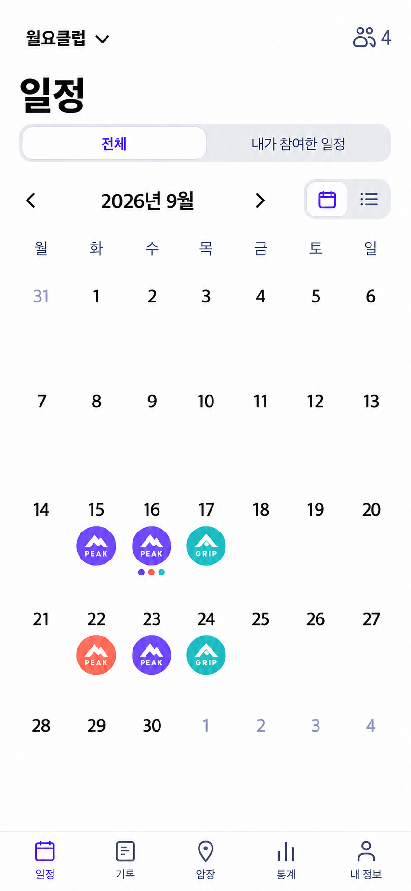

| 표시 | 뜻·동작 |
|---|---|
| 날짜 숫자만 있음 | 현재 크루·필터에 해당하는 일정 없음 |
| 도장 하나, 점 없음 | 일정 1개 |
| 도장 하나, 아래 점 2개 | 전체 일정 2개 |
| 도장 하나, 아래 `● + 2` | 전체 일정3개. 나머지2개이며 도장을 별도 일정으로 더하지 않음 |
| 도장 하나, 아래 `● + 3` | 전체 일정4개. 나머지3개이며 도장을 별도 일정으로 더하지 않음 |
| 대표 도장 | 그날 목록의 첫 일정에 지정된 브랜드 로고·지점 색상 |
| 각 점의 색 | 해당 일정의 지점 색상. 참여 여부·컨디션·페이지 번호가 아님 |
| 회색 위치 도장 / 회색 점 | 해당 일정의 암장이 미정. 취소·불참을 뜻하지 않음 |
| 흐린 날짜 숫자 | 앞뒤 달 날짜. 내 참석 상태와 무관 |
| 날짜 칸 누르기 | 01.03에서 해당 날짜 전체 일정과 생성 동작을 표시 |

#### 표시와 공간 규칙

- 일정·방문1개는 도장만, 2개는 점2개, 3개 이상은 대표 도장 아래 점1개와 나머지 개수를 한 줄로 표시한다. 점은 최대2개다. 도장은 별도 건수로 더하지 않는다.
- 축약 숫자는 `min(전체 개수 - 1, 99)`다. `● + 2`, `● + 12`, `● + 99`처럼 점·더하기·숫자 사이 간격을 각각4로 맞춘다.99는 ‘99개 이상 더 있음’을 뜻하며 실제 데이터는 줄이지 않는다. 날짜 시트·화면 읽기 안내는 정확한 전체 건수를 제공한다.
- 점은 해당 지점 색상, 암장 미정은 회색이다. 축약 점은 첫 항목의 색상을 쓰며 숫자는 보조색 글자다. 배경·테두리는 두지 않는다. 점6·글자11/14를 시안 기준으로 쓴다.
- 도장·점 순서는 날짜 목록 순서를 따른다. 크루·필터 변경 시 대표 도장·점·시트 총건수를 함께 갱신한다. 사람 수나 암장 수가 아니라 일정·방문 건수다.
- 날짜 숫자와 도장을 띄우고 고정 표시 영역 안에서 도장·점 줄을 가운데 정렬한다. 표시 영역은 약42×52 논리 픽셀을 기준으로 하되 실제 기기에서 조정한다. 점 없는 날도 같은 공간을 유지한다. 두 줄 표시나 칸 밖 돌출은 없다.
- 시간·긴 암장명·참여 인원·내 응답은 목록과 시트에 표시한다. 달력 칸에는 시간 문구를 넣지 않는다.
- 날짜 칸 전체가 하나의 누르기 영역이다. 도장·점은 별도 버튼이 아니다. 선택 테두리·배경 효과, 달력 아래 목록·범례·독립 생성 버튼은 없다.

[현재 일정 달력](https://www.figma.com/design/vla4pXPo8FaCWFXfpIbYzx/Holdlog?node-id=123-479) · [축약 부품 검증](history/figma/final-polish-2026-10-01.json). 최신 상태 사진은 [Figma 자료 안내](./figma/README.md)를 따른다.

#### 구현 확인 기준

- 가운데 날짜에 일정 3개를 두고 좌우 날짜와 바로 다음 주 날짜에도 도장을 배치했을 때 서로 겹치지 않는다.
- 작은 화면, 글자 확대, 6주 달력에서도 날짜·도장·점이 옆 칸이나 아래 칸을 침범하지 않는다.
- 0·1·2·3·4개 이상, 같은 지점의 여러 일정, 암장 미정, 필터 변경을 확인한다.
- 날짜를 누르면 표시된 전체 건수와 같은 일정 목록을 보여준다. 시안을 문서에 넣은 것은 실제 앱 검증을 마쳤다는 뜻이 아니다.

#### 가입 크루 없음 · 일정 안의 상태

[01.01.02 Figma 상태 시안](https://www.figma.com/design/vla4pXPo8FaCWFXfpIbYzx/Holdlog?node-id=529-31675) · [현재 사진](./figma/assets/no-crew-schedule-2026-10-02/no-crew.png). 기존 가입 화면으로 강제 이동하지 않고 일정 탭 안에 안내한다.

- 일정 안의 빈 상태로 처리한다. 별도 안내 화면으로 이동하지 않는다. 본문 안내는 공통 원본 인스턴스로 재사용한다.
- 로그인 후 크루 가입을 강제하지 않는다. 가입 크루가 없을 때 일정 탭 안에 이 상태를 보여준다.

- 연결 기능: S03. 가입한 크루가 없는 상태에서 일정 탭을 열면 표시한다.
- 목적: 빈 달력 대신 크루 생성·가입의 시작점을 안내한다.

| 요소 | 동작 |
|---|---|
| 크루 가입 | S02 초대 코드 입력(06.05) |
| 크루 만들기 | S24 크루 만들기(06.04) |
| 하단 메뉴 | 일정 / 기록 / 암장 / 통계 / 내 정보. 일정 활성화 |

- 가입 크루가 없으므로 상단 크루 이름·내 크루 버튼은 숨긴다. 제목은 일정만 표시한다. 범위 탭·월 이동·달력/목록 전환·달력도 숨긴다.
- 가입 크루가 없다고 확인된 경우에만 표시한다. 로딩·조회 실패·다시 시도 전체 화면을 추가하지 않는다.
- 일정 추가 버튼은 숨긴다. 중앙 안내와 크루 가입·크루 만들기 버튼을 제공한다.
- 개인 기록·통계·보관함은 계속 접근할 수 있다. 크루 가입·생성 성공 후 선택한 크루의 일정으로 이동한다.

### 01.02 일정 목록

- 연결 기능: S03
- 현재 시안: 일정 목록 v3
- 예시: 2026년 9월 28일 기준, 29일 한 일정과 30일 두 일정

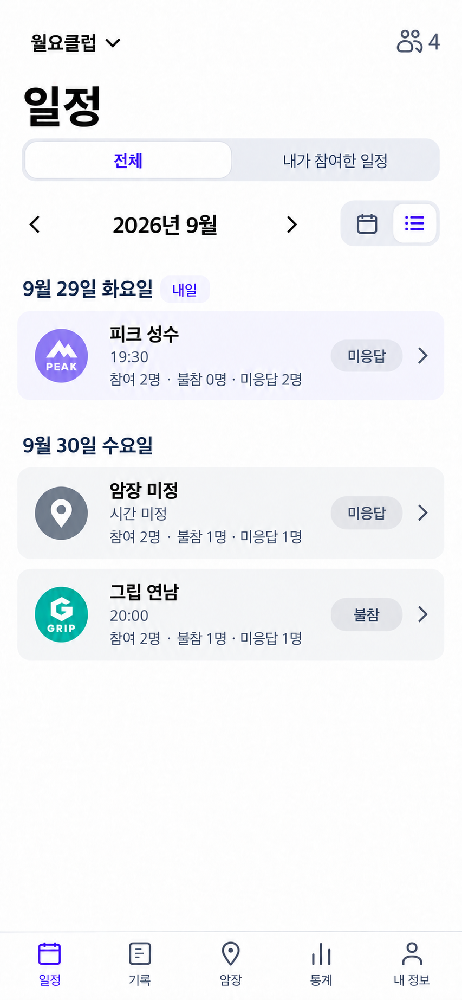

| 표시 | 의미·동작 |
|---|---|
| 월요클럽 ⌄ | 현재 크루. 누르면 S19-A 크루 선택창을 열고 행을 눌러 바로 전환 |
| 사람 아이콘 4 | 전체 크루원 수. 누르면 S20 회원 목록 |
| 전체 / 내가 참여한 일정 | 현재 크루의 모든 일정 / 본인이 참여로 신청한 일정. 불참·미응답 제외 |
| 2026년 9월·좌우 화살표 | 조회 월 변경 |
| 달력·리스트 아이콘 | 같은 월·필터를 유지하며 보기 전환 |
| 내일 | 현재 날짜 다음 날이라는 안내 |
| 로고·지점 이름 | 만날 장소. 실제 방문 증명이나 참석 여부가 아님 |
| 암장 미정·회색 위치 아이콘 | 아직 장소를 정하지 않음 |
| 19:30 | 필수 입력한 약속 시각을 기기 시간대로 표시 |
| 참여 2명 · 불참 0명 · 미응답 2명 | 참여 신청 인원. 실제 방문 참석 인원이 아님 |
| 참여 / 불참 / 미응답 | 내 신청 상태. 미응답은 아직 응답하지 않음, 불참은 참여하지 않겠다는 응답 |
| 항목·화살표 | S05 일정 상세로 이동. 신청 상태는 상세에서 변경 |
| 하단 보라색 일정 | 현재 선택한 주요 메뉴 |

내 상태는 작은 글자 배지로 표시하며 목록에서 바로 바꾸는 버튼이 아니다. 시간이 없는 일정은 저장할 수 없다. 종료·취소 일정은 해당 글자 상태로 구분하고, 종료된 일정은 기록 있음/없음도 확인할 수 있어야 한다.

### 01.03 날짜 일정 시트

- 연결 기능: S03-D, S04, S05
- 목적: 그날의 기존 일정 확인과 새 일정 생성

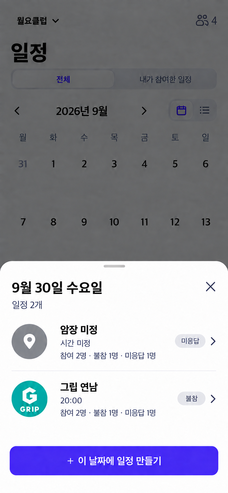

| 표시 | 의미·동작 |
|---|---|
| 9월 30일 수요일 | 누른 날짜 |
| 일정 2개 | 현재 필터에 해당하는 이 날짜의 일정 수. 동일 데이터의 달력에서는 대표 도장 아래 점 2개와 일치 |
| 암장 미정 | 날짜·시간은 정했고 암장만 아직 정하지 않은 일정 |
| 그립 연남 · 20:00 | 같은 날의 두 번째 일정 |
| 참여 2명 · 불참 1명 · 미응답 1명 | 각 일정의 신청 인원 |
| 미응답 / 불참 | 각 일정에 대한 내 신청 상태 |
| 항목·화살표 | S05 일정 상세 |
| 이 날짜에 일정 만들기 | S04로 이동. 9월 30일과 현재 크루를 기본값으로 전달 |
| ×·배경·아래로 끌기 | 시트를 닫고 원래 달력으로 복귀하는 기본안 |

- 일정이 없는 날짜도 같은 시트를 열어 ‘이 날짜에 일정이 없어요’와 생성 동작을 제공한다.
- 일정 항목은 한 번에 최대 2개만 보인다. 더 있으면 목록 안에서 세로 스크롤한다. 날짜·닫기·생성 버튼은 목록 밖에 두고 유지한다. 생성 동작은 시트 안에만 둔다.
- 생성 화면에서 날짜·시간은 필수이며 암장은 선택이다.
- 과거 날짜 신규 생성 제한은 기존 기본안 D02를 따른다. 과거 일정 조회는 가능하며 실제 방문 기록은 기록 메뉴에서 작성한다.
- 시트만 열거나 닫아서는 일정이 생성되지 않고 알림도 보내지 않는다.
-  달력을 표시할 때 현재 월·크루·필터의 일정 내용을 미리 불러온다. 날짜 시트는 받은 데이터를 사용하므로 별도 조회와 로딩·조회 실패 상태를 두지 않는다. 일정 있음·없음 상태만 표시한다.
- 참석자를 자동 확정하거나 운동 종료 버튼을 추가하지 않는다. 기존 일정 종료 정책을 유지한다.

#### 일정 화면 사이의 이동

| 시작 | 누르는 곳 | 다음 화면과 전달 정보 |
|---|---|---|
| 일정 달력 | 리스트 아이콘 | 일정 리스트. 크루·조회 월·필터 유지 |
| 일정 리스트 | 달력 아이콘 | 일정 달력. 크루·조회 월·필터 유지 |
| 일정 달력 | 일정이 있는 날짜 | 그 날짜 바텀시트. 날짜·전체 일정 수·일정 목록 표시 |
| 일정 달력 | 일정이 없는 날짜 | 빈 날짜 바텀시트. 안내와 ‘이 날짜에 일정 만들기’ 표시 |
| 날짜 바텀시트 | 기존 일정 항목 | S05 일정 상세. 선택한 일정으로 진입 |
| 일정 리스트 | 일정 항목 | 동일한 S05 일정 상세 |
| 날짜 바텀시트 | 이 날짜에 일정 만들기 | S04 생성 화면. 선택한 크루·날짜를 기본값으로 전달 |
| 일정 상세 | 참여·불참 | 해당 일정의 내 신청 상태 변경. 목록과 시트의 인원·내 상태도 갱신 |
| 일정 상세 | 더보기 → 일정 수정 → 암장 선택 | 권한 확인 후 검색·추천으로 선택하고 수정 화면에서 저장 |
| 일정 상세 | 일정 수정·취소 | 생성자·관리자 권한에 따라 처리. 관련 화면과 알림에 반영 |
| 일정 상세 | 방문 기록 만들기 / 보기 | 해당 일정에 연결된 공동 방문 생성 또는 조회 |

S04 생성은 01.04, S05 상세는 01.05에 화면 그림과 동작을 정리했다. S04 수정은 생성 화면의 입력 구성을 재사용한다. S06 암장 선택은 03.02에, 독립 지도와 암장 상세는 03.01·03.03에 정리했다.

#### 일정 화면의 빈 상태와 갱신

- 현재 월·크루·필터의 일정 내용은 달력에서 미리 불러온다. 최초 조회와 월·크루·필터 변경 중의 로딩·조회 실패·재시도는 데이터를 불러오는 달력·목록에서 처리한다. 조회 실패를 ‘일정 없음’으로 표시하지 않는다. 날짜 시트에는 별도 로딩·조회 실패·재시도 상태를 추가하지 않는다.
- 선택한 월·필터에 일정이 없으면 달력은 날짜만, 리스트는 일정이 없다는 안내를 보여준다. 달력 날짜에서 생성하는 경로는 유지한다.
- 일정을 생성·수정하거나 참여 신청을 바꾸고 돌아오면 달력·리스트·열린 날짜 시트의 정보를 갱신한다.
- 장소 미정인 일정도 정상적으로 보여준다. 참여 신청 수를 실제 방문 인원으로 표시하지 않는다.
- 날짜가 지나거나 연결 방문이 생성되어 종료되더라도 일정 조회는 유지한다. 일정의 별도 수동 종료 버튼은 두지 않는다.

**일정 데이터 예시:** 01.02와 같은 9월 30일 첫 `암장 미정` 일정은 `19:30 · 참석 · 참여 3명 / 불참 1명 / 미응답 0명`으로 표시한다. 두 번째 `그립 연남 · 20:00 · 불참`은 `참여 2명 / 불참 1명 / 미응답 1명`이다. 달력·목록·날짜 시트는 같은 일정 데이터를 사용한다.

 모든 항목의 배경은 흰색이고, 제목 → 시간 → 내 응답 → 전체 응답 인원 순으로 별도 줄에 표시한다. 참석은 보라색 체크와 ‘내가 참석해요’, 불참은 코랄색 ×와 ‘내가 불참해요’, 미응답은 회색 빈 원과 ‘아직 응답하지 않았어요’다. 01.02 목록의 참석 배경 규칙은 유지한다. 빈 날짜는 중앙 달력 그림·‘이 날짜에 일정이 없어요’·‘함께할 일정을 만들어 보세요.’를 묶는다. 너비390, 최대2개 표시와 내부 스크롤을 지킨다. 미응답 예시는 별도 전체 화면을 만들지 않고 같은 바텀시트 인스턴스만 복사한다. 예시에서 내가 참석을 미응답으로 바꾸면 첫 항목 인원은 참여2·불참1·미응답1로 함께 바뀐다.

### 01.04 일정 작성

- 연결 기능: S04. 날짜 바텀시트의 ‘이 날짜에 일정 만들기’에서 진입한다.
- 예시: 월요클럽의 2026년 9월 30일 수요일. 시간·암장·설명은 아직 입력하지 않았다.

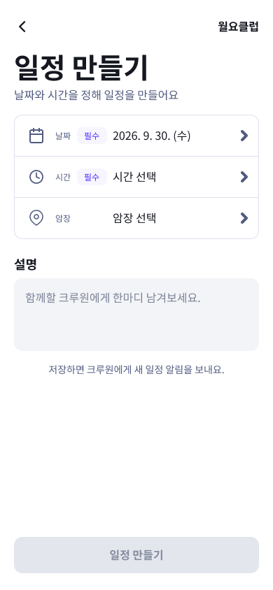

입력 폼: 날짜·시간·암장을 아이콘·제목·값·화살표의 세 행 테두리 묶음으로 표시한다. 날짜·시간에만 필수 배지를 붙이고 암장·설명의 선택 배지는 표시하지 않는다. 암장 미정 저장은 유지한다. ‘날짜와 시간을 입력하면 저장할 수 있어요’와 입력 묶음 밖의 시간대·암장 보조 문구는 표시하지 않는다. [수정 상태 사진](./figma/assets/schedule-form-2026-10-02/edit.png).

| 표시·입력 | 뜻·동작 |
|---|---|
| 뒤로 화살표 | 이전 날짜 시트로 돌아감. 저장 전에는 일정·알림이 생성되지 않음 |
| 월요클럽 | 생성 대상 크루. 편집 중 바뀌지 않는 안내이며 전환 버튼이 아님 |
| 날짜 · 필수 | 선택했던 날짜를 미리 채움. 누르면 날짜 변경 |
| 시간 + 공통 필수 배지 | 시간 선택. 입력 시간대로 해석해 저장하며 미입력은 저장 불가 |
| 암장 | S06 암장 검색·선택. 선택 배지 없이 표시하며 선택하지 않아도 저장 가능 |
| 설명 | 선택 배지 없이 자유 입력. 크루원에게 보여줄 내용이며 안내 문구 자체를 저장하지 않음 |
| 일정 만들기 | 필수 날짜·시간을 확인하고 저장. 성공 후 생성된 일정 상세로 이동하는 기본안 |
| 알림 안내 | 저장 성공 시 해당 크루원 모두에게 새 일정 알림 발송 |

- 날짜·시간을 필수로 입력한다. 제목·정원·초대 대상 등 별도 입력을 추가하지 않는다.
- 저장 중 중복 누르기는 동작으로 막으며 별도 저장 중 시안은 만들지 않는다. 문제가 생기면 입력을 유지하고 기존 화면 위 공통 다이얼로그로 처리한다.
- 생성만으로 작성자를 참여자로 자동 등록하지 않는 기존 기본안을 따른다. 생성 직후 상세의 내 신청 상태는 미응답이다.
- 암장을 고르는 단계에서는 참여자가 아직 없으므로 검색 중심이다. 참여 신청 후 일정 수정의 암장 선택에서 참여자 기반 추천을 사용한다.
- 작은 화면·키보드 표시 때 입력 영역은 스크롤한다. 저장 버튼이 입력 내용을 가리지 않게 아래 여백을 둔다.
- 수정 화면은 같은 필드를 사용하되 기존 값을 채우고 제목은 ‘일정 수정’, 버튼은 ‘저장’으로 바꾼다. 수정 권한과 알림은 S04를 따른다.

### 01.05 일정 상세

- S05. 일정 리스트·날짜 바텀시트에서 진입한다.
- 예시: 9월 29일 피크 성수 19:30. 민수는 작성자이며 아직 응답하지 않았다.

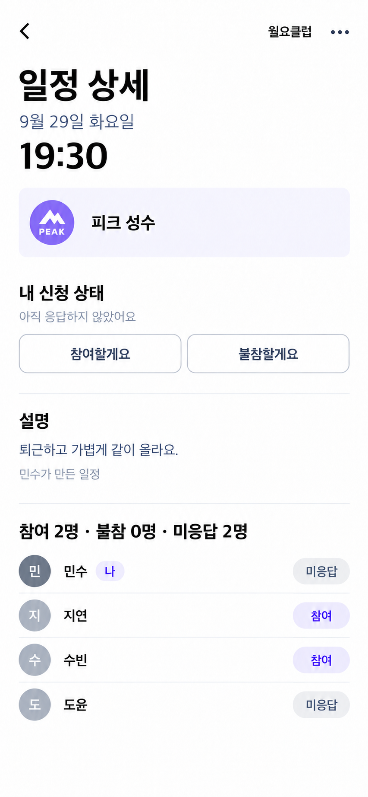

#### 일정 응답과 수정 — 현재 기준

- 선택지는 **참여 / 불참**이다. 아직 선택하지 않은 초기 상태는 **미응답**이며 직접 선택하는 항목이 아니다. 암장의 미정과 구분한다. 시간은 필수 입력이다.
- 내 신청 상태는 상세의 약속 정보 바로 아래, 설명·명단보다 위에 둔다. 미응답이면 둘 다 선택되지 않는다.
- 별도 신청 취소 버튼은 없다. 참여하지 않게 되면 불참으로 바꾼다. 다시 미응답으로 돌리는 버튼은 없다.
- 암장 지정·변경은 **더보기 → 일정 수정 → 암장 선택 → 저장**에서 한다. 상세의 암장 영역에는 변경 버튼을 두지 않는다. 작성자·관리자만 수정한다.
- 수정 화면에서 암장을 고르면 검색·현재 참여자 기반 추천을 사용한다. 저장 전에는 실제 일정과 알림에 반영하지 않는다.
- 추천과 참여자 대상 알림에는 참여 응답자만 포함한다. 새 일정 알림은 전체 크루원에게 보낸다. 실제 방문 참석 여부는 방문 기록에서 별도로 관리한다.
- 리스트·날짜 시트·상세 모두 참여·불참·미응답으로 표시한다. 참여·불참은 선택한 응답이고 미응답은 아직 응답하지 않은 상태다.

| 표시 | 의미·동작 |
|---|---|
| 날짜·시간·암장 도장 | 약속 정보. 방문 완료를 의미하지 않음 |
| 참여할게요 / 불참할게요 | 본인의 응답을 즉시 저장. 실패 시 이전 상태를 유지하고 안내 |
| 설명·작성자 | 크루원에게 공유한 설명과 일정을 만든 사람 |
| 참여 2명 · 불참 0명 · 미응답 2명 | 응답별 인원. 실제 방문 참석 인원이 아님 |
| 명단의 상태 배지 | 회원의 현재 응답. 타인 상태를 바꾸는 버튼이 아님 |
| 더보기 | 변경 이력, 권한에 따른 일정 수정·일정 취소 |

- 명단이 길면 세로로 스크롤한다. 내 응답은 약속 정보 바로 아래에 유지한다.
- 미래 일정에는 방문 기록 생성 버튼이 없다. 기록 작성 가능한 날짜에 연결 방문이 없으면 만들기, 있으면 보기를 제공한다.
- 날짜 경과·연결 방문 생성에 따른 종료, 취소 상태 및 권한은 S05를 따른다. 수동 종료 버튼은 없다.
- 일정 취소 확인창01.05.04는 왼쪽 ‘일정 유지’(창만 닫기), 오른쪽 빨간색 ‘일정 취소’(실제 취소 처리)로 표시한다. 두 버튼에 ‘취소’가 반복돼 뜻이 헷갈리지 않도록 구분한다.

#### 내 응답 버튼 표시

‘참여할게요’와 ‘불참할게요’는 간격을 둔 독립 버튼 두 개다. 하나의 스위치나 붙어 있는 전환 영역으로 만들지 않는다.

| 상태 | 안내·버튼 표시 |
|---|---|
| 미응답 | ‘아직 응답하지 않았어요’. 두 버튼 모두 흰 바탕·회색 테두리·진한 회색 글자. 둘 다 활성 상태이며 아무것도 선택하지 않음 |
| 참여 | ‘참여로 응답했어요’. 참여 버튼에 보라색 테두리·글자·연한 보라색 바탕과 체크 표시. 불참 버튼은 기본 모양 |
| 불참 | ‘불참으로 응답했어요’. 불참 버튼에 같은 보라색 강조와 체크 표시. 참여 버튼은 기본 모양 |

다른 버튼을 누르면 응답을 변경한다. 이미 선택한 버튼을 다시 눌러도 응답을 해제하지 않는다. 저장 중에는 중복 요청을 막고 실패하면 이전 응답을 유지한다. 색상 외에도 안내 문구·체크·접근성 선택 상태로 현재 응답을 알려준다. 미응답은 선택지가 아니며 별도 신청 취소는 없다.

#### 두 화면의 공통 디자인

흰 바탕, 검은 굵은 제목, 회색 보조 글씨, 연한 회색 입력 영역, 보라색 주요 동작을 기존 일정 화면과 공유한다. 뒤로 이동하는 하위 화면에서는 하단 메뉴를 숨기는 구성이다. 생성 버튼은 기존 날짜 시트의 보라색 버튼을, 신청 상태 선택은 간격을 둔 독립 테두리 버튼 두 개를 사용하며, 응답 후 선택한 버튼만 보라색으로 강조한다. 시안 속 예시 로고는 실제 구현에서 등록된 원본 자산으로 통일한다.

## 02 기록

### 02.01 기록 달력

**운동 중 표시줄 · 2026-10-06 확정:** 달력·도장 위에 겹쳐 표시해도 괜찮다. 표시줄 때문에 달력을 줄이거나 화면 높이를 늘리지 않는다. 기존390×844 화면에서 목록과 같은 위치(20,709),350×52로 표시하며 하단 메뉴와24 간격을 유지한다. 운동이 끝나면 표시줄을 숨긴다.

- Figma 제작: [02.01.01 기본](https://www.figma.com/design/vla4pXPo8FaCWFXfpIbYzx/Holdlog?node-id=424-6062) · [390 검수](./figma/assets/record-views-2026-10-01/424-6062.png). 상태별 번호는 [번호표](./screen-numbering.md)를 따른다.

- 연결 기능: S08 기록 화면
- 상태: 통합 구성은 PRD·S08 기준. 이미지는 시각 검토 자료이며 하단 5개 메뉴를 반영했다
- 목적: 내 운동과 현재 크루의 방문을 한 달 단위로 확인

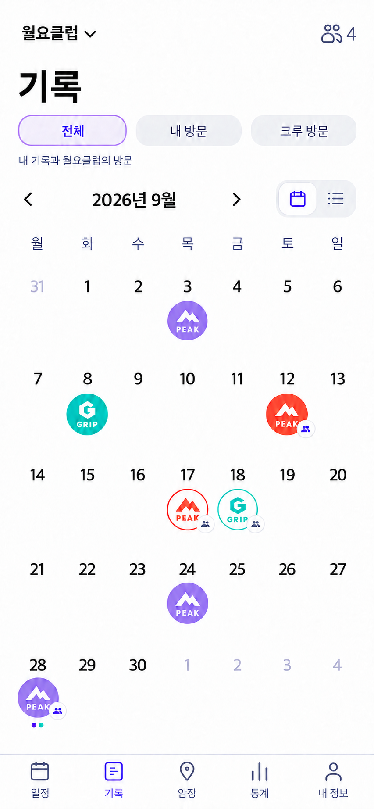

#### 위에서 아래로 읽기

| 위치·표시 | 보여주는 것 | 눌렀을 때 |
|---|---|---|
| `월요클럽 ⌄` | 현재 크루 이름과 선택창 표시 | S19-A 선택창 → 크루 행 누르기 → 현재 화면에서 즉시 전환 |
| 사람 아이콘 `4` | 현재 크루 회원 4명 | 크루원 목록 S20 |
| `기록` | 기록 메뉴 제목 | 제목 자체에는 동작 없음 |
| `전체 / 내 방문 / 크루 방문` | 표시할 방문 범위 | 같은 달 안에서 결과를 걸러 표시 |
| `2026년 9월`과 좌우 화살표 | 현재 보고 있는 월 | 이전 달·다음 달 |
| 달력·목록 아이콘 | 현재 보기 방식 | 같은 월과 필터를 유지하며 02.02로 전환 |
| 보기 전환 오른쪽 필터 버튼 | 기본 회색 / 적용 시 연보라 배경의 ‘필터 N ×’ | 글자: 필터 선택 / ×: 추가 조건 즉시 해제 |
| 날짜 숫자와 도장 | 그날의 방문 | 02.03 날짜 바텀시트 열기 |
| 도장 아래 점 2개 | 전체 방문 2건 | 해당 날짜 바텀시트 열기. 별도 생성 버튼 아님 |
| 하단 일정·기록·암장·통계·내 정보 | 앱의 주요 메뉴 | 해당 메뉴로 이동 |

#### 필터 범위

| 필터 | 표시 대상 |
|---|---|
| 전체 | 본인의 전체 개인 기록 + 현재 선택한 크루의 공동 방문. 연결된 같은 방문은 한 번만 표시 |
| 내 방문 | 계정 전체의 저장된 개인 기록만 표시. 크루에 연결된 내 기록은 포함하며 개인 기록 없는 참석은 제외 |
| 크루 방문 | 현재 선택한 크루의 공동 방문. 본인의 참석 여부와 무관 |

크루를 바꾸면 공동 방문 범위가 바뀌고, 내 개인 기록은 계정 기준으로 유지한다. 다른 크루의 공동 메모·참석 명단·미디어는 이 화면에 노출하지 않는다. 다른 크루에 연결된 내 개인 기록은 소유자의 개인 기록으로 볼 수 있지만, 현재 크루의 방문이라고 표시하지 않는다. 실제 참석만 있고 개인 기록이 없는 건은 개인 통계에 더하지 않는다. 날짜 시트에는 참석 인원만 표시하고 크루 방문 상세의 내 이름을 선택해 작성·기존 기록 연결을 시작한다(B03).

전체 필터에서 현재 크루 방문과 합친 연결 항목은 공동 시각으로 표시하고, 합치지 않은 개인 기록은 개인 시각으로 표시한다. 크루 방문 필터는 공동 시각, 내 방문·개인 통계는 개인 시각을 사용한다. 각 시각을 기기 시간대로 바꾼 뒤 날짜를 정하며 달력의 점·건수·날짜 시트·리스트에 같은 기준을 적용한다. 연결 항목의 대표 시각을 먼저 정한 뒤 기간을 걸러 월 경계에서 중복·누락되지 않게 한다. 내 방문에는 계정 전체의 저장된 개인 기록만 포함한다. 개인 기록 없는 참석은 실제 참석 인원에만 포함하며 반복 연결 안내 문구를 표시하지 않는다. 시간대 변환으로 두 기록의 표시 날짜가 다르면 상세에서 공동 방문 시각과 내 방문 시각을 구분해 보여준다.

#### 달력 동작

- 날짜 칸 전체를 누를 수 있다. 작은 로고나 점만 정확히 누를 필요가 없다.
- 날짜 선택 테두리·배경 효과는 없다. 바텀시트 제목으로 어떤 날을 열었는지 알 수 있다.
- 달력 아래에 날짜별 방문 카드나 암장 범례를 다시 붙이지 않는다.
- 기본 화면에는 `기록 남기기`, `+` 추가 버튼이 없다.
- 도장은 실제 방문만 나타내며 예정 일정은 일정 메뉴에서 관리한다.
- 여러 방문은 대표 도장 아래 점으로 표시한다. 필터에 따라 전체 방문 수와 점을 함께 갱신한다. 도장·점·참석 문구는 자기 날짜 칸 안에 둔다.
- 대표 도장과 점은 [공통 달력 규칙](#231-표시와-공간-규칙)에 따라 날짜 목록 순서를 사용한다.

### 02.02 기록 목록

- Figma 제작: [02.02.01 기본](https://www.figma.com/design/vla4pXPo8FaCWFXfpIbYzx/Holdlog?node-id=424-6398) · [390 검수](./figma/assets/record-views-2026-10-01/424-6398.png). 상태별 번호는 [번호표](./screen-numbering.md)를 따른다.

- 연결 기능: S08 기록 화면의 목록 보기
- 달력과 같은 ‘기록’ 제목, ‘전체 / 내 방문 / 크루 방문’ 필터, 월 이동, 보기 전환·그 오른쪽 필터 버튼, 하단 메뉴를 사용한다. 내용 영역만 달력에서 날짜별 리스트로 바뀐다.

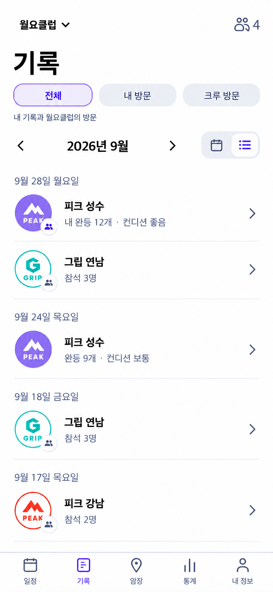

#### 달력과 공통 표시

- 전체·내 방문·크루 방문은 일정과 같은 연결된 탭 모양을 쓴다. 연회색 바탕·모서리12 안에 선택한 탭의 흰 면과 보라색 글자를 표시한다. 제목과 탭 사이 간격은12다. 필터 버튼은 달력·목록 보기 전환 오른쪽에 둔다. 범위·빈 기간 안내 문구는 표시하지 않는다.
- 보기 전환은 회색 바탕 안 흰 선택 면과 보라색 아이콘을 사용한다. 리스트에서는 오른쪽 목록 아이콘이 선택된다.
- 도장·사람 표시는 [공통 참석 표시](#122-현재-통합-달력-시안의-도장-읽는-법)를 따른다.
- 시안은 달력과 같은 방문 데이터를 사용한다. 28일은 두 방문을 같은 날짜 아래 펼치고, 24일 개인 방문, 18·17일 크루 방문을 보여준다. 더 아래로 스크롤하면 나머지 월 기록이 나온다.
- 참석하지 않은 방문에는 내 완등·컨디션을 만들어 넣지 않고 실제 참석 인원을 표시한다. ‘크루’, ‘내 참석’이라는 도장 아래 반복 문구는 넣지 않는다.
- 월·크루·필터를 유지한 채 달력과 리스트를 전환한다. 연결된 개인 기록과 공동 방문은 한 번만 표시한다.

| 방문 종류 | 행에 표시할 내용 | 누르면 |
|---|---|---|
| 내 개인 방문 | 날짜, 브랜드 로고·지점, 내 완등 개수·컨디션 | 내 기록 S12 |
| 내가 참석한 현재 크루 방문 | 사람 아이콘·채운 도장, 내 기록 요약 | 공동 방문 S10으로 이동. 본인 참석자 행에서 개인 기록 S12 열기 |
| 내가 불참한 현재 크루 방문 | 사람 아이콘·테두리 도장, 실제 참석 인원 | 공동 방문 S10. 내 완등·컨디션을 만들어 표시하지 않음 |

- 월 전체를 최신 날짜부터 보여주고, 같은 날의 방문은 같은 날짜 아래 묶는다.
- 연결된 개인·공동 방문은 한 행에 함께 표시한다. 같은 방문을 두 행으로 반복하지 않는다.
- 미입력 완등·컨디션은 `미입력`이며 0개·보통으로 대신 채우지 않는다.
- 스크롤하면 같은 월의 나머지 기록이 나온다. 다른 달은 월 전환으로 조회한다.
- 목록에는 독립 추가 버튼이 없다. 새 기록은 달력 날짜 → 바텀시트에서 시작한다.
- 빈 월은 안내 문구 없이 빈 목록을 보여준다. 달력은 날짜 격자를 유지한다. 기록 달력·목록의 조회 실패·재시도 상태는 제작하지 않는다.

### 02.03 날짜 기록 시트

- Figma: [기본 화면](https://www.figma.com/design/vla4pXPo8FaCWFXfpIbYzx/Holdlog?node-id=430-12403) · [상태별 번호·링크](./screen-numbering.md).

- 연결 기능: S08-D 날짜 바텀시트
- 상태: 통합 구성은 PRD·S08 기준. 이미지는 시각 검토 자료이며 하단 5개 메뉴를 반영했다
- 목적: 하루의 기존 방문 확인과 새 기록 작성

01.03.02 일정 없음과 같은 공통 달력 그림48×48·중앙 굵은 제목을 사용한다. 문구는 ‘이 날짜에 기록이 없어요’이며 기록 작성 버튼을 유지한다. 새 보조 안내는 추가하지 않는다. 빈 상태 묶음은350×136, 시트 안 위치는(20,100)이다. 월 달력·목록의 빈 기간 문구를 생략하는 규칙과는 별개다. [수정 후 사진](./figma/assets/record-day-empty-2026-10-02/record.png) · [검증 기록](history/figma/record-day-empty-2026-10-02.json).

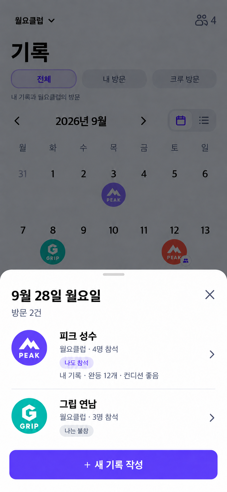

#### 표시와 동작

| 위치·표시 | 의미 | 눌렀을 때 |
|---|---|---|
| 어두워진 달력 | 시트가 열려 배경 조작이 잠긴 상태 | 바깥 영역을 누르면 닫기 |
| 상단 짧은 회색 선 | 아래로 끌어 닫을 수 있다는 표시 | 아래로 끌면 닫기 |
| `9월 28일 월요일` | 사용자가 누른 날짜 | 안내 제목 |
| `방문 2건` | 이 날짜에서 현재 필터에 포함되는 방문 수 | 안내 문구. 운동 2일이라는 뜻 아님 |
| `×` | 닫기 | 같은 월·필터의 달력으로 복귀 |
| 피크 성수 | 첫 번째 공동 방문 | 공동 방문 상세 S10 |
| `내 기록 · 완등 12개 · 컨디션 좋음` | 현재 크루 방문에 연결된 내 기록이 있을 때 표시 | 내 기록 상세02.05. 참석 인원·크루 이름·연결 안내는 함께 표시하지 않음 |
| 그립 연남 | 같은 날의 두 번째 공동 방문 | 공동 방문 상세 S10 |
| `3명 참석` | 현재 크루 방문에 연결된 내 기록이 없을 때 실제 참석 인원 | 공동 방문 상세. 크루 이름은 반복하지 않음 |
| `기록 작성` | 같은 날짜의 새 기록 작성 시작 | 종류 선택 다이얼로그 열기. 개인 기록 작성 / 크루 방문 등록 선택 후02.04 / 02.06으로 날짜 전달 |

첫 번째 항목은 공동 방문과 내 기록을 함께 보여주는 **방문 1건**이다. 총 2건이므로 달력에서는 도장 아래 점 2개로 표시한다. 참석자 4명+3명을 합쳐 7개의 방문으로 계산하지 않는다. 이 화면의 ‘방문 2건’과 개인 통계의 방문 횟수는 서로 다른 범위일 수 있다. 이 예시에서 내가 참석한 것은 첫 방문뿐이다.

#### 날짜 상태별 모습

| 상태 | 바텀시트 |
|---|---|
| 기록 없음 | 날짜, 공통 달력 그림과 `이 날짜에 기록이 없어요`, `기록 작성` |
| 방문 1건 | 해당 방문 한 항목, `기록 작성` |
| 방문 여러 건 | 방문 목록·건수, `기록 작성`. 목록이 길면 내부 스크롤 |
| 연결된 내 기록의 운동 수치 미입력 | 내 기록 요약에 미입력 표시. 실제 참석 등록만 있고 개인 기록 자체가 없으면 참석 인원만 표시 |
| 내 기록 없음 | 현재 크루의 실제 참석 인원만 표시. 기록 연결 안 됨·연결하기 문구 없음 |
| 미래 날짜 | 달력 날짜 칸 선택 불가. 시트·안내 화면을 열지 않음 |

#### 통합 화면에서 새 기록 종류 선택

날짜 시트 하단에는 **기록 작성** 버튼 하나를 둔다. 누르면 가운데 다이얼로그에서 **개인 기록 작성 / 크루 방문 등록**을 고른다. 선택 후 각각02.04 / 02.06으로 선택한 날짜와 현재 크루를 전달한다. 닫으면 원래 날짜 시트로 돌아가며 기록은 생성하지 않는다. 미래 날짜는 달력에서 선택 자체를 막으므로 날짜 시트나 안내 화면을 만들지 않는다. [다이얼로그 상태02.03.04](https://www.figma.com/design/vla4pXPo8FaCWFXfpIbYzx/Holdlog?node-id=434-17009). 필터로 작성 종류를 정하지 않는다. 달력에서 미리 받은 방문 데이터를 쓰며 날짜 시트에 별도 조회·로딩·조회 실패 상태를 추가하지 않는다.

일정에서 시작한 방문 기록은 이미 해당 일정·크루가 정해져 있으므로 기존 명세 흐름을 유지한다.

 날짜 시트는 현재 크루를 기준으로 한다. 해당 크루 방문에 연결된 내 기록이 있으면 내 기록 요약만, 없으면 실제 참석 인원만 표시한다. 같은 날짜·암장이라는 이유로 다른 크루나 독립 기록을 내 기록으로 합치지 않는다. 크루 이름·기록 연결 안 됨 문구는 이 시트에 넣지 않는다.

### 02.04 개인 기록 작성

기존 입력 폼과 함께 [운동 중 빠른 기록](./workout-recording-spec.md)을 제공한다. 운동 화면은02.13.01이며 기록 달력·목록에 운동 중 표시줄을 표시한다.

- Figma: [기본 화면](https://www.figma.com/design/vla4pXPo8FaCWFXfpIbYzx/Holdlog?node-id=430-12607) · [상태별 번호·링크](./screen-numbering.md).

D05 확정: 파일을 추가할 때는 기기 안의 미리보기만 표시하며 업로드하지 않는다. 기록 저장 버튼을 누르면 업로드를 시작한다. 작성 중에는 ‘업로드 완료’를 표시하지 않는다. 저장 이후의 파일 상태는 기록 자체의 저장 상태와 구분한다. 업로드 실패는 중앙 다이얼로그로만 알린다. 사진 위에 실패 색상·테두리·아이콘·문구를 넣지 않는다. 다이얼로그는 ‘업로드 실패’ 제목과 ‘다시 시도 / 닫기’를 표시한다. 다시 시도는 실패한 파일만 다시 올리며, 닫기·×는 다이얼로그만 닫고 기록·첨부를 유지한다. 별도 긴 설명은 넣지 않는다.

입력·첨부 표시: 제목 옆 사람 추가 아이콘과 작성·수정 화면의 상단 더보기 버튼을 제거한다. 날짜·시간·암장은 크루 방문 등록과 같은 공통 입력 묶음으로 표시한다. 암장 입력 행은 공통 위치 아이콘과 선택한 지점명 또는 ‘암장 선택’으로 표시한다. 입력 행에 도장을 넣지 않는다. 필수 입력은 현재 화면과 같은 공통 ‘필수’ 배지로 표시한다. 난이도 원과 글자는 세로 가운데, 컨디션 다섯 칸은 같은 폭과 가운데 정렬로 맞춘다. 컨디션 글자는12로 표시한다. 선택 글자는 공통 보라색으로 표시한다. 작성 첨부와 추가 칸은104×104 정사각형으로 통일하며 사진은 원본 비율을 유지해 잘라 표시한다. 파일별 공개 / 비공개 버튼은 썸네일 안쪽 아래에 배치해 별도 아래 줄을 만들지 않는다. 후기 공개 선택도 같은 공통 버튼으로 표시한다. 사진·영상의 공개 선택 버튼은 눈·자물쇠 아이콘만 표시한다. 버튼은24×24 원형이며 아이콘14을 가로·세로 가운데 정렬한다. 썸네일 오른쪽 아래에 가장자리4를 두고 배치하며 배경 불투명도는88%다. 글자·화살표는 없다. 후기의 공개 선택은 기존 아이콘·공개/비공개 글자·화살표 버튼88×24를 유지한다. 상세 사진·영상도 공개·비공개 아이콘만 표시하며 후기의 글자 표시는 유지한다. ‘후기 공개는 파일과 따로 선택해요’ 등 반복 설명은 표시하지 않는다.

- 연결 기능: S12. 달력 날짜 → 날짜 바텀시트 → 새 개인 기록에서 진입한다. 별도 떠 있는 기록 추가 버튼은 없다.
- 예시: 2026년 9월 28일 19:00, 피크 성수와 완등 개수·컨디션·사진을 입력한 상태다. 월요클럽 방문에서 시작한 작성이며 날짜·암장은 비활성으로 표시한다. 최초 기본값이 아니다.

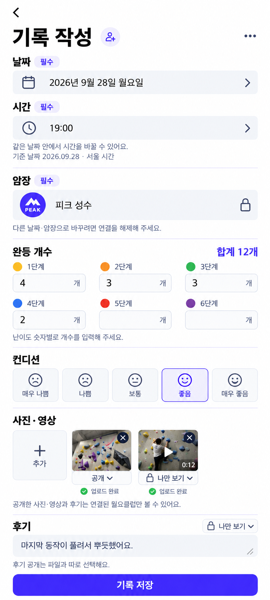

| 입력·동작 | 설명 |
|---|---|
| 날짜 + 공통 필수 배지 | 독립 작성은 선택 가능. 크루 방문에서 작성하거나 연결된 기록을 수정할 때 날짜는 비활성·자물쇠로 표시하고 변경을 막음. 제한 설명 문구는 표시하지 않음 |
| 시간 + 공통 필수 배지 | 실제 방문 시각 입력. 크루 방문에서 시작하면 공동 시각을 미리 채워 확인. UTC 저장·기기 시간대 표시. 연결 중에도 본인이 시간을 수정할 수 있으나 공동 방문의 저장 시간대에서 같은 날짜여야 함. 날짜가 바뀌면 연결 해제 후 수정 |
| 암장 + 공통 필수 배지 | 독립 작성은 검색·선택. 크루 방문에서 작성 시 대상 암장으로 고정. 연결 중 변경은 연결 해제 후 가능. 기록 작성에는 추천 없음 |
| 완등 개수 | 선택한 지점의 브랜드 난이도 순서로 색상·이름·숫자 입력. 숫자 키패드 사용 |
| 합계 | 입력한 개수의 합. 모두 비어 있으면 ‘미입력’, 일부 입력이면 입력한 값의 합계 |
| 컨디션 | 5단계 중 하나 선택. 선택한 항목을 다시 누르면 해제하는 기본안 |
| 사진·영상 추가 | 기기에서 선택해 로컬 미리보기만 표시. 업로드는 기록 저장 때 시작. 작성 중 업로드 완료 표시 없음. 앱에 이미 올린 파일·보관함에서 가져오기 없음 |
| 첨부의 × | 새 선택 파일은 업로드 대상에서 제거. 기존 개인 첨부는 제거 후 저장 성공 시 파일과 공유까지 삭제. 편집 취소·저장 실패 시 기존 파일 유지 |
| 메모 | 개인 후기 자유 입력. 안내 문구는 저장하지 않음 |
| 파일 공개 설정 | 사진·영상 파일별 공개 / 비공개 선택. 공개 파일도 이 기록이 연결된 크루만 조회. 후기 공개 선택은 별도로 제공. 시안은 사진 공개·영상 비공개·후기 비공개의 조합을 표시 |
| 기록 저장 | 날짜·시간·암장과 입력값을 검증하고 저장. 성공 후 해당 기록 상세로 이동하는 기본안 |

- 빈 완등 칸과 0은 다르다. 새 기록의 칸은 비워 두며, 입력값은 0 이상의 정수다. 시안의0은 사용자가 직접 입력한 예시다.
- 컨디션도 처음에는 선택하지 않는다. 기준은 사용자가 정하며 운동 전·후로 제한하지 않는다.
- 사진·영상·메모·완등·컨디션은 선택이다. 날짜·시간·암장만으로 저장할 수 있다.
- 같은 문제를 반복해 푼 횟수를 포함할지는 사용자가 정한다. 앱은 문제를 자동 식별하지 않는다.
- 저장 중 중복 누르기를 막고, 실패하면 입력을 보존한다. 업로드 실패는 공통 다이얼로그로만 표시한다. 다이얼로그의 다시 시도는 실패한 파일만 다시 올리며 닫으면 기록·첨부를 유지한다. 썸네일에 실패 효과·아이콘·문구나 별도 재시도·제거 버튼을 추가하지 않는다.
- 작은 화면·많은 난이도·키보드 표시에서는 세로로 스크롤한다. 저장 버튼과 키보드가 입력칸을 가리지 않도록 여백과 위치를 조정한다. 시안의 메모 칸 모서리 모양은 크기 조절 기능을 뜻하지 않으며 실제 앱에서는 일반 여러 줄 입력칸으로 구현한다.
- 수정은 같은 폼에 기존 값을 채우고 제목을 ‘기록 수정’으로 바꾼다. 개인 내용은 본인만 편집한다. 연결된 공동 방문의 날짜·시간·암장은 변경할 수 없다. 개인 기록은 같은 공동 기준 날짜 안에서 시간을 바꿀 수 있다. 공동 기준 날짜나 암장을 바꾸려면 본인이 연결을 해제한다(B01).
- 독립 개인 기록의 암장을 본인이 변경해 난이도가 달라지면 기존 개수·난이도를 보존하고 수정할 내용을 확인한다. 공동 수정으로 개인 암장·난이도를 자동 변경하지 않는다.
- 공동 방문에서 내 기록을 작성해도 별도 폼을 만들지 않는다. 기존 기록 연결이 필요한 경우 S11을 먼저 거친다. 크루 방문에서 시작한 작성은 본인 저장 시 해당 방문에 연결하며, 독립 작성은 자동 연결하지 않는다.

### 02.05 개인 기록 상세

- Figma: [기본 화면](https://www.figma.com/design/vla4pXPo8FaCWFXfpIbYzx/Holdlog?node-id=430-13478) · [상태별 번호·링크](./screen-numbering.md).

- 연결 기능: S12. 내 방문 행 또는 공동 방문의 내 기록에서 같은 상세 화면을 연다.
- 예시: 9월 28일 피크 성수, 완등 총 12개·컨디션 좋음. 월요클럽 방문에 연결된 본인 기록이다.

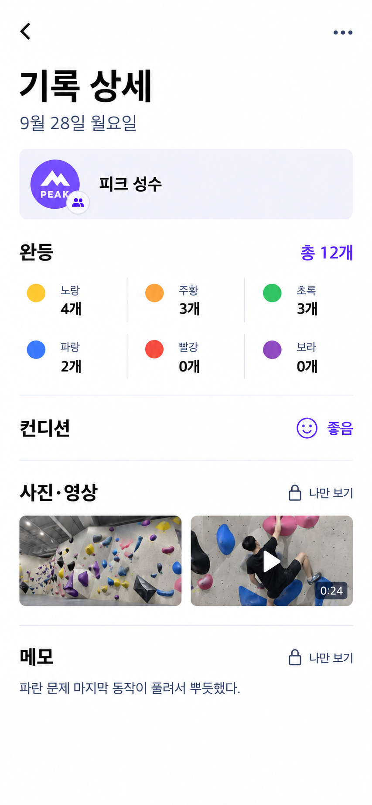

| 표시 | 의미·동작 |
|---|---|
| 뒤로 | 진입한 목록·날짜 시트·공동 방문으로 복귀 |
| 더보기 | 본인 기록 수정·삭제, 연결된 크루 방문 보기 / 연결 해제, 개인 기록의 변경 이력은 저장하지 않음. 삭제는 개인 기록·공동 연결·본인 첨부 파일을 제거하고 해당 파일 공유도 해제. 실제 참석 명단은 유지(B02 확정) |
| 날짜·피크 성수 도장 | 실제 방문 날짜·암장. 지점 색상과 브랜드 원본 로고 사용 |
| 사람 배지·채운 도장 | 내가 참석한 크루 방문에 연결된 기록 |
| 더보기 → 연결된 크루 방문 보기 | 연결된 공동 방문 S10의 참석자·공동 정보를 확인. 연결된 방문과 조회 권한이 있을 때만 표시하며 본문에 별도 이동 행을 두지 않음 |
| 완등 · 총 12개 | 입력한 난이도별 완등 개수의 합계 |
| 색상·이름·개수 | 해당 브랜드의 난이도 체계 순서. 시안은 흰색·노랑·주황·초록·파랑·빨강·핑크·보라·회색·갈색·검정의11색 예시. 실제 브랜드의 난이도는 별도 |
| 컨디션 · 좋음 | 사용자가 고른 5단계 중 저장된 값. 상세에서는 읽기 전용 |
| 사진·영상 | 사진은 확대 보기, 영상은 재생. 썸네일은169×169, 작성과 같은1:1 비율·원본 비율 유지 자르기. 두 열 배치, 공개·비공개 아이콘24는 오른쪽 아래 가장자리4. 개수에 따른 가로 스크롤·전체 보기를 제공하는 기본안 |
| 메모 | 개인 후기와 공개 / 비공개 상태. 내용·공개 선택 수정은 더보기의 기록 수정에서 수행 |
| 파일 공개·비공개 표시 | 파일별 공개 상태 표시. 공개는 눈, 비공개는 자물쇠 아이콘을 사진 오른쪽 아래에 표시. 사진 아래 공개 문구 없음 |

- 색상만으로 난이도를 구분하지 않고 등록된 이름과 숫자를 함께 표시한다. 11개 예시 입력값은0+4+3+3+2+0+0+0+0+0+0=12다.
- 예시의 0개는 사용자가 명시적으로 입력한 값이다. 미입력은 ‘미입력’으로 구분하고 임의로 0을 넣지 않는다. 완등 전체가 미입력이면 합계도 ‘미입력’이다.
- 컨디션 미선택은 ‘미입력’이다. 상세에서 기준을 강제하거나 자동 평가하지 않는다.
- 사진·영상·메모가 없으면 내용을 만들어 넣지 않고 간단한 빈 상태를 표시한다. 기록 수정에서 추가할 수 있다.
- 길어진 메모·미디어·많은 난이도는 스크롤로 확인한다. 하위 상세 화면이므로 하단 메뉴와 독립 저장 버튼은 두지 않는다.
- 날짜·암장·완등·현재 컨디션은 기존 공개 규칙을 따른다. 다른 크루원이 보는 S13에는 현재 조회 크루에 연결된 기록의 공개 미디어만 표시하고 비공개 미디어·수정·개인 이력은 노출하지 않는다. 현재 크루 방문에 연결되어 있고 공개로 선택한 개인 후기만 보여준다. 다른 크루의 후기·개인 이력까지 공개하지 않는다. 분리된 본인 전용 기록은 기존 예외 정책을 따른다.
- 이 그림은 본인 기록 S12다. 공동 방문 자체의 상세 S10 또는 다른 회원 공개 상세 S13의 화면으로 사용하지 않는다.

### 크루 방문 화면 모아보기

크루 방문은 아래 세 화면을 현재 디자인 기준으로 사용한다. 흰 바탕·보라색·브랜드 도장은 기록 달력과 공유한다. 날짜·암장은 짧은 행으로 묶고, 선택한 참석자는 작은 프로필·이름 묶음으로 표시한다.

| 화면 | 그림과 동작 설명 | 핵심 구성 |
|---|---|---|
| 크루 방문 등록 | [02.06 등록](#screen-02-06) | 날짜·암장, 함께 간 사람, 공동 사진·영상·메모, 방문 등록 |
| 참석자 검색 | [02.07 검색](#screen-02-07) | 이름 검색 → 선택한 사람 확인 → 추가 → 선택 완료 |
| 크루 방문 상세 | [02.08 상세](#screen-02-08) | 암장·날짜, 참석자별 개인 기록 상태, 공동 사진·영상·메모 |

‘함께 간 사람’은 실제 참석자를 뜻한다. ‘사진·영상’과 ‘메모’는 해당 크루의 공동 내용이다. 짧은 화면 문구로 바꾸어도 권한과 저장 범위는 바뀌지 않는다.

**작성 흐름:** 기록 날짜 시트 또는 일정 상세 → 방문 등록 → 함께 간 사람의 추가 → 검색·선택 완료 → 방문 등록 저장 → 크루 방문 상세. 검색 시트의 선택 완료는 폼에만 반영하며 서버 저장은 방문 등록 버튼에서 한다.

### 02.06 크루 방문 등록

- Figma: [기본 화면](https://www.figma.com/design/vla4pXPo8FaCWFXfpIbYzx/Holdlog?node-id=430-13703) · [상태별 번호·링크](./screen-numbering.md).

날짜·시간·암장은 개인 기록 작성과 같은 공통 입력 묶음의 세 행으로 정리한다. 암장 입력 행은 공통 위치 아이콘과 선택한 지점명으로 표시하며 도장을 넣지 않는다. 필수 입력은 현재 화면과 같은 공통 ‘필수’ 배지로 표시한다. 함께 간 사람은 작은 프로필·이름 묶음을 한 줄 가로 스크롤로 표시하며 줄바꿈하지 않는다. 미디어는 썸네일과 추가 칸으로 표시한다. 반복 설명은 생략하되 입력 조건은 유지한다. 파일 추가는 로컬 미리보기이며 방문 등록·수정 저장 때 업로드한다. 이 화면의 ‘함께 간 사람’은 실제 참석자이며, ‘사진·영상’과 ‘메모’는 공동 내용이다.

- 연결 기능: S09. 일정 상세의 방문 기록 만들기 또는 기록 날짜 바텀시트의 크루 방문 등록에서 진입한다.
- 예시: 9월 28일 피크 성수, 월요클럽 회원 4명 중 민수·지연·수빈 3명을 실제 참석자로 선택했다.

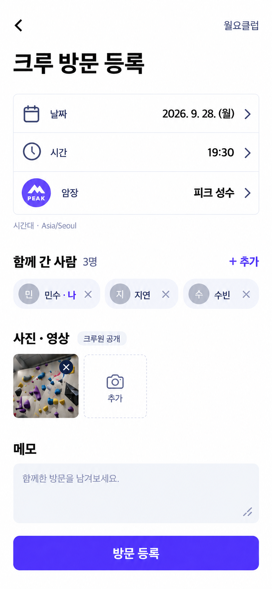

| 요소 | 의미·동작 |
|---|---|
| 월요클럽 | 이 공동 방문을 등록할 크루. 고정 안내이며 편집 중 크루 전환 버튼이 아님 |
| 날짜·시간·암장 | 실제 방문 시각과 지점. 모두 필수 입력. Figma에는 필수 시간 입력을 반영 |
| 함께 간 사람·3명 | 현재 선택된 실제 참석자만 표시. 일정 신청 상태와 구분 |
| 함께 간 사람의 + 추가 | 02.07 검색 시트에서 현재 크루원을 이름으로 찾아 추가 |
| 선택된 프로필·이름 묶음의 × | 작성 중 참석자 목록에서 제거. 나도 제외할 수 있어 작성자가 불참한 방문도 등록 가능 |
| 사진·영상 | 해당 크루에 공유할 파일 추가·첨부 제거. 개인 기록의 비공개 미디어와 별개 |
| 메모 | 이 방문에 함께 남길 내용. 선택 입력 |
| 방문 등록 | 공동 방문 저장 후 02.08 상세로 이동 |

- 일정에서 시작하면 날짜·암장·참여 응답자를 가져오되 실제 참석자를 확인한다. 불참·미응답 회원도 실제 왔다면 선택할 수 있고, 참여 응답자도 실제 오지 않았다면 해제한다.
- 일정 없이도 등록할 수 있다. 상단 크루는 진입 시 선택한 크루이며, 가입 크루가 없으면 크루 방문 등록은 제공하지 않는다.
- 날짜·시간·암장과 최소 1명의 실제 참석자가 필수다(D01 확정). 완등·컨디션은 이 화면에서 대신 입력하지 않는다.
- 크루 방문 등록은 실제 참석만 저장한다. 빈 개인 기록도 자동 생성하지 않는다. 본인은 상세에서 내 기록 작성 또는 기존 기록 연결을 선택한다(S09~S12).
- 같은 일정의 방문을 동시에 만들면 서버의 첫 저장 결과를 사용한다. 나중 입력은 보존하고 기존 방문 열기를 제공하며 메모·파일을 자동 합치지 않는다.
- 긴 회원 목록·많은 첨부·키보드에는 스크롤을 적용한다. 메모 모서리는 실제 크기 조절 기능이 아니며 일반 모바일 여러 줄 입력으로 구현한다.

### 02.07 실제 참석자 검색·추가

- Figma: [기본 화면](https://www.figma.com/design/vla4pXPo8FaCWFXfpIbYzx/Holdlog?node-id=430-14025) · [상태별 번호·링크](./screen-numbering.md).

검색창 아래에 선택한 프로필·이름 묶음을 먼저 두고 그 아래에 검색 결과를 보여준다. 짧은 목록에서 시트 높이를 과도하게 늘리지 않으며, 검색 결과·키보드가 길어지면 확장·스크롤한다. 닫기는 오른쪽 위, 선택 완료는 아래에 둔다.

- 연결 기능: S09-A. 크루 방문 등록·수정의 ‘함께 간 사람’ 옆 ‘+ 추가’에서 연다.
- 등록 폼에는 선택된 참석자를 작은 프로필·이름 묶음으로 표시한다. 전체 크루원 목록을 폼 안에 늘어놓지 않는다. 이름 묶음은 줄바꿈하지 않고 높이40의 한 줄 가로 스크롤로 표시한다. 배지는 이름 길이에 맞는 폭과 이름14·아바타28로 조립하며 ×의 누르기 영역을 확보한다.

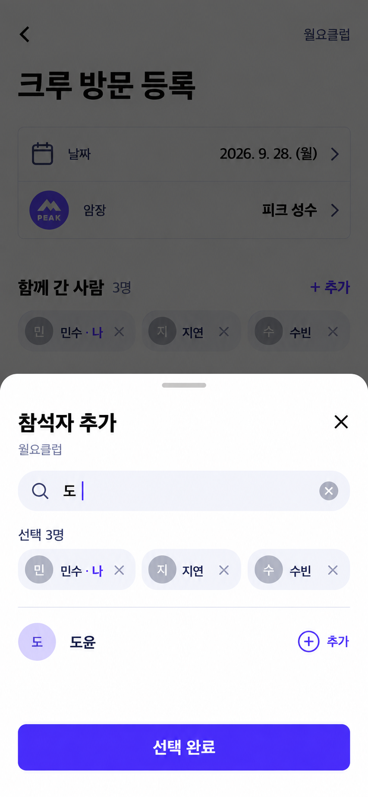

| 요소 | 동작 |
|---|---|
| 월요클럽 | 검색 범위 안내. 해당 공동 방문 크루의 회원만 검색 |
| 이름 검색 | 이름 일부로 검색. 예시는 ‘도’로 도윤을 찾은 상태 |
| 검색 결과 · 추가 | 해당 회원을 시트의 임시 선택에 추가. 이미 선택된 회원은 오른쪽 체크 아이콘만 표시하고 중복 추가를 막음. 이름 아래 선택됨 문구 없음 |
| 선택 3명·프로필 이름 묶음 | 검색어를 바꿔도 선택 유지. 칩의 ×로 임시 선택에서 제거 |
| 선택 완료 | 시트의 선택 결과를 등록·수정 폼에 반영하고 닫음. 이 동작만으로 방문을 서버에 저장하지 않음 |
| 닫기·뒤로·바깥 터치 | 이번 시트에서 바꾼 임시 선택을 적용하지 않고 닫는 기본안. 열기 전 폼의 선택은 유지 |

- 예시의 도윤은 아직 추가 전이므로 선택된 인원은 3명이다. 추가하면 시트에서 4명으로 바뀌고, 완료 시 폼도 4명으로 바뀐다.
- 검색어가 없으면 이름 검색 안내와 기존 선택을 표시한다. 조회 중·실패는 데이터 처리에서 실제 결과 없음과 구분한다. 문제가 생기면 기존 화면 위 공통 다이얼로그로 처리하고 별도 로딩·실패·재시도 시안은 추가하지 않는다.
- 이름이 같은 회원도 서로 다른 회원 ID로 선택한다. 프로필 사진과 이름을 함께 표시하며 이름만으로 합치지 않는다.
- 검색 결과와 선택 영역은 길어지면 스크롤한다. 키보드가 검색 결과나 완료 버튼을 가리지 않도록 시트 높이를 조절한다.
- 다른 크루 회원·비회원은 검색 결과에 포함하지 않는다. 참석자 추가는 크루 가입·초대 기능이 아니다.
- 이미 저장된 방문 수정에서는 폼의 최종 저장 시 참석자 제외·재추가와 개인 기록 분리·재연결 규칙을 적용한다. 시트에서 임시 선택만 바꿀 때 개인 기록을 변경하지 않는다.

### 02.08 크루 방문 상세

- Figma: [기본 화면](https://www.figma.com/design/vla4pXPo8FaCWFXfpIbYzx/Holdlog?node-id=430-14234) · [상태별 번호·링크](./screen-numbering.md).

연결된 개인 기록의 공개 미디어는 함께 표시한다. 비공개 미디어는 본인에게만 보여주며 공개·비공개 아이콘은 표시하지 않는다. 또한 타인에게 원본·썸네일을 노출하지 않는다.

이 화면은 [기록 관계 설계](./record-relationships.md)의 연결된 개인 기록과 접근 가능한 파일을 모아 보여준다. 개인 항목과 파일은 각 소유자의 원본을 참조하며, 공동 화면에서 보인다고 타인의 수정 권한이 생기지 않는다.

암장 도장 옆에 지점명·날짜를 묶고 큰 배경 카드는 두지 않는다. 참석자별 기록은 짧은 행으로 표시하며 본인 행도 오른쪽 화살표로 선택한다. 아래로 공동 사진·영상과 메모를 이어 배치한다.

- 연결 기능: S10. 사람 아이콘이 있는 방문, 등록 완료 또는 연결된 일정의 방문 기록 보기에서 진입한다.
- 예시는 등록 후 개인 기록 연결이 아직 끝나지 않은 상태다. 이전 개인 기록 상세·리스트 시안과는 다른 진행 단계다.

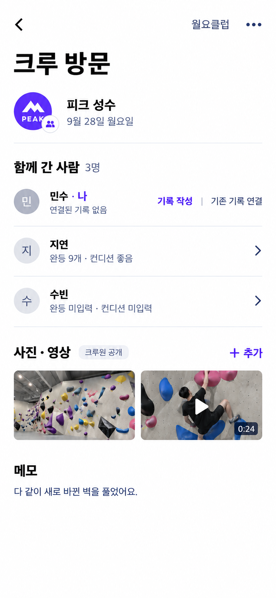

| 요소 | 의미·동작 |
|---|---|
| 날짜·암장·사람 배지 | 공동 방문 정보. 채운 도장은 내가 실제 참석했음을 표시 |
| 함께 간 사람 3명 | 신청 인원이 아닌 저장된 실제 참석 명단 |
| 민수 · 나 · 연결된 기록 없음 | 본인의 기록이 아직 연결되지 않은 상태. 기존 개인 기록 자체가 없다는 단정이 아님 |
| 본인 참석자 행 · 오른쪽 화살표 | 아래 내 기록 상태별 동작을 따름. 별도 작성·보기·연결 버튼 없음 |
| 작성 방법 선택 다이얼로그 | 새로 작성은02.04, 기존 기록 선택은S11. 본인·같은 날짜·암장 후보 중 선택. 타인이 대신 연결할 수 없음 |
| 지연 · 완등 9개 · 컨디션 좋음 | 연결된 개인 기록의 공개 요약. 누르면 해당 회원 공개 상세 S13 |
| 수빈 · 완등 미입력 · 컨디션 미입력 | 개인 기록은 연결됐으나 값이 비어 있음. 0개·보통으로 채우지 않음 |
| 사진·영상 | 상세에는 추가 버튼과 공개·비공개 아이콘 없음. 사진 확대·영상 재생만 제공. 첨부 추가는 수정 화면에서 수행 |
| 메모 | 해당 크루원에게 공개된 내용 |
| 더보기 | 공동 방문 수정·공동 변경 이력, 관리자에게만 공동 방문 삭제. 일정 연결이 있으면 연결된 일정 보기 |

#### 내 기록 상태별 동작

- 연결된 내 기록 없음: 다른 참석자와 같은 오른쪽 화살표를 표시한다. 본인 행 선택 → 작성 방법 다이얼로그02.08.04 → 새로 작성 / 기존 기록 선택. 별도 작성 버튼은 없다. 기존 후보 하나도 본인이 확인한다.
- 기록은 연결됐지만 운동 내용 미입력: 크루 방문 상세는02.08.02와 같은 화면을 사용하며, 별도 상태 화면을 만들지 않는다. 함께 간 사람의 본인 행을 눌러02.05.02 미입력 상세를 연다. 별도 내 기록 입력 버튼은 없다. 상세의 수정에서 같은 기록을 편집하며 새 기록을 만들지 않는다.
- 내용이 있는 내 기록 연결됨: 함께 간 사람의 본인 행을 눌러02.05 상세를 연다. 별도 내 기록 보기·작성·연결 버튼은 없다.
- 내가 실제 참석자가 아니면 내 기록 작성·연결 동작은 없다. 지점 도장은 테두리와 사람 아이콘으로 표시한다.

#### 공동 정보와 개인 정보의 구분

- 본인이 개인 기록을 삭제하면 실제 참석은 유지하고 개인 수치는 제거한다. 이후 본인 행은 위 ‘연결된 내 기록 없음’ 동작을 따른다. 기록을 자동 복원하지 않는다.
- 해당 크루원이 공동 정보를 수정할 수 있지만, 개인 연결이 있으면 날짜·암장은 수정할 수 없다. 메모·참석자 수정은 기존 권한을 따른다. 개인 내용은 본인만 수정하며 참석자 제외·공동 삭제에도 기존 개인 날짜·암장·내용은 그대로 보존한다.
- 다른 사람의 비공개 미디어·개인 변경 이력은 가져오지 않는다. 연결된 개인 후기는 공개 선택인 경우에만 해당 크루원에게 표시한다. 공동 방문에 직접 첨부한 파일과 연결된 개인 기록의 공개 파일을 함께 표시하되 각 파일의 소유권과 공개 범위를 유지한다.
- 공동 미디어 수정·삭제는 업로더 본인만 가능하다. 실제 공동 방문 삭제는 관리자만 가능하며 복구할 수 없다. 삭제 후 각 개인 기록은 본인 전용으로 남고 일정 상태는 유지한다.
- 참석자 제외·재추가 시 기존 개인 기록 보존·재연결 정책을 따른다. 임의의 새 복제 기록을 만들지 않는다.
- 사진 속 이름·개수·미디어는 화면 설명용 예시다. 실제 명단·권한·개인 기록 공개 범위는 서버 상태를 기준으로 한다.

### 기록 화면 사이의 이동

| 시작 | 사용자 행동 | 도착 |
|---|---|---|
| 02.01 달력 | 목록 아이콘 | 02.02 월간 리스트. 월·필터 유지 |
| 02.02 리스트 | 달력 아이콘 | 02.01 달력. 월·필터 유지 |
| 02.01 달력 | 오늘·과거 날짜 칸 | 02.03 해당 날짜 바텀시트. 미래 날짜는 선택 불가 |
| 02.03 시트 | 기존 방문 | 개인 S12 또는 공동 S10 상세 |
| 02.03 시트 | 기록 작성 → 종류 선택 다이얼로그 | 개인 기록은02.04, 크루 방문은02.06. 날짜·현재 크루 전달 |
| 02.03 시트 | 닫기 | 원래 달력. 새 기록이 자동 저장되지 않음 |
| 상단 크루 이름 ⌄ | 누르기 | S19-A 크루 선택창 |
| 일정 상세 | 방문 기록 만들기 | 02.06, 일정 연결 유지 |
| 02.08 크루 방문 상세 | 본인 참석자 행 | 위 내 기록 상태별 동작에 따라02.05 상세 또는02.08.04 작성 방법 선택 |
| 02.08 크루 방문 상세 | 다른 참석자의 연결 기록 | 02.11 해당 회원 기록 상세 |
| 상단 회원 아이콘 | 누르기 | S20 크루원 목록 → 회원 공개 기록 S13 |

## 02.09 기록 필터

[Figma 기본 시안](https://www.figma.com/design/vla4pXPo8FaCWFXfpIbYzx/Holdlog?node-id=497-45699) · [제작·검증](history/figma/additional-screens-2026-10-02.json).

기록 달력·목록의 필터. 날짜·암장·크루 방문 참석자를 임시 선택하고 적용. 닫기는 변경 취소, 초기화는 기본값.

**필터 버튼 적용 표시:** 기본은 회색 아이콘24×24, 적용은 연보라 배경·보라색 글자의 ‘필터 N ×’76×32다. 적용 상태에서 월 이동 영역은174, 보기 전환84, 간격8로 전체350 안에 배치한다. 달력·목록에서 같은 공통 버튼을 사용한다. 숫자·해제·조건 유지의 상세 동작은 [기능 명세S08-F](functional-spec.md#s08-f-기록-필터)를 따른다. 필터 개수 배지·선택 칩은 본문에 추가하지 않는다.

기존 [02.01.02 기록 없음](https://www.figma.com/design/vla4pXPo8FaCWFXfpIbYzx/Holdlog?node-id=424-7217)은9월1~2일을 적용해 기록이 없는 예시로 사용한다. 기존 [02.02.02 필터 적용](https://www.figma.com/design/vla4pXPo8FaCWFXfpIbYzx/Holdlog?node-id=424-6805)은 피크 성수 조건을 적용한 예시다. [달력 사진](./figma/assets/record-filter-applied-2026-10-02/applied.png) · [목록 사진](./figma/assets/record-filter-applied-2026-10-02/list.png) · [검증 기록](history/figma/record-filter-applied-2026-10-02.json).

S08-F · functional-spec.md

**바텀 시트 규격:** 공통 핸들36×4를 상단8·가운데에 배치하고 제목 옆 닫기 ×는 두지 않는다. 아래로 끌거나 바깥 배경을 누르면 적용 없이 닫는다. 입력 제목과 입력칸 간격은12, 묶음 간격은20, 좌우 여백은20을 사용한다. 참석자는 기존 `Data/AttendeeChip`과 `Control/SelectedAttendeeStrip`을 재사용하고 줄바꿈 없이 가로 스크롤한다.

## 02.10 기존 기록 연결

[Figma 기본 시안](https://www.figma.com/design/vla4pXPo8FaCWFXfpIbYzx/Holdlog?node-id=497-45797) · [제작·검증](history/figma/additional-screens-2026-10-02.json).

크루 방문에서 같은 날짜·암장의 내 개인 기록을 선택해 한 건 연결한다. 개인 기록 상세에서는 연결을 시작하지 않는다. 뒤로 아이콘 또는 기기의 뒤로 가기로 닫으면 연결을 저장하지 않고 원래 크루 방문 상세로 돌아가 기존 연결 상태를 유지한다. 별도 ‘나중에’ 버튼은 두지 않는다.

S11 · functional-spec.md

## 02.11 회원 기록 상세

[Figma 기본 시안](https://www.figma.com/design/vla4pXPo8FaCWFXfpIbYzx/Holdlog?node-id=499-47099) · [제작·검증](history/figma/additional-screens-2026-10-02.json).

회원 기록 목록에서 기록을 선택하거나 크루 방문에서 다른 참석자를 선택하면 연다. 크루 방문에서는 목록을 거치지 않고 그 방문에 연결된 회원 기록을 바로 보여준다. 뒤로 가면 들어온 회원 기록 목록 또는 크루 방문 상세로 돌아간다. 타인 편집·비공개 내용은 표시하지 않는다. 사진·후기는 현재 크루에 연결된 공개 항목만 보여준다.

S13 · functional-spec.md

## 02.12 변경 이력

[Figma 기본 시안](https://www.figma.com/design/vla4pXPo8FaCWFXfpIbYzx/Holdlog?node-id=499-47259) · [제작·검증](history/figma/additional-screens-2026-10-02.json).

일정·크루 방문의 더보기에서 변경 이력을 연다. 개인 기록은 이력을 저장하지 않으며 이력 메뉴도 없다. 작업자·시각·변경 전후를 표시하고 권한 있는 항목만 확인 후 되돌린다.

S14 · functional-spec.md

## 02.13 운동 중 기록

- Figma: [02.13.01 기본](https://www.figma.com/design/vla4pXPo8FaCWFXfpIbYzx/Holdlog?node-id=562-32587) · [화면 옆 명세](https://www.figma.com/design/vla4pXPo8FaCWFXfpIbYzx/Holdlog?node-id=562-32827).390×924로 난이도11개와 종료 버튼을 모두 표시한다.
- 제목·암장 도장·지난 시간 및 합계·세로 난이도별 −/개수/+·운동 종료 순서다.0개와 양수의 감소 버튼 상태는 같은 화면에서 확인한다.
- 운동 중 기록 화면에서 같은 위치에 공통 표시줄을 둔다. 하단 메뉴가 없어도 위치를 유지한다. 기록 달력에서는 달력·도장과 겹침을 허용하며 표시줄용 별도 공간을 확보하지 않는다(2026-10-06 사용자 확정). 현재02.01.01·02.02.01에 적용했다.
- Android·iOS 공통 알림은 시간·완등 합계만 표시하는 번호 없는 부품 견본이다. 다이내믹 아일랜드와 알림 조작 버튼은 제외한다.
- 운동 종료 버튼을 누르면 개인 기록을 자동 저장한다. 종료하지 않고 앱을 강제로 끝내면 운동을 취소하고 개인 기록으로 저장하지 않는다. 화면 이동·백그라운드 전환은 운동을 유지한다. 시작 A·B 선택만 미확정이다. 운동 중에는 암장 변경과 새 운동 중복 시작을 막는다. 상세 동작·시안은 [운동 기록 명세](./workout-recording-spec.md)를 따른다.

## 03 암장

### 03.01 암장 지도

- 시안: [편집 가능한 화면](https://www.figma.com/design/vla4pXPo8FaCWFXfpIbYzx/Holdlog?node-id=455-25612). 상태별 화면은 [번호표](./screen-numbering.md), 공통 부품과 확인 결과는 [암장 검증 기록](history/figma/place-refine-2026-10-01.json)을 따른다.

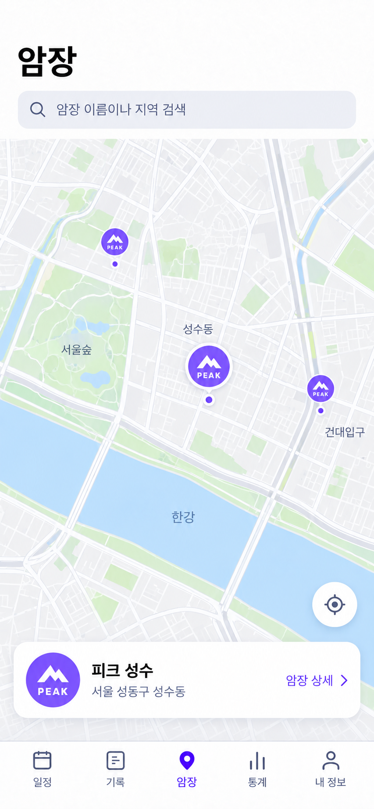

- 새 화면 S23. 일정 작성과 관계없이 암장을 찾는 독립 화면이다. 이 시안에서는 하단 중앙에 ‘암장’을 추가해 **일정 / 기록 / 암장 / 통계 / 내 정보**로 구성했다.
- 독립 지도와 5개 메뉴 배치는 2026-09-29 사용자 확정 사항이다. 모든 주요 화면에 일정 / 기록 / 암장 / 통계 / 내 정보를 적용한다. 하단 메뉴가 보이는 모든 이미지에 반영했다.
- 상단 크루 선택은 없다. 서버에 등록된 전체 지점을 위치로 찾는다.
- 검색은 브랜드·지점·지역으로 찾는다. 결과를 선택하면 해당 지점 위치로 이동하고 미리보기 카드를 연다.
- 지도 표시에는 브랜드 로고와 지점 색상을 쓴다. 점은 위치를 가리키는 지도 표시이며 달력의 여러 기록 표시와 다르다.
- 표시를 누르면 지점명·위치·‘암장 상세’ 카드가 나온다. 상세를 누르면 S07로 이동한다. 뒤로 돌아오면 지도 위치와 선택 지점을 유지한다.
- 현재 위치 버튼은 사용자가 누를 때 위치 권한을 요청한다. 허용하지 않아도 검색과 지도 이동은 가능하다.
- 지도 위치와 브랜드는 시각 예시다. 실제 서비스에서는 등록된 지점 좌표와 지도 제공자의 지도를 사용한다. 위치 정보가 없는 지점은 검색으로 찾되 지도에 임의 표시하지 않는다.

### 03.02 암장 검색·추천·선택

- 시안: [편집 가능한 화면](https://www.figma.com/design/vla4pXPo8FaCWFXfpIbYzx/Holdlog?node-id=455-26556). 상태별 화면은 [번호표](./screen-numbering.md), 공통 부품과 확인 결과는 [암장 검증 기록](history/figma/place-refine-2026-10-01.json)을 따른다.

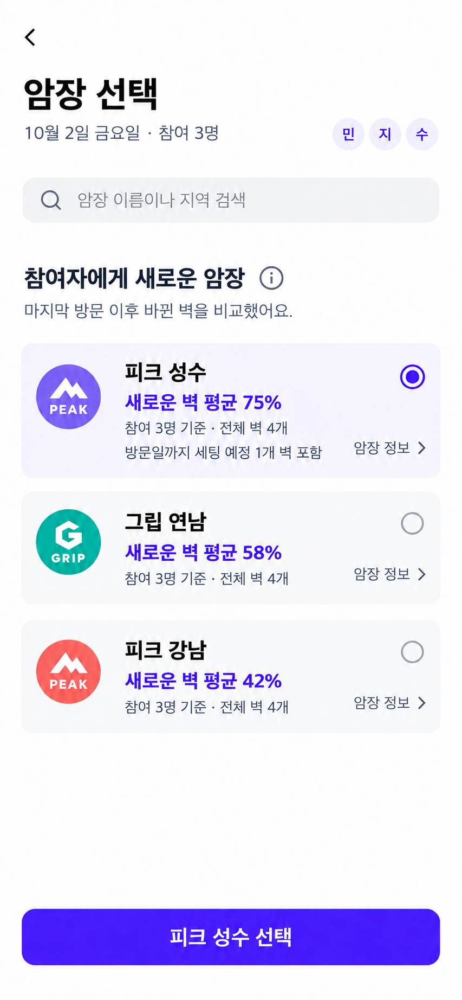

- S06. 피그마 표시 예시는 10월 2일, 참여자 4명이 있는 일정이다. 상단에 두 사람과 +2를 표시한다. 일정 수정의 암장 항목에서 연다. 새 일정 생성 시에도 동일한 선택 화면을 쓰며 실제 참여자가 없다면 검색을 제공한다. 예시 인원을 자동 등록하지 않는다.
- 상단 날짜·참여 인원은 추천 기준이다. 불참·미응답 회원은 제외한다.
- 참여자 그림은 3명까지 모두 표시한다. 4명부터는 2명과 `+나머지 인원`을 표시한다(4명은 `+2`, 13명은 `+11`). 참여 인원 숫자는 전체 인원을 유지한다.
- 피크 성수의 새로운 벽 평균 75%는 참여자별 4/4·3/4·3/4·2/4의 평균이다. 방문일까지 예정된 세팅도 포함한다. 연남 58%, 강남 42%는 예시다.
- 카드에 사람별 긴 설명을 나열하지 않는다. 계산 인원과 평균을 보여준다. 예정 세팅은 계산에 포함하지만 ‘방문일까지 세팅 예정 1개 벽 포함’ 같은 설명은 표시하지 않는다. 일부만 계산 가능하면 ‘참여 3명 중 2명 기준’처럼 표시한다. 계산 불가인 사람을 0점으로 넣지 않는다.
- 원형 선택 표시는 후보 선택이다. ‘암장 정보’는 S07 상세를 열며 선택 상태를 바꾸지 않는다.
- 추천 카드는 모두 350×124로 맞춘다. ‘암장 정보’는 각 카드의 같은 아래 위치에 두며, 추천·검색 항목의 선택 원은 오른쪽에서 세로 가운데로 맞춘다. 별도 동작이 없는 info 아이콘은 표시하지 않는다.
- 검색 결과 없음은 검색 그림·제목·‘암장 이름이나 지역을 바꿔 검색해 보세요.’ 안내를 함께 표시한다.
- 검색만 상태(03.02.02)는 이름·주소·‘암장 정보’를 세 줄로 배치한다. 상세 링크는 주소 아래 왼쪽에 두며 선택 원의 오른쪽 세로 가운데 정렬을 유지한다.
- 하단 선택 버튼은 부모 입력 화면에 지점을 전달한다. 일정 수정에서 최종 저장해야 장소 변경과 알림이 반영된다.
- 과거 일정과 방문 기록 작성에서는 추천 없이 검색만 제공한다. Figma는 추천·검색만·검색 결과 없음의 세 상태를 제공한다. 검색 결과가 없으면 최종 선택 버튼을 비활성화한다. 참여자가 없는 오늘·미래 일정은 검색을 유지하고 공통 참여자 없음 안내를 사용한다. 검색 실패와 추천 실패는 공통 안내·재시도로 구분하며, 추천 실패가 검색을 막지 않는다.

### 03.03 암장 상세

- 시안: [편집 가능한 화면](https://www.figma.com/design/vla4pXPo8FaCWFXfpIbYzx/Holdlog?node-id=455-26779). 상태별 화면은 [번호표](./screen-numbering.md), 공통 부품과 확인 결과는 [암장 검증 기록](history/figma/place-refine-2026-10-01.json)을 따른다.

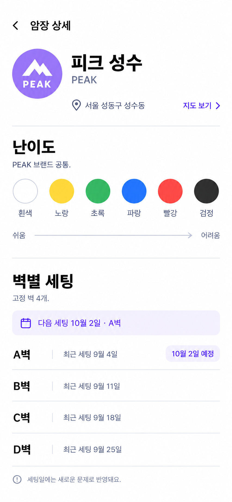

- S07. 지도 미리보기와 추천 목록의 ‘암장 정보’에서 같은 상세 화면을 연다.
- 브랜드 로고·지점명·위치, 브랜드 난이도 색상과 순서, 지점의 고정 벽 및 세팅 날짜를 표시한다.
- 예시는 9월 28일 기준 A벽 9/4, B벽 9/11, C벽 9/18, D벽 9/25 세팅이다. 다음 세팅은 10/2 A벽이다. 벽은 늘거나 줄지 않고 각 벽의 문제가 바뀐다.
- ‘지도 보기’는 해당 지점에 초점을 맞춘 지도를 연다. 추천에서 진입했어도 돌아가면 날짜·참여자·선택 후보를 유지한다.
- 상세를 조회하는 것만으로 일정의 암장이 바뀌지 않는다. 뒤로 돌아가 선택 화면에서 암장을 선택한다.
- 미등록 정보는 정보 없음으로 표시한다. 시안의 색상 순서·브랜드·위치는 예시이며 서버 등록 정보가 기준이다.
- 하위 화면이므로 하단 메뉴는 숨긴다.
- 최신 제작 시안의 난이도 예시는 흰색·노랑·주황·초록·파랑·빨강·핑크·보라·회색·갈색·검정의11색을 두 줄로 표시한다. 실제 난이도와 순서는 브랜드 등록값을 사용한다. 모든 내용이 보이도록 기본 상세 높이는950으로 맞췄으며, 별도 정보 없음 상태도 제공한다.
- ‘PEAK 브랜드 공통.’·‘고정 벽 4개’ 설명은 표시하지 않는다. 벽의 예정 날짜 배지는 글자를 가로·세로 가운데로 맞춘다.

## 04 통계

### 04.01 개인 통계

- 현재 Figma(2026-10-02): [기본 화면](https://www.figma.com/design/vla4pXPo8FaCWFXfpIbYzx/Holdlog?node-id=471-30692) · [방문 없는 기간](https://www.figma.com/design/vla4pXPo8FaCWFXfpIbYzx/Holdlog?node-id=471-31607) · [기간 선택](https://www.figma.com/design/vla4pXPo8FaCWFXfpIbYzx/Holdlog?node-id=507-50415) · 전체 시안3개. [번호표](./screen-numbering.md).
- 기본 화면은 너비390·높이2167로 날짜별 컨디션까지 모든 내용을 표시한다. GRIP 전환은 바뀌는 완등 영역만, 스크롤은 작은 상단만 옆에 표시한다. 기본·빈 기간에서 입력된 수치·0·미입력·기록 없음이 확인되므로 중복 견본은 두지 않는다. 실제 앱에서는 하단 메뉴를 고정하고 통계 메뉴만 선택 상태로 표시한다.
- 이번 Figma 난이도는 흰색·노랑·주황·초록·파랑·빨강·핑크·보라·회색·갈색·검정의11색 예시다. 미입력과 입력된0개를 구분하며 실제 브랜드 등록값을 따른다.

B03: 본인이 저장한 개인 기록만 집계한다. 내 기록 작성·연결 안내는 기록 탭의 현재 크루 방문에서 제공한다. 통계에 별도 미등록 건수를 넣지 않는다.

- 연결 기능: S15. 하단 통계 메뉴에서 진입한다. 두 이미지는 서로 다른 메뉴가 아니라 같은 화면의 위쪽과 아래로 스크롤한 상태다.
- 흰 바탕·보라색·브랜드 도장·하단 메뉴를 기존 화면과 공유한다. 숫자는 평평한 영역에 묶고 반복 카드를 줄인다.

#### 위쪽 — 방문 요약

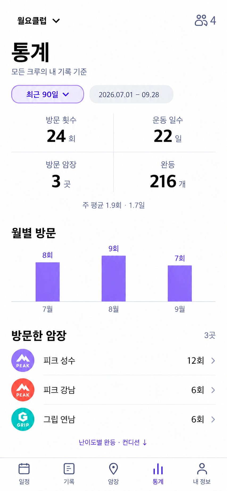

| 요소 | 의미·동작 |
|---|---|
| 통계·범위 안내 | 계정 전체의 내 개인 기록 기준. 크루 소속 없는 개인 방문과 본인 전용으로 남은 기록도 포함 |
| 상단 크루 이름 ⌄·회원 목록 | 기존 앱 공통 이동. 선택 크루가 바뀌어도 개인 통계 집계 범위는 달라지지 않음 |
| 최근 90일 | 기간 선택을 연다. 최근 N일·월간·연간·전체·시작일/종료일 직접 지정 |
| 날짜 범위 | 모든 통계에 적용되는 실제 방문일 범위. 예시는 2026년 7월 1일~9월 28일, 양 끝 포함 90일 |
| 기록한 방문 24회 | 해당 기간에 본인이 저장한 개인 기록 건수. 날짜·시간·암장을 저장해도 1회. 실제 참석만 등록된 건은 제외 |
| 운동 일수 22일 | 방문한 서로 다른 날짜 수. 같은 날 두 번 방문해도 1일 |
| 방문 암장 3곳 | 서로 다른 지점 수. 같은 브랜드의 다른 지점도 별도 집계 |
| 완등 216개 | 입력된 완등 개수 합계. 모든 방문이 입력됐다는 뜻은 아님 |
| 주 평균 1.9회·1.7일 | 24÷(90/7), 22÷(90/7)을 소수 한 자리로 표시한 예시 |
| 월별 방문 | 기간 안의 월별 방문 횟수. 예시 7월8회·8월9회·9월7회 |
| 방문한 암장 | 같은 기간의 지점별 횟수. 행을 누르면 해당 기간·지점의 내 방문 목록을 여는 기본안 |
| 난이도별 완등·컨디션 ↓ | 같은 페이지 아래 영역으로 이동하는 보조 링크. 직접 스크롤해도 도달 |

**요약 셀 정렬:** 네 셀의 폭은174.5로 동일하다. 제목·값 묶음은 칸 안의 가로·세로 가운데에 맞춘다. 숫자와 회·일·곳·개는 글자 기준선을 맞추고 실제 글자 폭으로 가운데 정렬한다. 완등 미입력은 동일한48높이 값 영역의 가운데에 표시하며 단위·숨은 빈 공간을 남기지 않는다. [검증](history/figma/statistics-metric-alignment-2026-10-02.json).

월간 조회는 일별, 짧은 최근 기간은 주별 등 조회 기간에 맞춘 방문 분포 단위를 사용하는 기본안이다. 첫 그림의 월별 차트는 최근 90일 예시이며 다른 기간에 같은 세 달을 고정하지 않는다.

#### 아래쪽 — 완등·컨디션

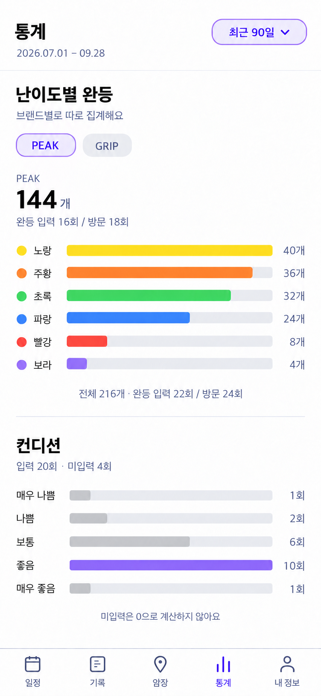

- 스크롤 후 상단은 작은 제목·기간 선택·날짜 범위로 줄이는 구성이다. 하단 통계 메뉴는 계속 선택되어 있다.
- 난이도는 브랜드별로 집계한다. PEAK·GRIP 전환은 완등 영역에만 적용하며 위쪽 방문 요약과 컨디션 전체 집계를 바꾸지 않는다.
- PEAK 144개는 40+36+32+24+8+4의 합이다. 두 지점 방문 18회 중 완등 입력 16회다. GRIP은 72개, 방문 6회 중 입력 6회인 예시로 전체 216개·입력22회/방문24회와 일치한다.
- 등급 색상·이름·순서는 브랜드 등록값을 사용한다. 다른 브랜드의 같은 색을 하나의 난이도로 합치지 않는다. 지점 색상과 난이도 색상을 구분한다.
- 막대 옆에 정확한 수치를 표시하며 구현에서는 공통 0 기준으로 값에 비례해 길이를 계산한다. 생성 이미지의 막대 길이를 그대로 측정해 구현하지 않는다.
- 컨디션은 입력한 20회만 분포로 집계한다. 매우 나쁨1·나쁨2·보통6·좋음10·매우 좋음1, 미입력4회의 예시다. 미입력을 보통이나 0으로 채우지 않는다.
- 컨디션은 사용자가 정한 느낌이며 건강 점수·평균 등급으로 해석하지 않는다. 색 외에 단계 이름과 횟수로 읽을 수 있게 한다.
- 날짜별 컨디션 추이는 기존 분포 아래 공통 부품으로 추가했다. 방문일에 따라 입력한 단계만 표시하며 미입력을0으로 채우지 않고 건강 점수·평균으로 해석하지 않는다. 개인 통계와 회원 통계에 같은 원본을 사용한다.
- 통계 기간 선택은 공통 바텀 시트다. 최근 N일·월간·연간·전체·직접 지정 중 선택하며 기간 종류는 두 줄의 선택 버튼으로 표시한다. 고른 항목의 입력만 아래에 표시한다. 최근 N일은 일수, 월간은 연·월, 연간은 연도, 전체는 입력 없음, 직접 지정은 시작일·종료일을 표시한다. 다른 항목의 날짜·값은 함께 나열하지 않는다. 적용 전 선택은 임시이며 바깥 누르기·아래로 끌기는 적용 없이 닫는다. 핸들은 상단 가운데, 닫기×는 없다.04.01.03·06.11.02에서 기존 화면 위에 겹쳐 확인한다.

#### 공통 상태

- 기간 변경 시 모든 기간 지표를 함께 갱신한다. 작성일이 아니라 방문일 기준이다. 같은 개인 기록을 공동 연결 때문에 중복 집계하지 않는다.
- 미입력과 명시적인 0은 구분한다. 기간 전체 완등 미입력이면 합계를 ‘미입력’으로, 컨디션 입력이 없으면 ‘기록 없음’으로 표시한다.
- 방문 없는 기간은 0회·0일·0곳이며, 조회 실패와 혼동하지 않는다. 별도 로딩·조회 실패·다시 시도 전체 화면이나 상태 견본은 만들지 않는다. 문제가 생기면 기본 화면 위 공통 다이얼로그로 처리한다. 이번 검증에서 임의 오류 메시지·새 다이얼로그 시안은 추가하지 않았다.
- 통계 전체는 본인 전용이며 연결된 개별 기록의 공개와 구분한다. 크루원에게 공개하는 완등·컨디션의 개별 기록과 통계 전체 공개는 별개다.

## 05 내 정보

### 05.01 내 정보

- 시안: [기본 화면](https://www.figma.com/design/vla4pXPo8FaCWFXfpIbYzx/Holdlog?node-id=473-32360) · 기본 화면1개 · [상태별 링크](./screen-numbering.md) · [검증 기록](history/figma/sections-04-05-review-2026-10-02.json).

- S16. 계정 전체에 해당하는 개인 화면이다. 상단 크루 선택·회원 수 아이콘은 없으며 하단 내 정보 메뉴만 활성화한다.

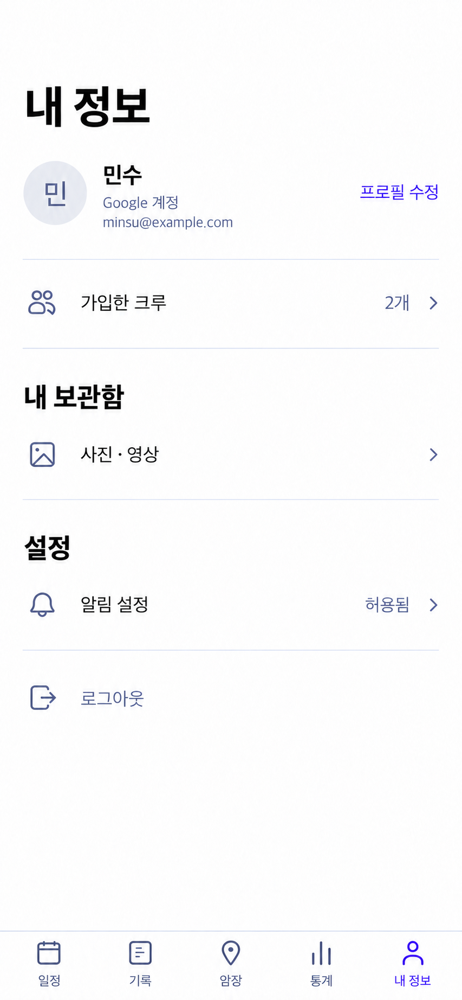

| 요소 | 의미·동작 |
|---|---|
| 프로필·로그인 계정 | 본인의 이름·사진·로그인 계정. 이메일은 본인 화면에만 표시 |
| 프로필 수정 | 앱 이름·사진 편집과 저장. 계정 삭제는 이 화면 내부에 둔다. 구글·Apple 계정 이메일 변경 기능은 아님 |
| 가입한 크루 · 2개 | S19의 가입 목록을 열고 크루를 누르면 06.01 크루 정보로 이동 |
| 내 보관함 → 사진·영상 | S21 계정 전체의 본인 파일 조회·재생·삭제. 다른 기록에 재첨부하는 기능 없음. 설정 메뉴와 별도 구역 |
| 설정 → 오픈소스 안내 | 05.06에서 앱의 오픈소스·라이선스 조회 |
| 설정 → 알림 설정 | S16 알림 상세. 행의 허용됨은 OS 권한이며 모든 종류의 알림을 켰다는 뜻은 아님 |
| 로그아웃 | 세션·기기의 해당 계정 푸시 연결 종료. 기록 삭제나 크루 탈퇴가 아님 |

- 계정 삭제를 내 정보의 독립 메뉴로 두지 않는다. 프로필 수정 → 계정 삭제 확인창에서 실행한다. 확인창은 [05.02.02](https://www.figma.com/design/vla4pXPo8FaCWFXfpIbYzx/Holdlog?node-id=499-48004)에 제작되어 있다.
- 이 화면에 크루원·초대 코드·관리자 메뉴를 직접 두지 않는다. 어떤 크루가 선택돼 있어도 같은 개인 화면이다.
- 가입 크루가 없으면 0개와 가입 목록의 크루 생성·가입 경로를 제공한다. 본인 기록·보관함 접근은 유지한다.
- OS 권한에 따라 허용됨·차단됨·권한 미설정을 표시한다. 알림 상세는 새 일정 / 일정 변경·취소 / 기록 요청의 기존 기본안을 따른다.
- 내 정보의 가입한 크루는 S19-B 목록이다. 모든 크루 행은 >로 S22 크루 정보를 열며, 현재 크루는 이름 옆 ‘현재’로 표시한다. 일정·기록 상단의 빠른 선택창 S19-A와 역할을 구분한다.

- 가입 크루0개·알림 차단·권한 미설정은 해당 메뉴 행만 기본 화면 옆에 표시한다. 문구만 다른 전체 화면은 만들지 않는다. 보관함·알림 설정 제목 아래의 불필요한 상단 구분선을 제거했다.

### 05.02 프로필 수정

- 시안: [기본 화면](https://www.figma.com/design/vla4pXPo8FaCWFXfpIbYzx/Holdlog?node-id=17-3) · 기본·계정 삭제 확인2상태 · [상태별 링크](./screen-numbering.md) · [검증 기록](history/figma/profile-crew-2026-10-01.json).

- 연결 기능: S16. 내 정보의 ‘프로필 수정’에서 연다.
- 기존 이미지 시안과 공통 부품으로 만든 프로필 수정 화면을 비교했다. 기존 프레임17:3과 화면 구성을 유지했으며 이전 PNG와 픽셀이 같다.

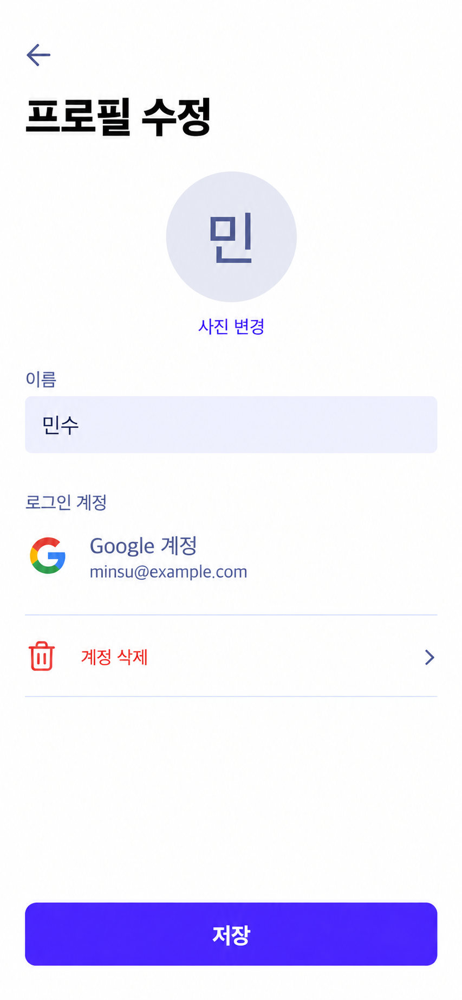

| 요소 | 의미·동작 |
|---|---|
| 뒤로 | 내 정보로 복귀 |
| 프로필 사진·사진 변경 | 본인 사진 변경. 사진이 없는 예시는 ‘민’ 아바타로 표시 |
| 이름 | 앱에서 사용할 본인 이름 편집 |
| 로그인 계정 | 실제 로그인 제공자의 아이콘·Google 계정 또는 Apple 계정·이메일을 읽기 전용으로 표시 |
| 계정 삭제 | 프로필 수정 내부의 메뉴. 누르면 삭제 확인창으로 이동하며 바로 삭제하지 않음 |
| 저장 | 프로필 변경을 저장하고 내 정보로 복귀 |

- 하위 화면이므로 하단 탭은 숨긴다. 크루 탈퇴 메뉴·기록 보존 안내는 넣지 않는다.
- 계정 삭제는 확인창05.02.02를 사용한다. 관리자 역할이 남으면 옆의 공통 확인 부품에서 관리자 이관으로 안내한다. 저장하지 않은 프로필 변경으로 나갈 때는 공통 나가기 확인을 사용한다.
- Google 계정과 [Apple 계정 칸 견본](https://www.figma.com/design/vla4pXPo8FaCWFXfpIbYzx/Holdlog?node-id=529-31281)은 같은 Account/Identity 원본을 사용하며 제공자 아이콘은 모두32×32 영역이다. [수정 후 사진](./figma/assets/apple-account-2026-10-02/apple-account.png).
- [이미지 생성 기록](history/design-generation/profile-edit-generation.md). 앱 동작은 개발 단계에서 구현한다.

## 05.03 사진·영상 보관함

[Figma 기본 시안](https://www.figma.com/design/vla4pXPo8FaCWFXfpIbYzx/Holdlog?node-id=499-47639) · [제작·검증](history/figma/additional-screens-2026-10-02.json).

내 정보에서 계정 전체의 본인 파일 조회·공유 상태 확인·파일 삭제. 기존 파일 재첨부 기능 없음.

S21 · functional-spec.md

## 05.04 사진·영상 보기

[Figma 기본 시안](https://www.figma.com/design/vla4pXPo8FaCWFXfpIbYzx/Holdlog?node-id=499-47695) · [제작·검증](history/figma/additional-screens-2026-10-02.json).

첨부 선택으로 사진 확대·영상 재생. 원래 비율 유지. 보기에서 추가·공개 변경 없음. 본인 보관함 경로에서만 파일 삭제.

S21 / 미디어 공통 · functional-spec.md

## 05.05 알림 설정

[Figma 기본 시안](https://www.figma.com/design/vla4pXPo8FaCWFXfpIbYzx/Holdlog?node-id=499-47316) · [제작·검증](history/figma/additional-screens-2026-10-02.json).

OS 권한과 새 일정·일정 변경 및 취소·기록 요청 설정을 구분. 권한 차이는 행 상태로 표시.

S16 · functional-spec.md

## 05.06 오픈소스 안내

[Figma 시안](https://www.figma.com/design/vla4pXPo8FaCWFXfpIbYzx/Holdlog?node-id=577-34214) · [사진](./figma/assets/announcements-licenses-2026-10-06/05.06.01-open-source.png).

내 정보05.01 설정의 ‘오픈소스 안내’ 행에서 진입한다. 기존 뒤로 버튼·제목·좌우20 여백을 재사용한다. 라이브러리 이름, 버전·라이선스, 저작권·고지와 라이선스 본문을 세로로 배치하며 항목 사이를 구분선으로 나눈다. 하단 주요 메뉴는 두지 않는다. 실제 앱에서는 스크롤하고 긴 시안은 본문이 모두 보이도록 높이를 늘린다.

React·React Native와 버전은 시안 예시다. 실제 사용 목록과 오프라인 조회·자료 갱신은 [S27](./functional-spec.md#s27-오픈소스-안내)을 따른다.

## 06 크루

문제는 기존 화면 위 공통 다이얼로그로 처리하고, 권한이 없으면 진입을 막는다. 시안 상태·부품 견본은 [제작 규칙](./figma-design-system.md#23-화면-상태를-늘리지-않는-규칙--2026-10-02-사용자-확정)을 따른다.

### 06.01 크루 정보

- 관리자 화면의 상시 이관 안내 문구는 표시하지 않고 관리자 넘기기 메뉴만 둔다.

- 시안: [기본 화면](https://www.figma.com/design/vla4pXPo8FaCWFXfpIbYzx/Holdlog?node-id=109-89) · [상태별 링크](./screen-numbering.md) · [검증 기록](history/figma/profile-crew-2026-10-01.json).

- 일반 회원과 관리자 상태는 같은 공통 부품을 사용한다.

관리자 넘기기(S25)는 첫 버전 필수 기능이며 관리자에게 크루 관리 구역을 표시한다. 회원 제외·차단 해제 등 S18 진입은 후순위로 숨긴다. 회원 목록·초대 조회·공유도 현재 범위다.

- 연결 기능: S22. 내 정보 → 가입한 크루 → 크루 항목에서 진입한다.
- 예시는 월요클럽의 관리자 화면이다. 관리자에게는 관리자 넘기기를 표시하고 일반 회원에게는 크루 탈퇴를 표시한다. 후순위 크루원 관리 메뉴는 표시하지 않는다.

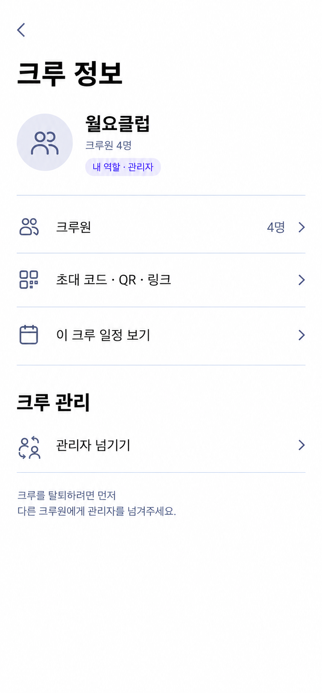

| 요소 | 의미·동작 |
|---|---|
| 뒤로 | 가입한 크루 목록으로 복귀 |
| 월요클럽·크루원 4명 | 지금 조회하는 크루. 이름은 다른 크루로 전환하는 버튼이 아님 |
| 내 역할 · 관리자 | 이 크루 안에서의 내 권한. 일반 회원은 크루원으로 표시 |
| 크루원 | 해당 크루 S20 회원 목록 → 회원의 공개 개인 기록 |
| 초대 코드·QR·초대 링크 | 해당 크루 S17 무기한 초대 확인·복사·공유. 재발급은 현재 범위 제외 |
| 이 크루 일정 보기 | 현재 크루를 해당 크루로 전환하고 일정 S03으로 이동 |
| 관리자 넘기기 | 해당 크루 관리자에게 S25 제공. 다른 활성 크루원에게 넘긴 뒤 본인은 일반 회원이 됨 |
| 크루 탈퇴 | 일반 회원에게 표시. 다른 메뉴와 행 높이·글자 크기·아이콘 크기·정렬을 맞춘다. 누르면 탈퇴 확인창을 연다. 관리자에게는 관리자 넘기기만 제공 |

- ‘개인 기록과 사진은 그대로 남아요’는 크루 정보에 상시 표시하지 않고 탈퇴 확인창에 둔다. 확인창에는 대상 크루명·취소·크루 탈퇴를 표시한다. [06.01.03 탈퇴 확인](https://www.figma.com/design/vla4pXPo8FaCWFXfpIbYzx/Holdlog?node-id=499-48044)을 사용한다.
- 크루 정보 조회만으로 일정·기록의 현재 선택 크루를 바꾸지 않는다. 각 하위 화면에 조회 중인 크루 ID를 명시적으로 전달한다.
- 크루원·초대·관리는 이 화면에서 고른 크루의 권한으로 검사한다. 다른 크루의 관리자 권한을 적용하지 않는다.
- 화면 진입 후 가입 권한을 잃으면 조회를 막고 가입 목록으로 안내한다.
- 하위 상세 화면이므로 하단 메뉴는 숨긴다. 개인 프로필·보관함·로그아웃은 여기에 넣지 않는다.
- 모바일 크루 생성·가입은 첫 버전에 포함하며 생성자가 최초 관리자가 된다(S24). 관리자 이관은 S25에서 제공하고 이관 전 탈퇴는 불가하다. 크루 이름 변경·삭제는 현재 추가하지 않는다. 기존 일정·기록 상단 회원 아이콘의 목록 바로가기는 유지한다.

### 06.02 크루원 목록

- 크루원 목록은 하위 화면이므로 하단 내비게이션을 표시하지 않는다. 기존 이미지의 하단 기록 탭도 제작에 포함하지 않는다.

- 시안: [기본 화면](https://www.figma.com/design/vla4pXPo8FaCWFXfpIbYzx/Holdlog?node-id=477-34402) · [상태별 링크](./screen-numbering.md) · [검증 기록](history/figma/crew-state-policy-2026-10-02.json).

- 연결 기능: S20 크루원 목록
- 진입: 일정·기록 화면 우측 위 사람 아이콘 또는 크루 정보의 크루원 행. 좌측 크루 이름을 눌러 가입 크루를 바꾸는 S19-A 선택창과 다르다.
- 목적: 진입 화면이 전달한 크루의 회원을 찾고 그 사람의 기록·통계로 이동. 크루 정보에서 다른 가입 크루를 조회 중이면 그 크루 ID를 유지하며 일정·기록의 선택 크루를 바꾸지 않는다.
- 상태: 반복 보조 문구를 제거하고 행을 줄인 수정 시안. 일반 회원 하린이 월요클럽을 조회하는 예시

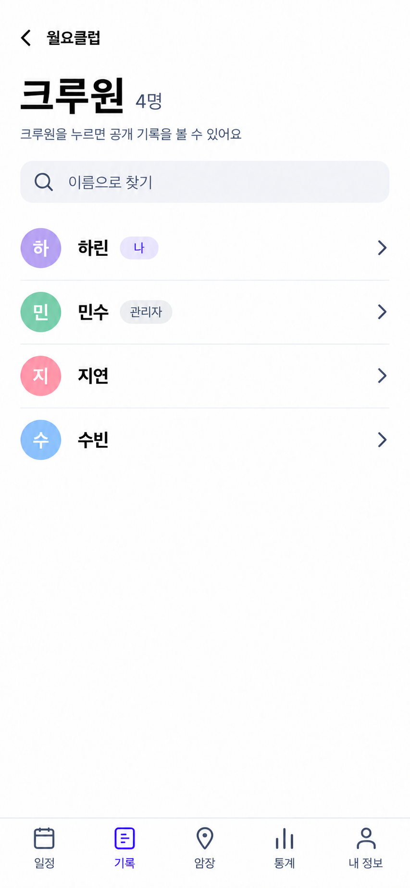

| 표시 | 의미 | 누르면 |
|---|---|---|
| 왼쪽 뒤로 가기 | 진입한 일정·기록 또는 크루 정보로 복귀 | 일정·기록에서 들어왔다면 월·필터·보기 방식 유지 |
| 월요클럽 | 조회 중인 크루 이름 | 이 화면에서는 제목이며 크루 전환 버튼이 아님 |
| 크루원 4명 | 조회 중인 크루의 전체 활성 회원 수 | 날짜별 실제 참석 인원과 무관 |
| 이름으로 찾기 | 조회 중인 크루 안에서 이름 검색 | 입력한 이름에 맞는 목록 표시. 회원 수 4명은 전체 수로 유지 |
| 프로필 원 | 회원 사진. 미등록이면 이름 첫 글자 | 행과 같은 동작 |
| 하린 옆 ‘나’ | 로그인한 본인 | 본인의06.11 회원 기록·통계로 이동. 기록 한 건을 선택하면 본인 기록 상세 |
| 민수 옆 ‘관리자’ | 이 크루의 관리 역할 | 역할 설명. 누른다고 관리 권한을 얻는 버튼이 아님 |
| 회원 이름·행의 화살표 | 회원의 기록·통계를 열 수 있음 | 06.11 회원 기록·통계 → 본인 기록은02.05, 타인 기록은02.11 상세 |

#### 색상과 권한

- 프로필 배경색은 사람을 구분하는 장식이다. 암장 지점 색상·난이도·출석·컨디션을 뜻하지 않는다.
- 보라색 ‘나’는 본인을 표시한다. 달력의 보라색 사람 배지와 의미가 다르므로 글자로 표기한다.
- 프로필·이름·역할·화살표를 한 줄로 배치한다. 반복되는 ‘내 기록 보기 / 공개 기록 보기’ 보조 문구는 표시하지 않는다. 상단 안내 한 번으로 동작을 설명한다.
- 행 높이 약 64pt/dp, 프로필 지름 약 36pt/dp를 시작값으로 한다. 글자 확대 시 잘리지 않게 행 높이를 늘린다.
- 이름과 프로필을 포함한 행 전체를 누를 수 있다. 작은 화살표만 누를 필요가 없다.
- 일반 크루원도 목록을 볼 수 있다. 이 시안에는 회원 삭제·관리 버튼이 없다. S18 회원 관리 페이지는 후순위이며 현재 구현하지 않는다.
- 다른 회원의 공개 기록은 방문 날짜·암장·난이도별 완등 수·컨디션을 조회한다. 사진·영상·후기는 현재 조회 크루에 연결된 기록의 공개 선택 항목만 조회한다. 개인 수정·변경 이력·비공개 미디어에 접근하지 않는다.
- 같은 크루 회원이면 다른 크루에서 운동한 개인 공개 기록도 볼 수 있으나, 다른 크루의 공동 메모·회원 목록·공유 미디어는 보여주지 않는다.

#### 화면 상태

- 검색 결과 없음: 검색칸 아래 남은 본문 영역의 가운데에 ‘찾는 크루원이 없어요’와 검색어 지우기를 표시한다.
- 로딩·조회 실패·다시 시도·권한 없음 전체 화면을 만들지 않는다. 조회에 문제가 생기면 기본 화면 위 다이얼로그로 처리하며, 실패를 실제 빈 목록으로 바꾸지 않는다.
- 회원 선택: 본인·타인 모두 해당 회원의06.11 기록·통계로 이동한다. 기록 한 건을 선택하면 본인 기록은02.05, 타인 기록은02.11 상세를 연다.
- 들어간 후 크루 접근 권한이 없어짐: 서버에서 조회를 막고 가입 크루 선택 또는 본인 영역으로 안내한다.

크루원 선택은 해당 회원의 전체 기록 목록06.11.01을 열고, 크루 방문의 참석자 선택은 해당 방문에 연결된 기록 상세02.11.01을 바로 연다.

### 크루 생성·가입·이관 공통 안내

06.03~06.09는 공통 디자인을 사용하는 서로 다른 화면이다. 가입 크루 없음은 일정01.01의 상태다.

글꼴·색상·화면 규격과 제작 방식은 [디자인 시스템](./figma-design-system.md)을 따른다. 실제 앱에서는 글자 확대와 스크롤 중에도 버튼을 사용할 수 있어야 한다.

가입 크루가 없는 일정 탭도 하단5개 메뉴를 유지하며 별도 시안은 만들지 않는다. 이 절의 크루 하위 화면은 하단 메뉴 없이 뒤로 가기를 제공한다. 아래 인물·크루·초대 코드·QR은 시안용 예시다. 공유 시안의 QR은 실제 초대가 아니며 앱에서는 서버 초대 링크로 만든 QR을 표시한다.

### 06.03 내 크루 목록

- 시안: [기본 화면](https://www.figma.com/design/vla4pXPo8FaCWFXfpIbYzx/Holdlog?node-id=478-35317) · [상태별 링크](./screen-numbering.md) · [검증 기록](history/figma/crew-state-policy-2026-10-02.json).

- 연결 기능: S19-B. 내 정보의 가입한 크루에서 진입하는 조회·관리 목록이다.

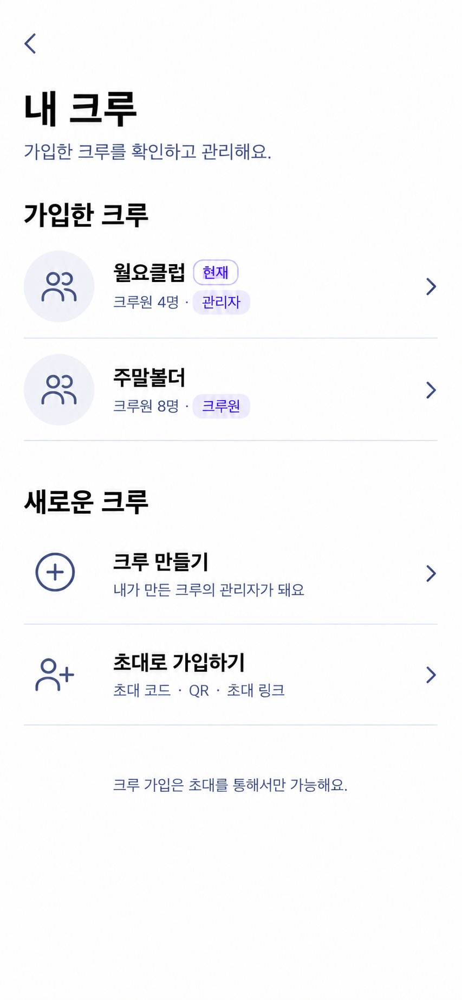

- 가입한 크루의 이름·회원 수·내 역할을 표시한다. 모든 행의 오른쪽은 동일한 >이며 현재 크루의 이름 옆에 ‘현재’ 표시를 둔다. 체크·라디오 선택 표시는 사용하지 않는다.
- 크루 행은 S22 크루 정보(06.01)를 열고 현재 크루를 바꾸지 않는다. 빠른 선택은 일정·기록 상단의 S19-A 선택창에서 한다. 상세의 ‘이 크루 일정 보기’는 전환 후 일정으로 이동하는 보조 경로다.
- 크루 만들기 → 06.04, 초대로 가입하기 → 06.05. 공개 검색·추천 크루 목록은 없다.
- 가입 크루가 없으면 목록 영역에 ‘가입한 크루가 없어요’를 표시하고 생성·가입 동작은 유지한다. 별도 실패·다시 시도 화면은 만들지 않는다. 가입 목록과 아래 메뉴의 글자 시작 위치를96으로 통일하고 이름·배지는 세로 가운데로 맞춘다. 각 제목과 목록·메뉴의 간격은16, 큰 묶음 사이 간격은24다.

### 06.04 크루 만들기

- 시안: [기본 화면](https://www.figma.com/design/vla4pXPo8FaCWFXfpIbYzx/Holdlog?node-id=478-35936) · [상태별 링크](./screen-numbering.md) · [검증 기록](history/figma/crew-state-policy-2026-10-02.json).

- 연결 기능: S24. 01.01.02·06.03 또는 06.10 선택창의 크루 만들기에서 진입한다.

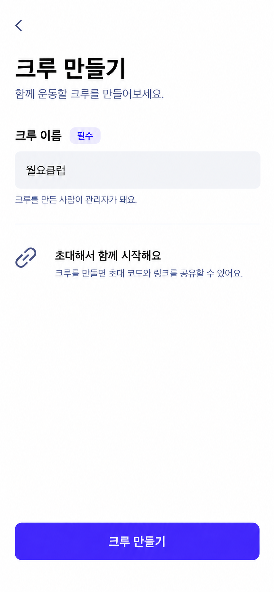

- 크루 이름만 필수 입력한다. 이름이 비어 있으면 생성 버튼은 비활성화한다.
- 생성자가 최초 관리자가 됨을 설명한다. 공개 탐색 설정·사진 업로드 등 추가 입력은 만들지 않는다.
- 저장 중에는 버튼 중복 실행만 막고 별도 저장 중 화면은 만들지 않는다. 실패하면 기본 화면의 입력을 유지하고 다이얼로그로 알린다. 제목 묶음과 설명 간격은 다른 크루 화면과 같은24다. 빈 이름 입력칸·비활성 버튼은 기본 화면 옆 부품 견본으로만 표시한다. 성공하면 새 크루가 선택된 S03 일정으로 이동한다.

### 06.05 초대 코드 입력

- 시안: [기본 화면](https://www.figma.com/design/vla4pXPo8FaCWFXfpIbYzx/Holdlog?node-id=478-36581) · [상태별 링크](./screen-numbering.md) · [검증 기록](history/figma/crew-state-policy-2026-10-02.json).

- 연결 기능: S02. 01.01.02·06.03·06.10의 가입 동작에서 진입한다.

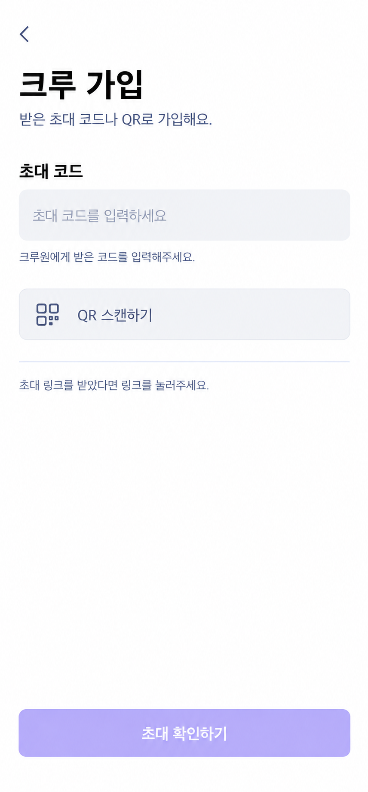

- 코드 입력 후 초대 확인하기 → 서버 검증 → 06.07 가입 확인. 빈 입력에서는 확인 버튼이 비활성화된다.
- QR 스캔하기 → 06.06. 초대 링크는 링크를 열면 같은 06.07으로 이어진다.
- 입력 완료·입력 오류는 기본 화면 옆 입력칸 견본으로만 표시한다. 기본 화면에서 초대 조회 문제가 생기면 입력을 유지하고 다이얼로그로 처리한다. 통신 실패·확인 중·다시 시도 전체 화면은 만들지 않는다.
- 이 단계에서는 가입하지 않으며 크루 일정·기록·회원 명단을 보여주지 않는다.

### 06.06 QR 스캔

- 시안: [기본 화면](https://www.figma.com/design/vla4pXPo8FaCWFXfpIbYzx/Holdlog?node-id=478-36995) · [상태별 링크](./screen-numbering.md) · [검증 기록](history/figma/crew-state-policy-2026-10-02.json).

- 연결 기능: S02. 06.05의 QR 스캔하기에서 진입한다.

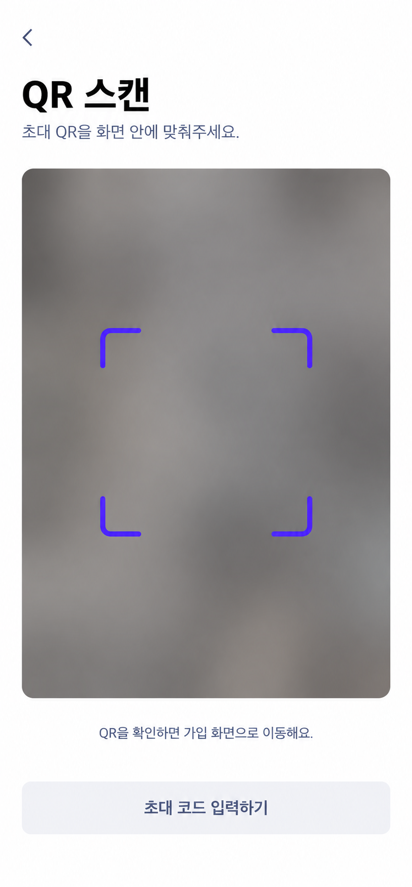

- 안내 프레임 안의 QR을 읽으면 서버 검증 후 06.07을 연다. 한 QR을 반복 인식해 화면을 여러 번 열지 않는다.
- 초대 코드 입력하기 → 06.05. 카메라 권한 거절 시 이유와 코드 입력 대안을 표시한다.
- 사용할 수 없는 QR은 기본 스캔 화면 위 중앙 다이얼로그로 알린다. 확인하여 닫으면 연속 스캔을 계속하며 ‘다시 스캔’ 버튼은 없다. 기본 화면 위에 겹친 대표 다이얼로그 시안1개로 위치·크기를 확인하고, 추가 메시지는 다이얼로그 부품만 옆에 표시한다. 카메라 권한 거절·잘못된 QR을 별도 전체 화면으로 복제하지 않는다. 인식만으로 자동 가입하지 않는다.

### 06.07 초대 가입 확인

- 시안: [기본 화면](https://www.figma.com/design/vla4pXPo8FaCWFXfpIbYzx/Holdlog?node-id=478-37564) · [상태별 링크](./screen-numbering.md) · [검증 기록](history/figma/crew-state-policy-2026-10-02.json).

- 연결 기능: S02. 코드·QR·초대 링크가 같은 확인 화면으로 모인다. 로그인이 필요하면 S01 완료 후 초대를 유지해 이 화면으로 돌아온다.

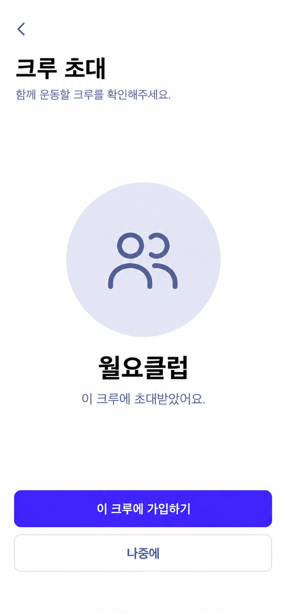

- 화면 중앙에 큰 원형 크루 기본 프로필 아이콘을 배치하고, 그 아래에 크루 이름과 ‘이 크루에 초대받았어요.’를 각각 별도 줄로 가운데 정렬한다. 프로필은 약 210dp 크기를 기준으로 하되 작은 화면·글자 확대 시 내용과 버튼이 겹치지 않도록 조정한다. 현재 버전은 기존 기본 크루 아이콘을 사용한다.
- 로그인 계정 안내 문구·계정 카드·가입 계정 선택·회원 명단·일정·기록은 표시하지 않는다. 상단 제목·설명과 하단 가입·나중에 버튼은 유지한다.
- 가입은 현재 로그인된 계정으로 진행한다. 계정 변경 버튼을 제공하지 않는다. 로그아웃 상태에서 링크를 연 경우에만 S01 로그인 후 같은 초대로 돌아온다.
- 이 크루에 가입하기 → 가입 저장 성공 후 해당 크루 S03. 나중에 → 진입 전 화면으로 복귀하며 가입하지 않는다.
- 이미 가입한 크루는 중복 가입하지 않고 해당 크루 일정으로 갈 수 있도록 처리한다. 가입 제한·사용할 수 없는 초대·통신 또는 가입 실패는 기본 화면 위 중앙 다이얼로그로 처리한다. 다이얼로그의 메시지를 바꿔 쓰며 별도 전체 화면이나 중복 가입 실패 화면을 만들지 않는다. 가입 중도 별도 시안으로 만들지 않는다.

### 06.08 초대 코드·QR·링크 공유

- 시안: [기본 화면](https://www.figma.com/design/vla4pXPo8FaCWFXfpIbYzx/Holdlog?node-id=478-38215) · [상태별 링크](./screen-numbering.md) · [검증 기록](history/figma/crew-state-policy-2026-10-02.json).

- 연결 기능: S17. 크루 정보 06.01의 초대 코드·QR·링크 행에서 진입한다.

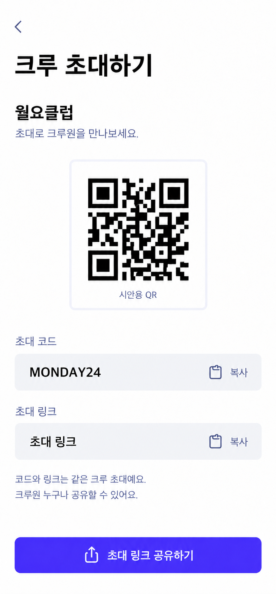

- 같은 초대를 코드·QR·링크로 제공한다. 활성 크루원 모두 사용할 수 있다.
- 코드·링크를 같은 배경·높이·모서리·정렬의 행으로 표시한다. 각 행 오른쪽은 동일한 복사 아이콘+‘복사’ 버튼이다. 코드 행은 코드, 링크 행은 링크를 복사하며 완료 시 누른 버튼만 초록색 아이콘·‘복사됨’으로 변경한다. 별도 토스트·복사 완료 화면은 없다. 06.08.01 하나에서 코드 버튼은 초록색 ‘복사됨’, 링크 버튼은 기본 ‘복사’로 표시해 두 상태를 함께 확인한다. 별도 복사 부품 견본은 두지 않는다. 실제 화면의 첫 진입에서는 두 버튼 모두 ‘복사’이며 사용자가 누른 버튼만 바뀐다.
- 초대 링크 공유하기 → 기기 기본 공유 화면. 공유 문구에 크루 이름·초대 링크·코드를 포함한다. 공유 취소 시 이 화면을 유지한다.
- 재발급·만료 설정·관리자 전용 제한은 없다. 권한이 없으면 화면 진입을 막는다. 진입 후 권한을 잃으면 공유를 막고 다이얼로그로 처리한다. 별도 권한 없음·실패 화면은 만들지 않는다.
- 이미지의 ‘시안용 QR’ 문구는 산출물 설명이며 실제 앱에는 표시하지 않는다.

### 06.09 관리자 넘기기

- 시안: [기본 화면](https://www.figma.com/design/vla4pXPo8FaCWFXfpIbYzx/Holdlog?node-id=478-39499) · [상태별 링크](./screen-numbering.md) · [검증 기록](history/figma/crew-state-policy-2026-10-02.json).

- 연결 기능: S25. 갱신한 크루 정보 06.01의 관리자 넘기기에서 진입한다.

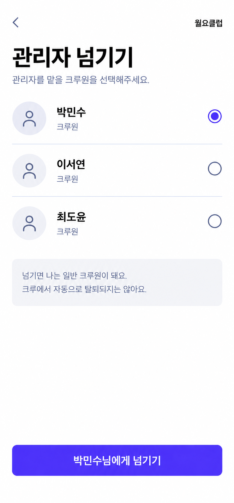

- 본인을 제외한 활성 회원 중 한 명을 선택한다. 그림은 박민수를 선택한 상태다. 선택 전 버튼은 비활성화한다.
- 주요 버튼 → 확인창 ‘박민수님에게 관리자를 넘길까요?’ / ‘나는 일반 크루원이 되며 자동으로 탈퇴되지 않아요.’ / 취소·넘기기.
- 확인 성공 시 06.01로 돌아오며 내 역할은 크루원으로 갱신한다. 자동 탈퇴하지 않는다. 일반 회원 상태에는 기존 탈퇴 진입을 제공한다.
- 대상이 없으면 ‘관리자를 넘길 크루원이 없어요’와 가입 초대 경로를 제공한다. 이관 전 탈퇴·계정 삭제는 불가하다.
- 대상 탈퇴·권한 변경·저장 실패 시 역할을 변경하지 않고 기본 화면 위 다이얼로그로 처리한다. 저장 중은 중복 실행만 막으며 별도 상태 화면을 만들지 않는다. 06.09.01 목록 안에 선택·미선택이 함께 보이므로 선택 상태 부품 견본은 추가하지 않는다. 확인창은 기존 선택 완료 화면 위에 겹친 대표 시안1개로 표시한다. 대상 없음은06.09.02로 정리한다.

### 06.10 크루 선택창

- 시안: [기본 화면](https://www.figma.com/design/vla4pXPo8FaCWFXfpIbYzx/Holdlog?node-id=478-41934) · [상태별 링크](./screen-numbering.md) · [검증 기록](history/figma/profile-crew-2026-10-01.json).

- 선택창 마지막 ‘초대로 가입하기’ 행 아래 밑줄은 표시하지 않는다. 회원 수와 관리자·크루원 배지는 같은14 글자 규격이며 같은 줄의 세로 가운데로 정렬한다.

- 연결 기능: S19-A. 일정·기록 상단 ‘크루 이름 ⌄’ 바로 아래에 겹쳐 여는 선택창이다. 배경 화면의 위치와 스크롤은 바뀌지 않는다.

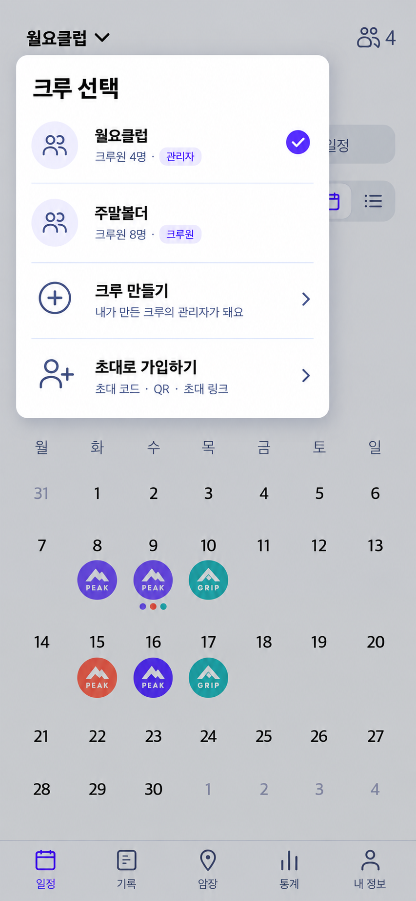

- 현재 크루만 체크한다. 다른 크루 행의 오른쪽은 비워 두며 크루 행에는 >를 쓰지 않는다.
- 크루를 누르면 바로 전환하고 창을 닫는다. 현재 탭·보기 방식·보고 있던 월과 날짜·암장 필터는 유지하고, 기록의 참석자 필터는 초기화한다. 같은 크루를 누르면 창만 닫는다.
- 창 밖을 누르거나 뒤로 가면 변경 없이 닫는다. 크루가 많으면 목록을 스크롤한다.
- 선택창 높이: 크루1~3개는 목록 길이에 맞춰 창 높이를 조절한다. 행 높이70, 목록 최대280으로4개까지 보이며 크루4개 이상이면 선택창 높이는 최대508이다. 제목과 아래 ‘크루 만들기·초대로 가입하기’는 고정하고 크루 목록 안에서만 세로 스크롤한다. 기본 시안 옆에 [목록을 아래로 내린 선택창 부품 견본](https://www.figma.com/design/vla4pXPo8FaCWFXfpIbYzx/Holdlog?node-id=529-31418)을 참고한다. [견본 사진](./figma/assets/crew-selector-height-2026-10-02/crew-selector-scrolled.png).
- 아래의 ‘크루 만들기 >’, ‘초대로 가입하기 >’는 각각 작성·가입 화면으로 이동한다. 취소하면 원래 화면과 선택 크루를 유지한다.
- 내 정보의 06.03는 상세 조회·관리 목록이며 이 선택창과 구분한다.

## 06.11 회원 기록·통계

[Figma 기본 시안](https://www.figma.com/design/vla4pXPo8FaCWFXfpIbYzx/Holdlog?node-id=499-47001) · [제작·검증](history/figma/additional-screens-2026-10-02.json).

06.02.01 크루원 목록에서 회원 프로필·전체 기록·통계를 연다. 통계는04.01.01과 같은 기간 선택·요약·월별 방문·방문한 암장·난이도별 완등·컨디션 부품을 재사용한다. 미입력 안내는 표시하지 않는다. 날짜·암장 필터는 아래 기록 목록에만 적용하며 통계는 별도 기간 선택을 따른다.

S13 · functional-spec.md

## 07 계정

## 07.01 로그인

[Figma 기본 시안](https://www.figma.com/design/vla4pXPo8FaCWFXfpIbYzx/Holdlog?node-id=499-47741) · [제작·검증](history/figma/additional-screens-2026-10-02.json).

앱 시작·로그아웃 후 구글·Apple 로그인. 초대 정보를 유지. 제공사 로그인창은 앱 자체 화면으로 복제하지 않음.

S01 · functional-spec.md

## 관리자 웹

너비는1440이며 실제 주소·로고·좌표·지도는 예시다. 저장·권한·입력 유지 규칙은 [관리자 명세](./admin-spec.md)를 따른다.

- [A02 암장·브랜드 등록·수정](https://www.figma.com/design/vla4pXPo8FaCWFXfpIbYzx/Holdlog?node-id=510-57505): 왼쪽 관리자 메뉴, 가운데 암장 폼, 오른쪽 브랜드 폼. 암장에는 불러오기·브랜드 선택·지점·좌표·벽 목록, 브랜드에는 불러오기·이름·로고·난이도를 표시한다. 제목은 ‘벽 목록’이며 로고 파일명과 선택 버튼은 같은 줄·높이로 배치한다.
- [A03 벽 세팅 등록·수정](https://www.figma.com/design/vla4pXPo8FaCWFXfpIbYzx/Holdlog?node-id=510-58616): 왼쪽 암장·벽·날짜 입력, 오른쪽 등록 목록. 수정은 같은 폼을 쓴다.
- [A03.02 취소 확인](https://www.figma.com/design/vla4pXPo8FaCWFXfpIbYzx/Holdlog?node-id=511-59027): 기존 화면을 어둡게 하고 중앙 확인창에 대상 암장·벽·날짜와 돌아가기·세팅 취소를 표시한다.
- 기존 항목의 입력·저장 버튼 차이는 [수정 부품 견본](https://www.figma.com/design/vla4pXPo8FaCWFXfpIbYzx/Holdlog?node-id=514-30631)으로 확인한다. 전체 수정 화면은 복제하지 않는다.
- [A02 옆 명세](https://www.figma.com/design/vla4pXPo8FaCWFXfpIbYzx/Holdlog?node-id=511-59151) · [A03 옆 명세](https://www.figma.com/design/vla4pXPo8FaCWFXfpIbYzx/Holdlog?node-id=511-59158) · [현재 웹 사진](./figma/assets/brand-gym-correction-2026-10-02/review.html). 명세 배치는 디자인 시스템의 공통 규칙을 따른다.

### A04 공지 관리

[Figma 시안](https://www.figma.com/design/vla4pXPo8FaCWFXfpIbYzx/Holdlog?node-id=577-34245) · [사진](./figma/assets/announcements-licenses-2026-10-06/A04.01-announcements.png).

기존 관리자 웹의1440 너비·왼쪽 메뉴를 재사용하고 ‘공지 관리’ 행을 추가한다. 왼쪽 공지 목록에는 작은 이미지·파일명·표시 순서와 ‘공지 추가’를 둔다. 오른쪽 같은 폼에는 이미지 미리보기·파일 선택·이동 링크·표시 순서·저장 버튼을 둔다. 파일명과 이미지 선택 버튼은 같은 줄에 정렬한다. 기존 공지는 저장 옆에 ‘공지 삭제’를 두며 새 공지 입력에는 삭제 버튼을 표시하지 않는다.

목록 선택으로 기존 값을 수정한다. 새 항목의 ‘공지 등록’ 버튼 차이는 옆 부품 견본으로 표시하며 등록·수정 전체 화면을 중복 생성하지 않는다. [A04.02 삭제 확인](https://www.figma.com/design/vla4pXPo8FaCWFXfpIbYzx/Holdlog?node-id=577-34883)은 기존 화면 위 중앙 확인창으로 표시한다. 취소하면 유지하고 삭제하면 목록과 이후 앱 조회에서 제외한다. 저장·삭제·권한 동작은 [관리자 명세](./admin-spec.md#공지-관리)를 따른다. 이미지·파일명·주소는 예시다.

## 99. 부록

### 화면 검토 체크

- 도장 아래 점이 전체 방문 건수이며 버튼이나 인원 수가 아님을 설명했는가?
- 브랜드·지점 색상과 사람 아이콘의 참석 의미를 혼동하지 않는가?
- 전체 회원 수, 실제 참석 인원, 표시 방문 건수를 구분했는가?
- 크루 방문에 참여 신청한 것과 실제 참석한 것을 구분했는가?
- 내 개인 기록과 연결된 공동 방문을 두 번 그리지 않는가?
- 나는 불참인 방문에 내 컨디션·완등 수치를 붙이지 않았는가?
- 날짜 선택 효과·달력 아래 카드·기본 화면 추가 버튼이 다시 생기지 않았는가?
- 현재 시안의 미반영 항목과 아직 그리지 않은 화면이 명확히 구분되는가?
- 색상만으로 의미를 전달하지 않고 상세 글자·화면 읽기 설명을 제공하는가?
