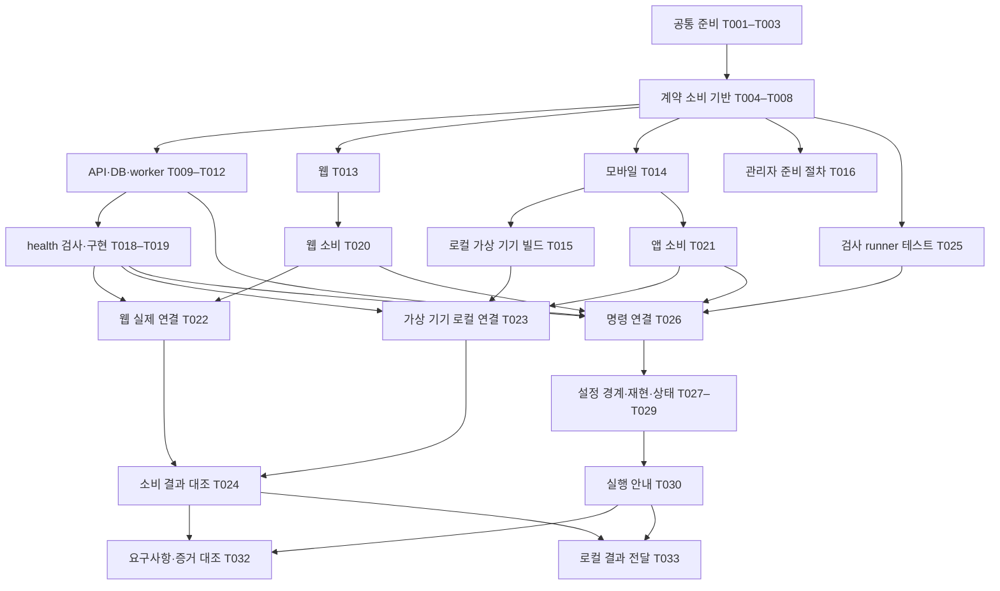

# Tasks: 개발 기반 구성

**작성일**: 2026-10-06 · **상태**: 작업별 구현·검사 여부는 각 작업 항목의 체크를 따른다. 실제 연동 검증 전.

**입력**: [spec.md](spec.md) · [plan.md](plan.md) · [research.md](research.md) · [data-model.md](data-model.md) · [기반 인터페이스](contracts/README.md) · [검증 안내](quickstart.md)

아래 파일·명령은 구현할 위치와 결과이며 실제 생성·설치·실행 완료를 뜻하지 않는다. 2026-10-06 일관성 분석과 준비 문구 보완을 수행했다. T001–T003의 구현·로컬 검사 증거는 [공통 준비 검증 기록](../../docs/history/development/001-shared-foundation-verification.md)에 남겼다. GitHub 연결 상태는 아래 배정 묶음과 상위 이슈에서 확인한다. 후속 변경 시 영향받는 스펙·설계·작업의 일관성을 다시 확인한다.

## 읽는 방법과 범위

- `001/T001`처럼 스펙 번호와 작업 번호를 함께 사용한다. 기존 기능 검증 `T01`과 다르다.
- `[SHARED]`는 공통 준비, `[FE]`는 앱/웹, `[BE]`는 서버, `[INTEGRATION]`은 합친 결과 확인이다. 사람은 아직 배정하지 않았다.
- `[US1]`은 실행 준비, `[US2]`는 앱/웹과 서버 연결, `[US3]`는 재사용할 자동 검사다.
- `[P]`는 선행 작업이 끝난 뒤 다른 파일을 수정하는 작업과 병렬 진행할 수 있다는 뜻이다. 각 항목의 선행 ID를 먼저 확인한다.
- 각 항목에 변경 경로·선행 작업·FR/SC·검사/전달 결과를 적었다. 완료 표시는 구현과 명시한 검사를 모두 수행한 뒤 한다.
- `package-lock.json`·루트 `package.json`·공통 계약 원본·공유 문서는 공통 담당 한 명이 변경을 모은다. 앱별 작업에서 의존성 변경 요청을 전달하고 lockfile을 동시에 갱신하지 않는다.

실제 휴대폰 검사·물리 서버 배포·제품 화면·인증·지도·푸시·미디어 처리·운동 시작 방식·운영 배포는 이 목록에서 구현하지 않는다. 제품 계약은 [002 원본](../002-shared-contracts/contracts/README.md), 상세 역할은 [개발자 구분](../development-roles.md)을 따른다.

## Phase 1: 공통 준비

목표: 기존 자료를 보존하면서 재현 가능한 도구·작업 공간을 준비한다.

- [x] T001 [SHARED] `docs/setup-checklist.md`에 개발 도구·Docker daemon·Xcode/Android 도구의 실제 준비 상태와 Git 설정 오류를 확인해 기록하고, 서버 사양·휴대폰 미정을 유지한다. 선행 없음; FR-007–009·SC-005. 검사/전달: 도구 존재와 실행 성공을 구분하고 운영 자료·비밀값을 출력하지 않는다. 서버/휴대폰 결정은 이 작업의 완료 조건이 아니다.
- [x] T002 [SHARED] `.nvmrc`, `.npmrc`, `package.json`, `package-lock.json`과 `apps/mobile/package.json`, `apps/admin/package.json`, `apps/server/package.json`, `packages/contracts/package.json`에 workspace·패키지 이름·호환 도구/의존성 정확한 버전을 고정한다. 선행 T001; FR-001·002·005. 검사/전달: 계획의 Node/npm·SDK 계열에서 공식 메타데이터/엔진을 재확인하고 `npm ci`가 재현되는지 확인한다. 빈 작업 폴더를 만든다는 이유로 기존 계약·문서·시안을 덮어쓰지 않는다.
- [x] T003 [SHARED] `tsconfig.base.json`, `eslint.config.mjs`, `.gitignore`에 공통 타입/lint 기준과 로컬 비밀·서명·인증서·DB/파일 자료 제외 규칙을 준비한다. 선행 T002; FR-006·007·009. 검사/전달: 공개 예시는 추적할 수 있고 실제 비밀/빌드/저장 자료는 추적되지 않는지 합성 파일로 확인한다. 앱별 React 조합을 공통 설정에서 강제하지 않는다.

- [x] T034 [SHARED] 사용자 요청에 따라 서버를 `apps/server`·`@holdlog/server`로 변경하고 각 workspace의 `tsconfig.json`·lint/typecheck 명령, 환경 확인용 `checks/environment.ts`, 루트 `scripts/check-tooling.mjs`·`scripts/test/tooling.test.mjs`를 준비한다. 선행 T003; FR-001·002·006·007·008·009. 검사: manifest/lockfile 일치와 불일치 거절, 임시 파일 정리의 기존 파일 보존, 관리자 Node 설정과 브라우저 타입 분리, Node/브라우저/React Native 환경·Hooks·타입 기반 lint, 브라우저 서버 전역 거절, 필수 명령 누락·실패 종료 전파를 검증한다. 루트 `npm run check`는 현재 코드와 설정 검사를 수행하며 서비스 빌드·DB·기기 검사를 대신하지 않는다. #2의 보완 범위이며 T025·T026의 서비스 전체 검사 연결은 미완료로 유지한다.

## Phase 2: 공통 계약 소비 기반

목표: 같은 원본에서 타입·검사·예제를 생성해 후속 역할에 전달한다. 이 단계가 끝나면 각 실행 대상의 단독 작업을 시작할 수 있다.

- [x] T004 [SHARED] `scripts/contracts/schema-registry.mjs`와 `packages/contracts/test/schema-registry.test.mjs`에 로컬 문서 ID/JSON Pointer 참조 해결과 HTTP operation 입출력 schema 추출을 준비한다. 선행 T003; FR-005·006. 검사/전달: runtime의 OpenAPI 외부 참조·모든 `$defs`·path/query/header/body/response를 처리하고 미해결 참조/지원하지 않는 검증 키워드는 실패한다. OpenAPI 전체 문서를 JSON Schema로 간주하지 않는다.
- [x] T005 [SHARED] `scripts/contracts/generate.mjs`, `scripts/contracts/formats.mjs`, `scripts/contracts/http-input.mjs`, `packages/contracts/test/validation.test.mjs`, `packages/contracts/test/http-input.test.mjs`, `packages/contracts/generated/`에 HTTP/runtime 타입과 Ajv2020 standalone 검사 함수를 생성한다. 선행 T004; FR-005·007. 검사/전달: `coerceTypes`, `useDefaults`, `removeAdditional`을 끄고 UUID/date/date-time/email/URI·IANA 시간대를 검사한다. standalone format 코드와 모바일에서 사용할 출력 형식을 준비하고 서버 모듈을 클라이언트 출력에 포함하지 않는다.
- [x] T006 [SHARED] `scripts/contracts/check-examples.mjs`, `packages/contracts/generated/fixtures.mjs`, `packages/contracts/test/examples.test.mjs`에 기존 `examples.json`을 읽는 fixture adapter와 규약/정상/거절 검사를 준비한다. 선행 T005; FR-005·006. 검사/전달: 예제 schema와 operation 입출력 연결, 모든 `mustReject` 거절을 확인한다. 예제에 없는 업무 동작을 생성하지 않고 비JSON bytes·권한 검사의 후속 경계를 표시한다.
- [x] T007 [SHARED] `packages/contracts/package.json`, `packages/contracts/test/frontend-consumer.ts`, `packages/contracts/test/backend-consumer.ts`에 진입점과 FE HTTP/runtime·BE HTTP/job/storage 소비 타입 검사를 준비한다. 선행 T006; FR-001·005·007. 검사/전달: 같은 원본 버전의 정상 소비는 통과하고 잘못된 타입은 기대 오류로 검증한다. 브라우저/모바일 진입점에 NestJS·DB·비밀 설정 의존성이 없어야 한다.
- [x] T008 [SHARED] `scripts/contracts/check-generated.mjs`, `packages/contracts/generated/manifest.json`, `packages/contracts/test/generated.test.mjs`, 루트 `package.json`·`scripts/check-tooling.mjs`에 `contracts:generate`/`contracts:check` 명령과 생성 차이 검사를 연결한다. 선행 T007; FR-005·006·008. 검사/전달: 계약 버전·원본 SHA-256·도구 버전·출력 목록을 남기고 “매번 달라지는 시각을 생성 결과에 넣지 않음”을 지킨다. 재생성은 동일해야 하며 임시 원본 변경 후 미재생성은 실패해야 한다. 원본 변경 검사는 별도 시험 사본에서 수행한다.

T004–T008의 실행 증거·남은 조건은 [계약 검사 결과](quickstart.md#계약-생성과-소비-검사-결과)에 있다. 구현·검사 완료와 PR 병합·#4 종료는 구분한다.

## Phase 3: US1 — 개발 작업 시작 (P1)

목표: 모바일·관리자 웹·API·DB·worker를 각각 시작하고 필요한 설정을 알 수 있다.

독립 확인: 로컬에서 API/DB/worker·웹·모바일 시뮬레이터/에뮬레이터를 켜고 실행 증거를 남긴다. 필수 설정 누락은 실패여야 한다. 로컬 실행과 실기기 확인은 별도 상태로 기록한다.

- [x] T009 [P] [US1] [BE] `apps/server/test/config.spec.ts`, `apps/server/test/database.integration.spec.ts`, `apps/server/test/jobs.integration.spec.ts`에 설정 누락·DB 변경/재시작·worker 재시도/중복 효과 검사를 먼저 작성하고 구현 전 실패를 확인한다. 선행 T008; FR-002·003·007·SC-003. 검사/전달: 합성 자료만 사용하고 비밀값 로그 금지·checksum 변경 거절·동일 jobId 효과 중복 방지를 기대값으로 둔다.
- [x] T010 [US1] [BE] `apps/server/src/main.ts`, `apps/server/src/app.module.ts`, `apps/server/src/config/`, `apps/server/.env.example`에 NestJS 실행·환경 검사·안전한 요청 로그를 준비한다. 선행 T009; FR-002·007. 검사/전달: “필수 설정 누락은 설정 이름만 알려주고 실패한다”·“값을 로그에 출력하지 않는다”를 지키고 제품 API·인증 우회를 추가하지 않는다. API workspace 실행 명령을 전달한다.
- [x] T011 [US1] [BE] `infra/development/compose.yaml`, `infra/development/.env.example`, `apps/server/src/database/`, `apps/server/db/migrations/`에 개발/시험 DB·비공개 파일 볼륨·SQL 변경 실행기를 준비한다. 선행 T010; FR-003·007·SC-003. 검사/전달: PostgreSQL 이미지 tag/digest·영구 볼륨·개발/시험 구분, 변경 이력의 버전/checksum/시각과 “적용한 파일의 checksum 변경을 거절한다”를 확인한다. 제품 테이블·운영 연결·볼륨 삭제를 사용하지 않는다.
- [x] T012 [US1] [BE] `apps/server/src/worker.ts`, `apps/server/src/jobs/`, `apps/server/test/jobs.integration.spec.ts`에 pg-boss 실행·종료·합성 작업 재개와 결과 표식을 준비한다. 선행 T011; FR-002·003·SC-003. 검사/전달: worker 작업 중 중지/재시작·재시도에서 동일 jobId 효과가 중복되지 않는지 실제 시험 DB로 확인한다. 내부 queue schema는 라이브러리에 맡기고 실제 영상/알림/삭제 처리기를 구현하지 않는다.
- [x] T013 [P] [US1] [FE] `apps/admin/package.json`, `apps/admin/vite.config.ts`, `apps/admin/tsconfig.json`, `apps/admin/src/main.tsx`, `apps/admin/.env.example`에 React/Vite 실행·빌드 기반을 준비한다. 선행 T008; FR-001·002·007·SC-001. 검사/전달: 개발 서버·웹 빌드·설정 오류를 확인하고 상대 API 경로를 사용한다. 제품 화면을 새로 설계하지 않으며 서버 비밀을 웹 변수에 넣지 않는다. 의존성/lock 변경은 공통 담당에게 전달한다.
- [x] T014 [P] [US1] [FE] `apps/mobile/package.json`, `apps/mobile/app.config.ts`, `apps/mobile/metro.config.cjs`, `apps/mobile/tsconfig.json`, `apps/mobile/App.tsx`, `apps/mobile/.env.example`에 Expo·전용 개발 빌드·계약 패키지 소비 기반을 준비한다. 선행 T008; FR-001·002·007·SC-001. 검사/전달: SDK 지원 조합·타입·Metro 모듈 해석·설정 누락을 확인한다. 제품 화면/탐색과 로그인/지도/푸시 동작은 추가하지 않는다. 로컬 가상 기기는 개발용 앱 식별자로 준비하고 실제 배포 식별자·실기기 서명이 필요한 검사는 해당 후속 기능·배포 범위에서 계획한다. lock 변경은 공통 담당에게 전달한다.
- [x] T015 [US1] [FE] `apps/mobile/app.config.ts`와 `docs/history/development/001-foundation-verification.md`에 로컬 Xcode/Android 도구·개발용 앱 식별자를 준비하고 iOS 시뮬레이터/Android 에뮬레이터용 전용 개발 빌드 설치/시작 결과를 기록한다. 선행 T014 및 로컬 플랫폼 빌드 도구; FR-002·008·SC-001·005. 검사/전달: OS/가상 기기/도구·실제 명령·결과를 남긴다. Metro 시작/Expo Go로 전용 개발 빌드를 대신하지 않고 가상 기기를 실기기로 표시하지 않는다. 휴대폰·스토어 계정·물리 서버 미정으로 이 작업을 막지 않는다.
- [x] T016 [P] [US1] [BE] `specs/001-development-foundation/contracts/admin-bootstrap.md`에 초기 관리자 비밀 입력·전달·Argon2id 해시·명시적 교체·재실행/실패 절차를 작성해004에 전달한다. 선행 T008; FR-002·007·008. 검사/전달: C02 원본에 맞고 기존 비밀번호를 조용히 덮어쓰지 않는 절차인지 확인한다. 실제 principal 저장·로그인·cookie/CSRF 구현/실행은004에 연결하며001 완료 조건으로 당겨오지 않는다.
- [ ] T017 [US1] [INTEGRATION] `docs/history/development/001-foundation-verification.md`에 API/worker·개발 DB·웹·모바일의 실제 시작·설정 누락 실패와 DB 정상 재시작/자료 보존 결과를 합쳐 기록한다. 선행 T010–T016; FR-001–003·007–009·SC-001·003·005. 검사/전달: 같은 계약/도구 버전과 합성 자료를 사용하고 대상별 성공/실패/미수행을 분리한다. 로컬 플랫폼 도구 미준비 시 해당 실행만 미수행으로 남긴다. 실물 서버/휴대폰 미정은 로컬 실행의 차단 조건이 아니다.

T009–T012·T018–T019의 서버 단독 실행·DB 재시작·worker 중단/재개 증거는 [서버 기반 검증 기록](../../docs/history/development/001-backend-foundation-verification.md)에 있다. 브라우저·가상 기기의 실제 API 연동은 #10 범위다.

T014·T021의 모바일 기반·단독 검사와 T015의 iOS/Android 전용 앱 실행 증거는 [로컬 검증 기록](../../docs/history/development/001-foundation-verification.md#모바일-기반--7--t014t015t021)에 있다. Xcode27 초기 구성 후 iOS26.2 시뮬레이터에서 빌드·설치·시작과 Hermes 계약 소비를 확인했다.

## Phase 4: US2 — 앱과 서버 연결 확인 (P1)

목표: 웹·앱에서 같은 개발 서버에 요청하고 성공·DB 불가·네트워크 불가를 구분한다.

독립 확인: 제품 API 없이 개발 health 경로에 실제 요청한다. mock·로컬 API/가상 기기·실기기 통과를 따로 기록한다. US1 전체 완료를 기다리지 않고 필요한 대상이 준비되면 단독 작업을 시작할 수 있다.

- [x] T018 [US2] [BE] `apps/server/test/health.e2e-spec.ts`에 live200·ready200/503·비밀/DB 오류 미노출·개발 경로의 운영 외부 노출 차단 검사를 먼저 작성하고 실패를 확인한다. 선행 T011; FR-004·007·SC-002. 검사/전달: [기반 연결 계약](contracts/README.md#개발-연결)의 정확한 상태/body를 기대값으로 사용하고 worker 성공을 API live 응답으로 판단하지 않는다.
- [x] T019 [US2] [BE] `apps/server/src/health/`, `apps/server/src/app.module.ts`에 `/internal/health/live`와 `/internal/health/ready`를 구현하고 실제 DB 쿼리/오류 처리·개발 접근 제한을 연결한다. 선행 T018; FR-004·007·SC-002. 검사/전달: T018 통과, DB 중지503·복구200, 제품 `/api/v1` 계약에 추가하지 않는 개발 경로와 호출 방법을 전달한다.
- [x] T020 [P] [US2] [FE] `apps/admin/src/development/connection-check.ts`, `apps/admin/test/connection-check.test.ts`, `apps/admin/vite.config.ts`에 테스트 호출 진입점과 개발 proxy를 준비한다. 선행 T013; FR-004·005·007·SC-002. 검사/전달: 응답/503/연결 불가 검사부터 작성하고 구현한다. health 응답은001 기반 계약, 제품 타입은002 생성물을 사용한다. 제품 화면 추가 없이 실행하며 관리자 인증의 로컬 HTTPS/Secure/CSRF는004 전달 조건으로 유지한다.
- [x] T021 [P] [US2] [FE] `apps/mobile/src/development/connection-check.ts`, `apps/mobile/test/connection-check.test.ts`에 개발 호출 진입점과 실제 개발 호스트 주소 처리를 준비한다. 선행 T014; FR-004·005·007·SC-002. 검사/전달: 성공/503/연결 불가와 설정 누락 검사부터 작성하고 구현한다. health 응답은001, 제품 타입/runtime 검사 함수는002 생성물을 소비한다. 앱 화면/버튼을 추가하지 않고 개발 테스트 실행 방법을 제공한다.
- [ ] T022 [US2] [INTEGRATION] `docs/history/development/001-foundation-verification.md`에 실제 브라우저와 개발 API의 연결200·DB 중지503·API/네트워크 연결 불가 결과를 기록한다. 선행 T019·T020; FR-004·008·SC-002·005. 검사/전달: proxy 주소/Origin·API/계약 버전과 각 결과를 남기고 실패를 빈 결과나 성공으로 취급하지 않는다.
- [ ] T023 [US2] [INTEGRATION] `docs/history/development/001-foundation-verification.md`에 iOS 시뮬레이터/Android 에뮬레이터에서 로컬 API200·DB503·연결 불가와 standalone validator 실행 결과를 기록한다. 선행 T015·T019·T021; FR-004·005·008·SC-002·005. 검사/전달: 플랫폼별 개발 호스트 주소를 사용하고 mock과 실제 로컬 API 연결 결과를 구분한다. 가상 기기/로컬 네트워크 결과는 실기기/외부 서버 결과가 아니며 해당 후속 기능·운영 범위에서 필요한 별도 확인을 계획한다.
- [ ] T024 [US2] [INTEGRATION] `docs/history/development/001-foundation-verification.md`에 FE/BE 생성 버전·원본 해시·공통 예제 소비 결과와 실제 연결 결과를 대조해 전달한다. 선행 T022·T023; FR-005·008·SC-002·005. 검사/전달: 프론트/백엔드 소비 확인을 분리하고 형식 통과·개발 health 연결을 제품 권한/DB 관계/실제 기능 완료로 취급하지 않는다. 해당 범위의 계약 확인만002에 전달한다.

## Phase 5: US3 — 변경 결과 검사 (P2)

목표: 코드·문서·계약·기반 실행 검사를 다시 쓸 수 있고 실패 원인·미수행 상태가 분명하다.

독립 확인: 안내한 검사 명령의 성공·실패·재실행을 확인한다. 미정 서버/기기 때문에 수행하지 못한 항목은 통과로 집계하지 않는다.

- [ ] T025 [US3] [SHARED] `scripts/test/check-runner.test.mjs`에 검사 실패/설정 누락/필수 명령 부재의 비정상 종료와 대상·원인 표시 검사를 먼저 작성한다. 선행 T008; FR-006·008·SC-004·005. 검사/전달: 검사 하나가 실패해도 전체 성공으로 바뀌지 않고 실행하지 않은 대상을 통과로 표시하지 않아야 한다.
- [ ] T026 [US3] [SHARED] `scripts/check-workspaces.mjs`, 루트 `package.json`, `apps/server/package.json`, `apps/admin/package.json`, `apps/mobile/package.json`에 `typecheck`/`lint`/`test`/`build:admin`/`build:api`/`test:foundation`과 개발 실행 명령을 연결한다. 선행 T010–T014·T019–T021·T025; FR-002·006·SC-004. 검사/전달: workspace의 실제 명령을 루트에서 호출하며 Python 문서/계약 검사도 안내한다. `test:foundation`은 로컬의 실제 시험 DB·queue를 쓰며 실제 휴대폰 검사는 001에 포함하지 않는다. T025 통과와 비정상 종료 전파를 확인한다.
- [ ] T027 [US3] [INTEGRATION] `docs/history/development/001-foundation-verification.md`에 공개 예시·추적 파일·웹/API 빌드·모바일 공개 설정·로그의 서버 비밀 미포함 검토 결과를 기록한다. 선행 T026; FR-007·008·SC-004·005. 검사/전달: 합성 비밀 표식으로 경계를 확인하고 실제 비밀/개인 자료를 검사 결과에 저장하지 않는다. 모든 출력/플랫폼을 확인하지 않았다면 해당 부분을 미수행으로 남긴다.
- [ ] T028 [US3] [INTEGRATION] `docs/history/development/001-foundation-verification.md`에 별도 시험 작업 폴더에서 `npm ci`·계약 재생성·타입/lint/test/build·설정 누락 실패/복구·DB/worker 재시작 결과를 기록한다. 선행 T026; FR-002·003·005·006·009·SC-003·004·006. 검사/전달: lockfile/이미지 기준으로 재현되고 일부러 잘못된 설정/입력에서 실패 후 복구되는지 확인한다. 기존 문서/시안·개발 DB 볼륨을 삭제하지 않는다.
- [ ] T029 [US3] [INTEGRATION] `docs/setup-checklist.md`와 `docs/history/development/001-foundation-verification.md`에 물리 서버 사양·기기·계정·초기 자료의 준비 여부와 각 실행 증거의 범위를 대조한다. 선행 T017·T022·T027·T028; FR-008·SC-005. 검사/전달: “로컬 통과가 외부 검사 상태를 바꾸지 않는다”를 지키고 미정/미수행 사유를 남긴다. 초기 암장 자료·관리자 실제 계정·네이티브 기능 검사는 해당 후속 스펙에 전달한다. 서버를 결정/배포해야만 기록할 수 있는 작업은 아니다.

## Phase 6: 공통 마무리

- [ ] T030 [INTEGRATION] `docs/development.md`, `specs/001-development-foundation/quickstart.md`, `docs/setup-checklist.md`에 실제 설치/실행/검사 명령과 성공 조건·필수 설정 이름·문제 해결 절차를 반영한다. 선행 T026·T028·T029; FR-002·006·008·009·SC-004–006. 검사/전달: 실행 확인한 명령만 현재 안내에 추가하고 범위 밖 기기·서버 확인은 후속 범위로 표시한다. 문서 링크/화면 번호·`git diff --check`를 확인한다.
- [ ] T032 [INTEGRATION] `specs/001-development-foundation/tasks.md`, `specs/001-development-foundation/spec.md`, `specs/README.md`에서 FR-001–009·SC-001–006과 실제 증거를 최종 대조한다. 선행 T017·T024·T027–T030; FR-001–009·SC-001–006. 검사/전달: 확인한 결과와 누락 증거·보완 작업을 상위 #1에 전달한다. 001 로컬 범위의 필수 검사 미수행은 누락으로 남긴다. 실제 휴대폰 검사·물리 서버 배포는 범위 밖으로 구분한다. 이 검증 작업 완료만으로001 전체 완료를 표시하지 않으며, 전체 완료는 상위 #1에서 T033 전달을 포함한 현재 로컬 범위의 모든 필수 작업의 완료 증거를 모아 판단한다.
- [ ] T033 [SHARED] `packages/contracts/README.md`와 `specs/002-shared-contracts/quickstart.md`에 기반 도구/소비자 검사 결과와 후속003/004/006의 전달 링크를 갱신한다. `specs/development-roles.md`에는 검사 결과 원본 링크만 연결한다. 선행 T024·T030; FR-001·005·008·009. 검사/전달: 제품 계약 필드를 복사하지 않고 검증된 버전·소비 범위·미검증 항목만 연결한다.001 기반 완료를002 전체 합의나 제품 기능 완료로 바꾸지 않는다.

## 선행 관계와 진행 순서

그림은 주요 흐름의 요약이다. 정확한 선행 조건은 각 작업 항목을 따른다. US1 실행 확인 T017은 서버/웹/모바일·관리자 절차를 합친다. US2는 US1 전체 완료를 기다리지 않고 해당 대상 준비 뒤 진행할 수 있다. US3 runner 테스트는 계약 준비 뒤, 자동 검사 실행은 실제 각 대상 준비 뒤 진행한다.

## 병렬 진행 예시

| 이야기 | 같이 진행할 수 있는 작업 | 조건·충돌 방지 |
|---|---|---|
| US1 | T009 서버 검사, T013 웹, T014 모바일, T016 관리자 절차 | T008 이후. 앱 의존성 변경은 공통 담당이 lockfile에 모음 |
| US2 | T020 웹 테스트 소비, T021 모바일 테스트 소비 | 각 앱 준비 이후, 실제 health 서버 구현을 기다리지 않아도 단독 검사 가능 |
| US3 | T027 설정/번들 경계 검토, T028 별도 시험 폴더 재현 | T026 이후. 같은 증거 문서는 한 연동 담당이 결과를 모으므로 `[P]`를 붙이지 않음 |

`apps/server/src/app.module.ts`를 수정하는 T010/T019는 순서대로 진행한다. `apps/admin/vite.config.ts`를 수정하는 T013/T020도 순서대로 진행한다. 루트 설정 T002/T003/T008/T026과 후속 문서 갱신은 공동 편집하지 않는다. `[P]`는 사람이나 에이전트를 실제 배정했다는 뜻이 아니다.

## 외부 준비와 후속 기능 경계

| 항목 | 현재 상태 | 막는 작업·처리 |
|---|---|---|
| 로컬 플랫폼 도구·개발용 앱 식별자 | Xcode27·Android SDK36 도구와 양쪽 가상 기기 앱 실행 확인 | T015·T023에서 로컬 빌드·실행·연결을 확인. 실제 휴대폰·실기기 서명은 001 범위 밖 |
| 물리 서버 OS/CPU/RAM/디스크·접속 | 미정 | 001은 개발 컴퓨터의 Docker로 검사. 해당 서버 배포·접속·자원 제한 확인은 후속 운영·관련 기능 범위 |
| 실제 관리자 계정·인증 저장/API |004 구현 전 | T016 절차 작성 가능. 실제 계정 준비/로그인·Secure cookie/CSRF 확인은004에서 수행 |
| 초기 암장·세팅 자료 | 미확인 | 합성 자료로001 검사 가능. 실제 운영 자료는006 준비에서 확인 |
| Firebase·지도·로그인 네이티브 기능 | 실제 연동 전 | 기반 빌드 성공과 기능별 모듈/기기 확인을 분리.004/007/017 등 후속 스펙에서 검사 |

## 요구사항·완료 기준 연결

| 요구사항 | 구현/준비 작업 | 핵심 확인 작업 |
|---|---|---|
| FR-001 작업 위치/역할 | T002·T007·T010–T014 | T017·T032·T033 |
| FR-002 실제 명령/설정 | T001–T003·T010–T016·T026 | T017·T028·T030 |
| FR-003 개발 저장 | T009·T011·T012 | T017·T028 |
| FR-004 앱/웹 연결 | T018–T021 | T022·T023·T024 |
| FR-005 동일 계약 | T004–T008·T020·T021 | T024·T028·T033 |
| FR-006 코드/문서 검사 | T003–T008·T025·T026 | T028·T030·T032 |
| FR-007 비밀 분리 | T001–T003·T007·T010–T016·T019–T021 | T027·T032 |
| FR-008 상태 구분 | T001·T008·T015–T017 | T022–T024·T027–T030·T032·T033 |
| FR-009 기존 자료 보존 | T001–T003 | T028·T030·T032·T033 |
| SC-001 대상별 실행 | T010–T015 | T017 |
| SC-002 연결 성공/불가 | T018–T021 | T022–T024 |
| SC-003 저장 환경 재시작 | T009·T011·T012 | T017·T028 |
| SC-004 검사 성공/실패/재실행 | T025·T026 | T027·T028·T030 |
| SC-005 외부 미수행 구분 | T001·T015 | T017·T023·T024·T029·T032 |
| SC-006 기존 연결/번호 검사 | 기존 `scripts/check-docs.py` 유지 | T028·T030·T032 |

## 구현 전략과 배정 묶음

첫 결과(MVP)는 공통 준비·계약 생성·US1의 로컬 실행이다. 이어서 US2 로컬 연결·US3 재현 검사와 T033 후속 전달까지 로컬에서 진행한다. 실물 서버·휴대폰 미정으로 코드 개발을 기다리지 않는다. 최종 T032는 로컬 완료와 범위 밖 외부 검사를 구분한다. 실제 휴대폰 검사·물리 서버 배포는 001 완료 조건에 포함하지 않는다. 실제 기기에서 수행하지 않은 검사를 통과로 바꾸지 않는다.

현재 범위의 33개 작업을 다음 11개 작업 이슈로 나눠 [상위 스펙 #1](https://github.com/trycatch98/Holdlog/issues/1)의 실제 서브 이슈로 연결한다.

준비 문서는 [준비 문서 PR #3](https://github.com/trycatch98/Holdlog/pull/3)에서 검토한다. 작업별 구현·검사 완료 여부는 각 작업 항목의 체크를 따른다. 완료 목록과 미완료 개수를 따로 복사하지 않는다. PR 병합·이슈 완료는 별도다. 담당자는 GitHub Assignees로 배정하고 PR 리뷰는 [개발 흐름](../../docs/development-workflow.md#pr-리뷰와-수정)을 따른다. 이슈 등록 여부와 코드 구현 완료를 구분한다. 선행 결과가 준비되면 [개발 흐름](../../docs/development-workflow.md#github-이슈와-pr)에 따라 상태를 갱신한다.

| 이슈·작업 식별자 | 역할 | 포함 작업 | 결과 | 선행 이슈 |
|---|---|---|---|---|
| [#2](https://github.com/trycatch98/Holdlog/issues/2) · `001/shared-foundation` | SHARED | T001·T002·T003·T034 | 같은 도구·버전·설치 기준으로 앱·웹·서버 개발을 시작할 수 있다. | 없음 |
| [#4](https://github.com/trycatch98/Holdlog/issues/4) · `001/contract-generation` | SHARED | T004·T005·T006·T007·T008 | 같은 데이터 규칙에서 타입·값 검사 함수·예제를 생성하고 앱·웹·서버가 함께 쓴다. | #2 |
| [#5](https://github.com/trycatch98/Holdlog/issues/5) · `001/backend-runtime` | BE | T009·T010·T011·T012·T018·T019 | 개발 API·저장소·작업 처리기를 실행하고 정상·DB 불가 상태를 확인할 수 있다. | #4 |
| [#6](https://github.com/trycatch98/Holdlog/issues/6) · `001/admin-runtime` | FE | T013·T020 | 관리자 웹을 실행·빌드하고 개발 API 연결을 검사할 수 있다. | #4 |
| [#7](https://github.com/trycatch98/Holdlog/issues/7) · `001/mobile-runtime` | FE | T014·T015·T021 | 전용 개발 앱을 가상 기기에서 실행하고 개발 API 연결을 검사할 수 있다. | #4 |
| [#8](https://github.com/trycatch98/Holdlog/issues/8) · `001/admin-bootstrap-guide` | BE | T016 | 초기 관리자 비밀 입력·교체·재실행 절차를 004 인증 개발에 전달한다. | #4 |
| [#9](https://github.com/trycatch98/Holdlog/issues/9) · `001/check-commands` | SHARED | T025·T026 | 루트에서 실행·타입·코드·빌드·기반 검사를 호출하고 실패를 정확히 알 수 있다. | #6·#5·#4·#7 |
| [#10](https://github.com/trycatch98/Holdlog/issues/10) · `001/foundation-integration` | INTEGRATION | T017·T022·T023·T024 | 실제 로컬 실행·브라우저·가상 기기 연결과 공통 계약 소비 결과를 확인한다. | #8·#6·#5·#7 |
| [#11](https://github.com/trycatch98/Holdlog/issues/11) · `001/foundation-reproducibility` | INTEGRATION | T027·T028·T029·T030 | 별도 작업 폴더에서 설치·검사를 재현하고 비밀 경계와 실제 실행 안내를 확인한다. | #9·#10 |
| [#14](https://github.com/trycatch98/Holdlog/issues/14) · `001/foundation-final-audit` | INTEGRATION | T032 | 요구사항·실행 증거 대조 결과와 누락 항목을 상위 #1에 전달한다. | #10·#11 |
| [#13](https://github.com/trycatch98/Holdlog/issues/13) · `001/contracts-handoff` | SHARED | T033 | 확인된 계약 소비 범위와 남은 조건을 다음 기능 개발자에게 전달한다. | #10·#11 |

같은 작업을 두 묶음에 중복 배정하지 않는다. 큰 묶음을 나누면 기존 식별자·포함 ID와 선행 연결부터 조정한다. 현재 목록의 총합은 공통 준비4 + 계약 기반5 + US1 9 + US2 7 + US3 5 + 마무리3 = **33개**다. 작업 형식 확인은 작성 품질 검사이며 실제 구현/서비스 실행 검사가 아니다.

## 범위에서 제외한 작업

- **T031**: 실제 휴대폰의 개발 앱·API 연결 검사는 001 로컬 개발 기반 범위에서 제외했다. 기존 번호는 다시 사용하지 않는다. [기존 이슈 #12](https://github.com/trycatch98/Holdlog/issues/12)는 수행 완료가 아닌 범위 제외로 종료한다. 실제 기기 확인은 필요해지는 후속 기능의 계획·작업·이슈에서 정한다.
