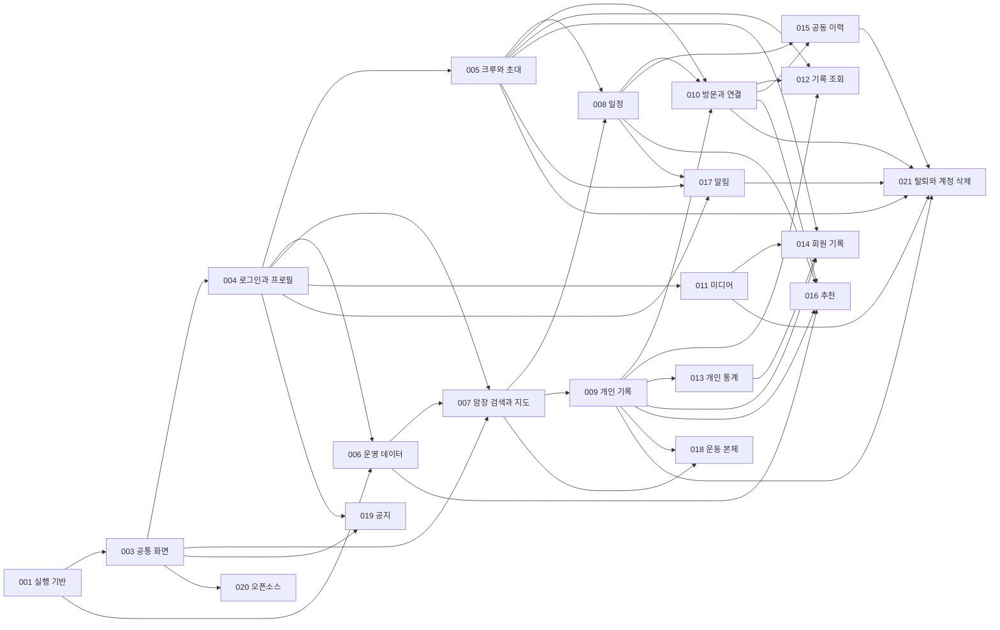

# 기능 스펙 목록과 개발 단위

갱신일: 2026-10-06

기존 개발 기반001과 새 범위002~021, 총21개 개발 단위로 전체 기능을 나눴다. 이 목록은 **개발 범위·담당 연결·선행 관계의 원본**이다. 각 `spec.md`는 Living Spec으로 유지한다. 상세 제품 규칙은 기존 명세에서 관리하며 기능 스펙에는 범위와 짧은 요구 결과·원본 링크만 둔다.

현재는 전체 범위 명세·[공통 API·데이터 설계](002-shared-contracts/contracts/README.md)와 [001 기반 설계](001-development-foundation/plan.md)를 작성했다. 현재 Spec Kit 선택은001이며 [32개 역할별 작업](001-development-foundation/tasks.md)을 작성했다. 001 일관성 분석과 문구 보완을 마쳤다. 확정된 32개 작업의 세부 이슈를 모두 연결했다. T001–T003의 공통 준비·설치·설정 검사를 수행했다. [검증 기록](../docs/history/development/001-shared-foundation-verification.md)을 참고한다. 다음은 #2 구현 PR 병합 후 계약 생성 기반 #4다. 서비스 구현·생성 소비자 실행 검증은 아직 없다. 절차와 선택 방법은 [개발 흐름](../docs/development-workflow.md)을 따른다.

## 상세 규칙 원본

| 내용 | 한곳에서 관리할 원본 |
|---|---|
| 제품 목적과 기능 F01~F23 | [PRD](../docs/prd.md) |
| 화면 동작 S01~S27·공통 상태·권한·공개·계산·D01~D08·B01~B05·T01~T80 | [기능 명세](../docs/functional-spec.md) |
| 기록·참석·개인 연결·파일의 논리 관계와 삭제 영향 | [기록 관계](../docs/record-relationships.md) |
| 운동 본체·표시줄·운영체제 알림 | [운동 명세](../docs/workout-recording-spec.md) |
| 서비스 관리자 등록·수정·취소·공지 관리 | [관리자 명세](../docs/admin-spec.md) |
| 기술 구성·저장소·작업 처리·운영 범위 | [기술 명세](../docs/technical-spec.md) |
| 화면 배치·경로·현재 Figma 링크·상태 번호 | [화면 설계](../docs/screen-design.md) · [최신 시안 목록](../docs/screens.md) · [번호표](../docs/screen-numbering.md) |
| 개발자별 담당·전달·단독/연동 검사 구분 | [프론트·백엔드 작업 구분](development-roles.md) |
| 공통 계약을 설계할 범위·변경 책임·합의 종료 조건 | [002 계약 설계 범위](002-shared-contracts/contract-scope.md) |
| 미결정·시안 적용·외부 준비 상태 | [미결정 사항](../docs/open-questions.md) · [화면 작업 목록](../docs/screen-worklist.md) · [준비 체크리스트](../docs/setup-checklist.md) |

현재 상세 규칙을 기능 스펙으로 옮기지 않았다. 향후 원본을 옮기면 기존 위치를 요약·링크로 바꾸고 기존 ID·주소를 보존한다. 현재 기능 스펙의 FR·SC는 해당 폴더 안에서만 사용하는 번호다. 기존 F·S·D·B·T와 화면 번호를 새 스펙 번호로 바꾸지 않는다.

## 개발자별 작업 구분

프론트와 백엔드는 서로 다른 개발자가 맡는다. 기능별 화면·서버 책임, 계약 전달, 단독 검사와 실제 연동 완료 기준은 [작업 구분 원본](development-roles.md)에서 관리한다. 각 기능은 같은 `spec.md`와 공통 계약을 사용하고 상세 제품 규칙을 프론트용·백엔드용으로 복사하지 않는다.

## 개발 단위

기능 단위는 모바일 화면만을 뜻하지 않는다. 해당 결과에 필요한 서버 동작과 검증을 함께 포함하며 서비스 관리자 웹을 별도로 구분한다. 같은 화면의 보조 기능은 아래 담당을 통해 합친다. 공통 부품은003을 사용한다.

| 번호·스펙 | 담당 결과·화면 | 기존 기능 연결 | 상태 |
|---|---|---|---|
| [001 개발 기반 구성](001-development-foundation/spec.md) | 모바일·관리자 웹·서버·개발 DB·검사 기반 | 기술·준비 범위 | 명세·기반 설계·작업 목록 작성 / 일관성 분석 완료·구현·실행 검증 전 |
| [002 공통 계약 설계](002-shared-contracts/spec.md) | — | 공통 | API·데이터·기기 계약 설계·정적 검토 / 구현 전 |
| [003 앱 탐색과 공통 화면 부품](003-app-shell/spec.md) | 공통 부품 | F12·F19 | 범위 명세·품질 확인 / 설계·구현 전 |
| [004 로그인과 내 정보·프로필](004-identity-profile/spec.md) | 07.01·05.01·05.02 | F01 | 범위 명세·품질 확인 / 설계·구현 전 |
| [005 크루 생성·초대 가입·선택·이관](005-crew-membership/spec.md) | 06.01~06.10 | F01·F19 | 범위 명세·품질 확인 / 설계·구현 전 |
| [006 브랜드·암장·벽·세팅 관리](006-gym-catalog-admin/spec.md) | A02·A03 | F09~F11 | 범위 명세·품질 확인 / 설계·구현 전 |
| [007 암장 검색·선택·지도·상세](007-gym-discovery/spec.md) | 03.01·03.02·03.03 | F17·F21 | 범위 명세·품질 확인 / 설계·구현 전 |
| [008 일정 작성·응답·달력·상세](008-schedules/spec.md) | 01.01~01.05 | F02~F04·F12 | 범위 명세·품질 확인 / 설계·구현 전 |
| [009 개인 기록 작성·수정·상세](009-personal-records/spec.md) | 02.04·02.05 | F05~F07·F16 | 범위 명세·품질 확인 / 설계·구현 전 |
| [010 크루 방문·실제 참석·개인 기록 연결](010-crew-visits-links/spec.md) | 02.06·02.07·02.08·02.10 | F05~F07·F14·F16 | 범위 명세·품질 확인 / 설계·구현 전 |
| [011 미디어 업로드·처리·보기·보관함](011-media-library/spec.md) | 05.03·05.04 | F08 | 범위 명세·품질 확인 / 설계·구현 전 |
| [012 통합 기록 달력·목록·필터](012-record-browsing/spec.md) | 02.01·02.02·02.03·02.09 | F12 | 범위 명세·품질 확인 / 설계·구현 전 |
| [013 계정 전체 개인 통계](013-personal-statistics/spec.md) | 04.01 | F15 | 범위 명세·품질 확인 / 설계·구현 전 |
| [014 회원 공개 기록·통계·상세](014-member-records/spec.md) | 06.11·02.11 | F20 | 범위 명세·품질 확인 / 설계·구현 전 |
| [015 공동 변경 이력·수정 되돌리기](015-shared-history/spec.md) | 02.12 | F13~F14 | 범위 명세·품질 확인 / 설계·구현 전 |
| [016 참여자 기준 암장 추천](016-gym-recommendations/spec.md) | 03.02 추천 영역 | F11 | 범위 명세·품질 확인 / 설계·구현 전 |
| [017 일정 푸시·알림 설정](017-push-notifications/spec.md) | 05.05 | F18 | 범위 명세·품질 확인 / 설계·구현 전 |
| [018 운동 중 빠른 기록](018-workout-recording/spec.md) | 02.13·기록 영역 표시줄·OS 알림 | F07·F16 확장 | 확정 본체 명세·품질 확인 / 시작 진입 미정 |
| [019 앱 시작 공지·관리자 공지 관리](019-announcements/spec.md) | 00.01·A04 | F22 | 명세·품질 확인 / 개선 시안 승인·구현 전 |
| [020 모바일 오픈소스 안내](020-open-source-notices/spec.md) | 05.06 | F23 | 범위 명세·품질 확인 / 설계·구현 전 |
| [021 크루 탈퇴·계정 삭제·권한 회수](021-account-lifecycle/spec.md) | 06.01 탈퇴·05.02 계정 삭제 | F01·F14·F19 | 범위 명세·품질 확인 / 설계·구현 전 |

## 전체 화면 담당 연결

최신 목록의 모바일41개·관리자 웹3개, 총44개 독립 화면을 각각 하나의 주 담당에 연결했다. 상태별 목록은 [원본 번호표](../docs/screen-numbering.md)를 사용한다.003은 모든 화면의 공통 부품을 지원한다. 보조 기능은 주 화면 담당이 조립하며 별도 화면을 복제하지 않는다.

| 화면 번호 | 주 담당 스펙 | 보조 기능·연동 |
|---|---|---|
| [00.01](../docs/screen-design.md#screen-00-01) | [019](019-announcements/spec.md) | — |
| [01.01](../docs/screen-design.md#screen-01-01) | [008](008-schedules/spec.md) | 005 선택·미가입 진입 |
| [01.02](../docs/screen-design.md#screen-01-02) | [008](008-schedules/spec.md) | 005 선택 |
| [01.03](../docs/screen-design.md#screen-01-03) | [008](008-schedules/spec.md) | — |
| [01.04](../docs/screen-design.md#screen-01-04) | [008](008-schedules/spec.md) | — |
| [01.05](../docs/screen-design.md#screen-01-05) | [008](008-schedules/spec.md) | — |
| [02.01](../docs/screen-design.md#screen-02-01) | [012](012-record-browsing/spec.md) | 005 선택·018 운동 표시줄 |
| [02.02](../docs/screen-design.md#screen-02-02) | [012](012-record-browsing/spec.md) | 005 선택·018 운동 표시줄 |
| [02.03](../docs/screen-design.md#screen-02-03) | [012](012-record-browsing/spec.md) | — |
| [02.04](../docs/screen-design.md#screen-02-04) | [009](009-personal-records/spec.md) | 010 연결·011 미디어 |
| [02.05](../docs/screen-design.md#screen-02-05) | [009](009-personal-records/spec.md) | 010 연결·011 미디어 |
| [02.06](../docs/screen-design.md#screen-02-06) | [010](010-crew-visits-links/spec.md) | 008 일정 진입·011 미디어 |
| [02.07](../docs/screen-design.md#screen-02-07) | [010](010-crew-visits-links/spec.md) | — |
| [02.08](../docs/screen-design.md#screen-02-08) | [010](010-crew-visits-links/spec.md) | 009 본인·014 타인 상세·011 파일·015 이력 |
| [02.09](../docs/screen-design.md#screen-02-09) | [012](012-record-browsing/spec.md) | — |
| [02.10](../docs/screen-design.md#screen-02-10) | [010](010-crew-visits-links/spec.md) | — |
| [02.11](../docs/screen-design.md#screen-02-11) | [014](014-member-records/spec.md) | — |
| [02.12](../docs/screen-design.md#screen-02-12) | [015](015-shared-history/spec.md) | 008·010 쓰기 결과 |
| [02.13](../docs/screen-design.md#screen-02-13) | [018](018-workout-recording/spec.md) | — |
| [03.01](../docs/screen-design.md#screen-03-01) | [007](007-gym-discovery/spec.md) | — |
| [03.02](../docs/screen-design.md#screen-03-02) | [007](007-gym-discovery/spec.md) | 016 추천 결과 |
| [03.03](../docs/screen-design.md#screen-03-03) | [007](007-gym-discovery/spec.md) | — |
| [04.01](../docs/screen-design.md#screen-04-01) | [013](013-personal-statistics/spec.md) | — |
| [05.01](../docs/screen-design.md#screen-05-01) | [004](004-identity-profile/spec.md) | 005 크루·011 보관함·017 설정·020 안내 진입 |
| [05.02](../docs/screen-design.md#screen-05-02) | [004](004-identity-profile/spec.md) | 021 계정 삭제 |
| [05.03](../docs/screen-design.md#screen-05-03) | [011](011-media-library/spec.md) | — |
| [05.04](../docs/screen-design.md#screen-05-04) | [011](011-media-library/spec.md) | — |
| [05.05](../docs/screen-design.md#screen-05-05) | [017](017-push-notifications/spec.md) | — |
| [05.06](../docs/screen-design.md#screen-05-06) | [020](020-open-source-notices/spec.md) | — |
| [06.01](../docs/screen-design.md#screen-06-01) | [005](005-crew-membership/spec.md) | 021 탈퇴 |
| [06.02](../docs/screen-design.md#screen-06-02) | [005](005-crew-membership/spec.md) | 014 회원 기록 진입 |
| [06.03](../docs/screen-design.md#screen-06-03) | [005](005-crew-membership/spec.md) | — |
| [06.04](../docs/screen-design.md#screen-06-04) | [005](005-crew-membership/spec.md) | — |
| [06.05](../docs/screen-design.md#screen-06-05) | [005](005-crew-membership/spec.md) | — |
| [06.06](../docs/screen-design.md#screen-06-06) | [005](005-crew-membership/spec.md) | — |
| [06.07](../docs/screen-design.md#screen-06-07) | [005](005-crew-membership/spec.md) | 004 로그인 후 이어가기 |
| [06.08](../docs/screen-design.md#screen-06-08) | [005](005-crew-membership/spec.md) | — |
| [06.09](../docs/screen-design.md#screen-06-09) | [005](005-crew-membership/spec.md) | 021 탈퇴·삭제 전 이관 |
| [06.10](../docs/screen-design.md#screen-06-10) | [005](005-crew-membership/spec.md) | — |
| [06.11](../docs/screen-design.md#screen-06-11) | [014](014-member-records/spec.md) | 013 통계 부품 |
| [07.01](../docs/screen-design.md#screen-07-01) | [004](004-identity-profile/spec.md) | — |
| [A02](../docs/screen-design.md#admin-web) | [006](006-gym-catalog-admin/spec.md) | — |
| [A03](../docs/screen-design.md#admin-web) | [006](006-gym-catalog-admin/spec.md) | — |
| [A04](../docs/screen-design.md#admin-web) | [019](019-announcements/spec.md) | — |

## 선행 관계

두 종류를 구분한다. **계약 선행**은 입력·결과의 약속을 먼저 맞추는 일이다. **연동 선행**은 실제 기능을 합쳐 완료를 확인할 때 필요한 기능이다. 아래 숫자는 스펙 번호이며 모든 제품 기능은001 실행 기반과 사용하는002 계약이 필요하다. 표에는 기능별 직접 계약을 요약했다. 명시된 계약 소비 목록의 원본은 [002 계약 범위](002-shared-contracts/contract-scope.md#정해야-할-계약)이며 기능이 직접 또는 연동 검사에서 사용하는 계약을 모두 포함한다. 공통 요청 C01·보호 기능 권한 C02·공통 화면 진입 C12는 필요한 모든 기능에 함께 적용한다. 각 스펙의 예제 검사는 해당 실제 구현을 기다리지 않고 계약 합의 뒤 시작할 수 있다.

002 설계 범위 자체는001 구현을 기다리지 않는다. 001과002의 설계를 먼저 맞추고, 공통 구조·권한·시간대·연결 계약이 합의되면 각 기능의 상세 계획과 구현 작업을 나눈다. 아래 표는 완료 순서의 제약이며 구현 담당을 차례로만 작업시키라는 뜻이 아니다.

| 개발 단위 | 사용하는 계약 | 실제 연동 선행 | 함께 확인할 후속·옆 기능 |
|---|---|---|---|
| 001 | C01·C02의 기반 연결 부분 | 없음 | 002·각 앱·서버·관리자 소비자 |
| 002 | C01~C12 설계 | 설계는 없음. 소비자 실행 검증은001 | 모든 제품 기능 |
| 003 | C01·C02·C03·C12 | 001 | 004·005의 실제 탐색, 각 화면 적용 |
| 004 | C01·C02·C03·C08·C09·C12 | 001·003 | 005 로그인 후 초대·017 로그아웃 기기 해제·021 삭제 |
| 005 | C02·C03·C09·C12 | 004 | 008·010의 크루 권한,014 회원 기록,021 탈퇴 |
| 006 | C02·C04·C08 | 001·004 | 007 지도/상세·009 난이도 입력·016 세팅 추천 |
| 007 | C04·C10·C12 | 003·004·006 | 008·009 장소 선택,016 추천 영역 |
| 008 | C03·C04·C05·C09·C10·C11·C12 | 003·004·005·007 | 010 방문·015 이력·016 추천·017 알림 |
| 009 | C04·C06·C07·C08·C10·C11 | 003·004·007 | 010 생성/연결/해제·011 파일·012 조회·013 통계 |
| 010 | C03·C05·C06·C07·C08·C09·C10·C11 | 005·008·009 | 011 공동 파일·012 중복 제외·015 이력·017 최초 방문 사건 |
| 011 | C02·C06·C07·C08·C11 | 004 | 009 개인 첨부·010 공동 첨부·014 공개 접근·021 삭제 |
| 012 | C03·C04·C06·C07·C10·C12 | 003·005·009·010 | 009·010 저장 후 갱신,018 표시줄 |
| 013 | C04·C06·C10 | 003·009 | 010 연결/공동 삭제 후 동일 집계,014 부품 재사용 |
| 014 | C02·C03·C04·C06·C07·C08·C10 | 005·009·011·013 | 010 연결 크루별 공개,021 권한 회수 |
| 015 | C02·C05·C07·C09·C11 | 008·010 | 008·010 되돌리기 현재 제약,017 되돌린 변경 사건 |
| 016 | C04·C05·C06·C07·C10 | 006·008·009·010 | 007 검색과 조립,세팅·참여 변경 후 추천 갱신 |
| 017 | C02·C03·C05·C09·C11·C12 | 004·005·008 | 010 최초 방문 생성/삭제,021 회수 |
| 018 | C04·C06·C12 | 003·007·009 | 012 기록 영역 표시줄·실기기 OS 상태 |
| 019 | C02·C08·C12 | 003·004 | 004 로그인·005 초대 진입 유지,공지 이미지 저장 |
| 020 | C12 | 003 | 실제 모바일 배포 의존성 전체 |
| 021 | C02·C03·C06·C07·C08·C09·C11 | 004·005·009·010·011·015·017 | 이전 직접 링크·처리 중 미디어·예약 알림의 회수 |

그림은 실제 연동의 주요 경로이며 정확한 선행 목록은 위 표다. 002 계약 합의는 그림의 모든 제품 기능에 공통으로 걸린다.

## 병렬 개발 묶음

| 묶음 | 계약 합의 뒤 독립 개발할 범위 | 합칠 때 필요한 결과 |
|---|---|---|
| 공통 준비 | 001 기반,002 계약,003 공통 부품 | 공용 폴더·설정·모델·자료형의 주 변경 담당 지정 |
| 계정과 크루 | 004·005·021 | 가입·역할·선택·탈퇴·삭제·권한 회수의 일관성 |
| 운영 자료와 암장 | 006·007·016 | 등록 값과 모바일 표시·추천 결과의 일치 |
| 일정과 전달 | 008·015·017 | 상태·최초 방문 사실·이력·예약 사건의 일치 |
| 기록과 파일 | 009·010·011·018 | 참석·개인 기록·연결·소유·공유·지연 처리의 일치 |
| 조회와 집계 | 012·013·014 | 중복 제외·본인/크루 공개 범위·시간대·미입력의 일치 |
| 독립 앱 정보 | 019·020 | 기본 진입 유지·관리자 공지 연동·배포 자료 확인 |

묶음은 담당 영역의 예시이며 필요한 인원 수가 아니다. 021처럼 여러 영역을 건드리는 통합 기능은 계약 예제로 개발한 뒤 선행 기능과 마지막에 합친다. 각 기능 안에서도 앱·서버·웹을 나누기 전에 해당 계약을 합의한다. 병렬 착수·파일 충돌 방지·합친 뒤 검사 조건은 [공통 계약 범위](002-shared-contracts/contract-scope.md#병렬-작업과-합친-뒤-확인)에 둔다.

## 기존 요구사항과 검증 연결

F·S·화면 담당은 위 개발 단위 표와 각 스펙의 범위 표를 따른다. S18·T27은 후순위 관리 기능으로 아래에서 구분한다. 03.02의 주 화면은007이며 추천은016, 06.01 주 화면은005이며 탈퇴는021, 05.02 주 화면은004이며 계정 삭제는021이다. 05.01의 알림·보관함·오픈소스·크루 진입은 해당 기능을 연결한다.

D/B 상세 내용은 복사하지 않고 주 적용 단위만 표시한다. 모든 기능은 공통 권한·시간·입력 규칙을 함께 따른다.

| 정책 ID | 주 적용 개발 단위 | 원본 |
|---|---|---|
| D01 | 002·006~010·012~013·016~018 | [개발 정책과 시간](../docs/functional-spec.md#7-개발-정책과-결정-상태) |
| D02 | 008·010 | 같은 원본7절 |
| D03 | 009~011·014 | 같은 원본7절·공개 범위2.3절 |
| D04 | 008·017 | 같은 원본7절·푸시5.5절 |
| D05 | 006·009~011·013 | 같은 원본7절·미디어4절 |
| D06 | 009·010 | 같은 원본7절·기록 연결5.2절 |
| D07 | 005 | 같은 원본7절·초대S02/S17 |
| D08 | 005·009·011~014 | 같은 원본7절 |
| B01 | 009·010·015 | [연결 규칙](../docs/functional-spec.md#52-개인-기록-연결해제) |
| B02 | 009~011·021 | 같은 원본5.2절 |
| B03 | 012~014 | [집계](../docs/functional-spec.md#53-통계-계산) |
| B04 | 008·010·017 | [경계 정책](../docs/functional-spec.md#8-경계-상황의-확정-정책) |
| B05 | 004·005·011·014·017·021 | 같은 원본8절 |

아래는 기존 T01~T80의 **검사 연결**이다. 실행 결과는 아직 없다. 여러 기능이 표시된 경우 합친 뒤 함께 확인한다. 기대 결과는 [기능 명세9절](../docs/functional-spec.md#9-기능-완료-확인-시나리오)에서만 관리한다.

| 기존 검증 | 연결 개발 단위 |
|---|---|
| T01 | 004 |
| T02 | 005 |
| T03 | 008 |
| T04 | 008·016 |
| T05 | 008 |
| T06 | 010 |
| T07 | 010 |
| T08 | 010 |
| T09 | 010·021 |
| T10 | 009·014·015 |
| T11 | 013 |
| T12 | 009·013 |
| T13 | 009·013·015 |
| T14 | 016 |
| T15 | 016 |
| T16 | 007·016 |
| T17 | 007·016 |
| T18 | 017 |
| T19 | 017 |
| T20 | 017 |
| T21 | 008·017 |
| T22 | 008·017 |
| T23 | 011 |
| T24 | 009·012 |
| T25 | 017 |
| T26 | 005·012 |
| T27 | 후순위 S18. 현재 구현 대상 아님; 역할 구분 계약은002·005 |
| T28 | 014 |
| T29 | 011·021 |
| T30 | 011 |
| T31 | 017 |
| T32 | 015 |
| T33 | 014 |
| T34 | 014·021 |
| T35 | 003·008·012 |
| T36 | 003·008·012 |
| T37 | 003·008·012 |
| T38 | 009·010·015 |
| T39 | 010·021 |
| T40 | 010 |
| T41 | 009 |
| T42 | 009·021 |
| T43 | 009·011·021 |
| T44 | 010 |
| T45 | 009·010 |
| T46 | 010 |
| T47 | 010·015 |
| T48 | 010·012 |
| T49 | 009·013 |
| T50 | 010·012·013 |
| T51 | 009·013 |
| T52 | 008·017 |
| T53 | 005·021 |
| T54 | 011·014 |
| T55 | 011·014·021 |
| T56 | 009·012 |
| T57 | 010 |
| T58 | 008·009·010 |
| T59 | 008·017 |
| T60 | 006·009·013 |
| T61 | 009·012·013 |
| T62 | 009·011·014 |
| T63 | 009·010·012 |
| T64 | 010 |
| T65 | 010 |
| T66 | 013·016 |
| T67 | 004 |
| T68 | 005 |
| T69 | 021 |
| T70 | 005·021 |
| T71 | 009·011 |
| T72 | 009 |
| T73 | 006·007·016 |
| T74 | 010 |
| T75 | 004 |
| T76 | 005 |
| T77 | 005 |
| T78 | 005 |
| T79 | 003·005·012 |
| T80 | 003·005·012 |

운동은 [운동 완료 기준](../docs/workout-recording-spec.md#완료-확인-기준)→018, 관리자 등록·세팅은 [관리자 완료 기준](../docs/admin-spec.md#3-완료-확인-기준)→006, 공지의 S26·관리자 완료 기준→019, 오픈소스의 S27 검증→020에 연결한다. 공통 계약 자체는002 계약 합의 종료 조건을 따른다. 기존 T번호가 없는 기능에도 각 스펙의 FR·SC를 적용한다.

## 보류·제외와 다음 작업

- S18 회원 제외·차단 해제·관리자 추가 지정 화면, 초대 재발급, 공개 크루 검색은 이번 초기 구현에 포함하지 않는다. 기존 차단 상태와 B05 권한 검사는 공통 계약에서 누락하지 않는다.
- 운동 시작 A·B는 [미결정 사항](../docs/open-questions.md)에 남긴다.018 본체 설계와 시작 진입 완료를 구분한다.
- 공지 개선 시안은 승인됐으며 표시줄 범위·겹침 허용도 확정됐다. [화면 작업 목록](../docs/screen-worklist.md)은 실제 구현 적용과 시안 승인을 구분한다.
- 기능 이후 운영 준비는 [기술 명세6절](../docs/technical-spec.md#6-기능-개발-이후에-다룰-운영-준비)을 따른다. 이번 착수 조건으로 추가하지 않는다.

002의 [API·데이터 계약](002-shared-contracts/contracts/README.md)과 [001 기반 설계](001-development-foundation/plan.md)를 작성했다. [001 작업 목록](001-development-foundation/tasks.md)을 작성했다. 일관성 분석과 문구 보완을 마쳤다. 확정된 32개 작업의 세부 이슈를 모두 연결했다. T001–T003 공통 준비·설치·설정 검사 이후 계약 생성·소비자 준비를 진행한다. 병합·완료 상태는 GitHub 이슈에서 확인한다. 실제 서버·기기는 미정이며 001은 로컬 서버·웹·가상 기기 검사로 완료를 판단한다. 실제 휴대폰·물리 서버 확인은 후속 범위다. 이후 필요한 기능부터 계획·작업·검증 예제를 작성하며 제품 코드·DB 변경 파일은 아직 없다.
